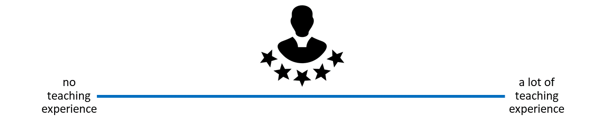
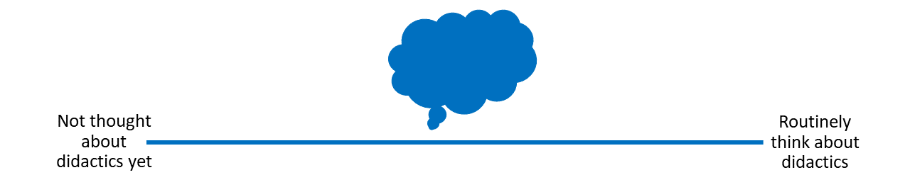
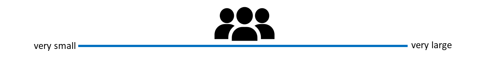
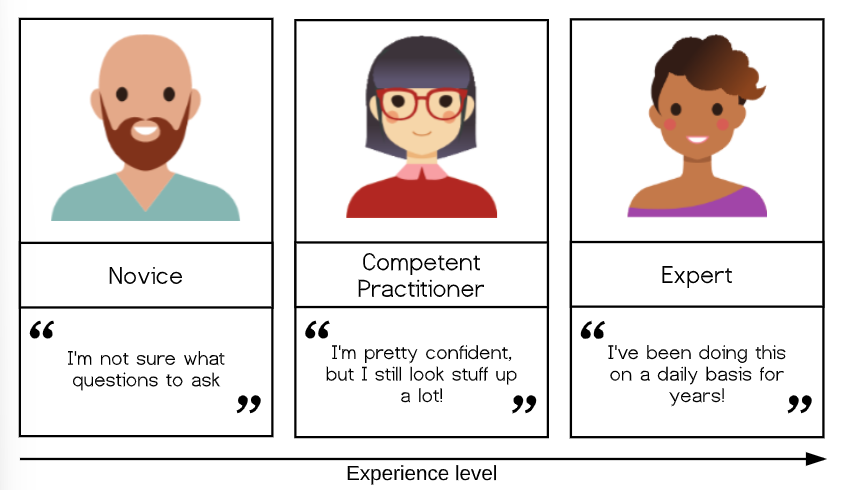
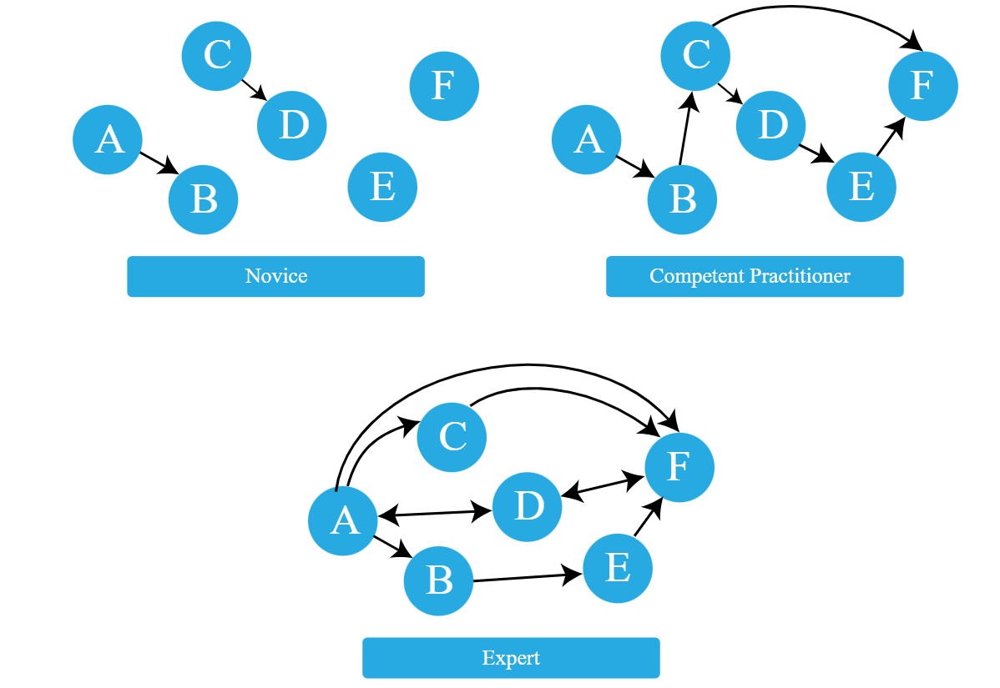
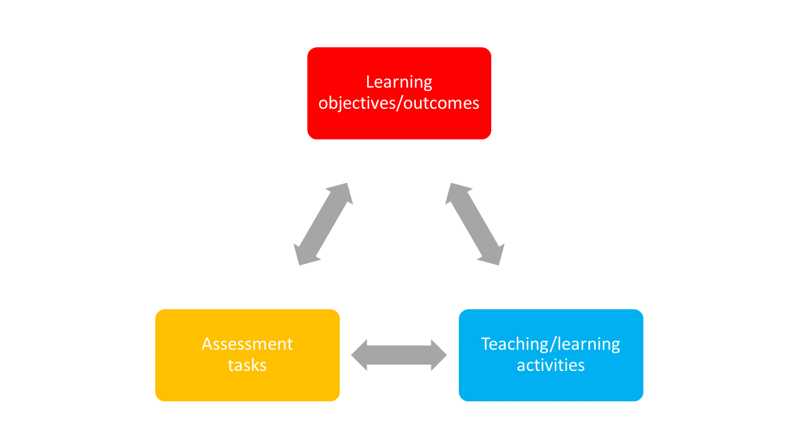
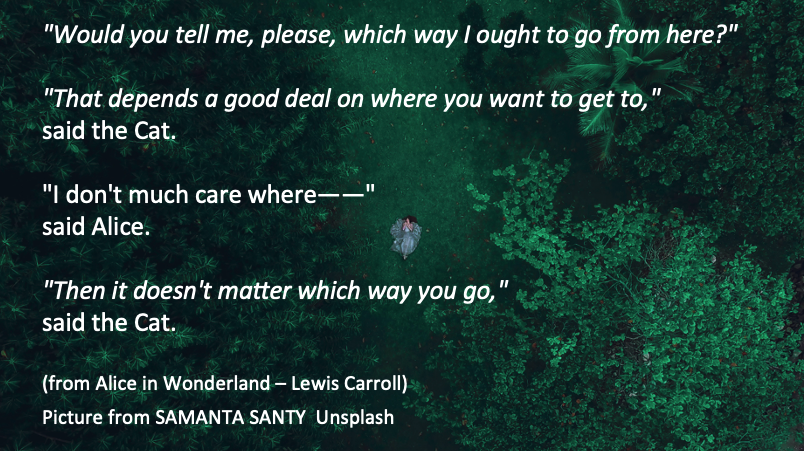
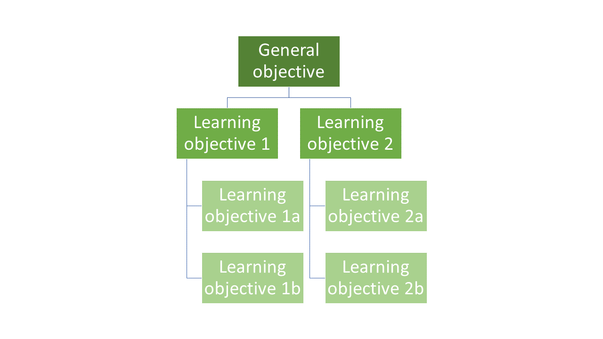
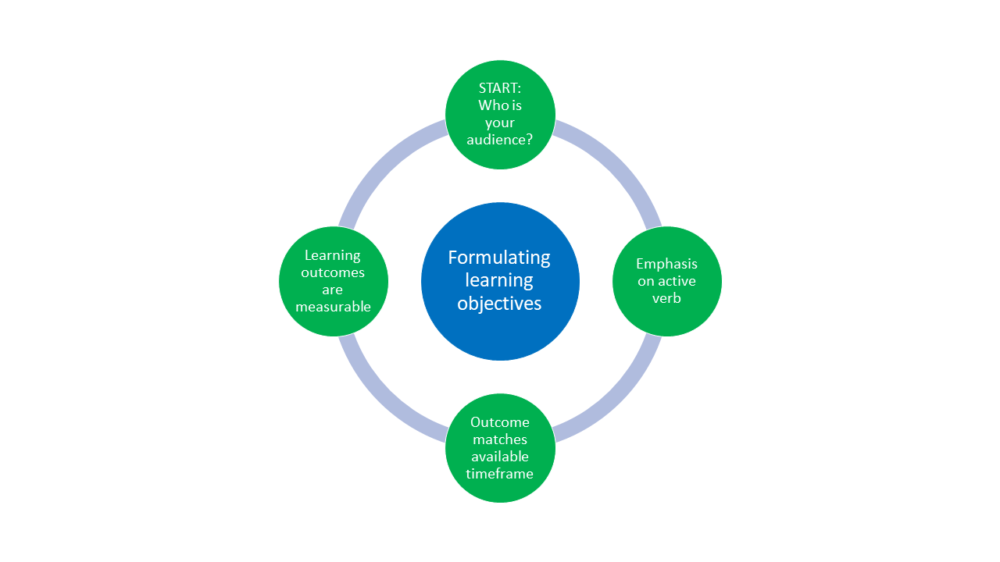

## Licence

<br>

<p style="text-align:center;">
  
</p>

<div style="background-color: #f0f0f0; padding: 0.05em; border-radius: 2px; font-size: 0.6em;">
This work was originally created by [Mike Croucher ](https://github.com/mikecroucher) under a CC-BY-SA 4.0 [Creative Commons Attribution 4.0 SA International License](https://creativecommons.org/licenses/by-sa/4.0/deed.en). It was subsequently adapted by [Malika Ihle](https://www.osc.uni-muenchen.de/about_us/coordinator/index.html) during her time at Reproducible Research Oxford. This current work by Sarah von Grebmer zu Wolfsthurn, Sara Lil Middleton and Malika Ihle is licensed under a CC-BY-SA 4.0 [Creative Commons Attribution 4.0 International SA License](https://creativecommons.org/licenses/by-sa/4.0/deed.en). It permits unrestricted re-use, distribution, and reproduction in any medium, provided the original work is properly cited. If you remix, transform, or build upon the material, you must distribute your contributions under the same license as the original.

Code snippets are dedicated to the public domain and licenced under a CC0 1.0 [Creative Commons Universal Licence](https://creativecommons.org/publicdomain/zero/1.0/). You may use, modify, distribute, and sell the code snippets for any purpose, without permission or attribution. The code snippets are provided “as is”, without warranty of any kind.

</div>

::: {.notes}
**Presenter Notes**: The Creative Commons Attribution–ShareAlike 4.0 license, or CC BY-SA 4.0, allows others to copy, share, and adapt a work in any medium, including for commercial purposes. These permissions are broad and cannot be withdrawn as long as the license terms are followed. The main requirement is attribution: users must give appropriate credit to the original creator, provide a link to the license, and clearly indicate whether any changes were made, without implying endorsement by the original author. In addition, the ShareAlike condition means that if someone modifies or builds upon the work, the resulting material must be distributed under the same CC BY-SA 4.0 license, or a compatible one. Finally, users are not allowed to apply legal or technical restrictions, such as DRM, that would prevent others from exercising these same rights.
:::

---

## Contribution statement

<br>

**Creator**: Von Grebmer zu Wolfsthurn, Sarah ({fig-alt="orcid logo"}
[0000-0002-6413-3895](https://orcid.org/0000-0002-6413-3895))

**Reviewer**: Ihle, Malika ({fig-alt="orcid logo"} [0000-0002-3242-5981](https://orcid.org/0000-0002-3242-5981))

**Consultant**: Schönbrodt, Felix ({fig-alt="orcid logo"}[0000-0002-8282-3910](https://orcid.org/0000-0002-8282-3910))


::: {.notes}
**Presenter Notes**: These are the **presenter notes**. You will find a script for the presenter for every slide. In presentation mode, your audience will not be able to see these presenter notes, they are only visible to the presenter. 

**Instructor Notes**: There are also **instructor notes**. For some slides, there will be pedagogical tips, suggestions for activites and troubleshooting tips for issues your audience might run into. You can find these notes underneath the presenter notes.

**Accessibility Tips**: Where applicable, this is a space to add any tips you may have to facilitate the accessibility of your slides and activities. 
:::

---

## Prerequisites

::: {.callout-important}
Before completing this submodule, please carefully read about the prerequisites.
:::

<div style="font-size: 0.8em;">
| Prerequisite   |  Description  | Link/Where to find it   |
|------------|------------|------------|
| Topic Name | Basic intro to X | Module + Submodule |
| Software Name | Configuring the environment | [Download Link](https://quarto.org) |
</div>

::: {.notes}
**Presenter Notes**: Script for the slide here. 

**Instructor Notes**: These are the prerequisites for this submodule. Before you get started on this submodule with your audience, you need to ensure that the audience fulfills these criteria. Outline any essential prerequisites (software, tools, other submodules etc.) here in table format. If you prefer bullet points to list the prerequisites, delete the table and use bullet points instead. 
:::

---

## Questions from previous submodule

- **Aim**:  This first slide is dedicated to clarifying questions from the previous submodule and/or to discuss assignments. 
- Additional slides may need to be added depending on the nature of the homework assignments. 
- Critical for the learning process to ensure that learners are on the same page and have been able to achieve the learning goals of the previous workshop. 
- Not applicable if this set of slides corresponds to the first submodule of a new module. 

::: {.notes}
**Presenter Notes**: Script for the slide here.

**Instructor Notes**: <br>
- **Aim**:  This first slide is dedicated to clarifying questions from the previous submodule and/or to discuss assignments. 
- Additional slides may need to be added depending on the nature of the homework assignments. 
- Critical for the learning process to ensure that learners are on the same page and have been able to achieve the learning goals of the previous workshop. 
- Not applicable if this set of slides corresponds to the first submodule of a new module. 
:::

---

## Before we start: Survey time!

- **Aim**: The pre-submodule survey serves to examine students' prior knowledge about the sumodule's topic.
- Use free survey software such as  or other survey software (particify, formR) to establish the following questions (shown on separate slides):

---

**What is your level of familiarity with [Topic] (e.g., basic concepts, terminology, or tools)?**

a. I have never heard of it before.

b. I have heard of it but have never worked with it.

c. I have basic understanding and experience with it.

d. I am very familiar and have worked with it extensively.

---

**Which of the following concepts or skills do you feel most confident about in relation to [Topic]? (Select all that apply)**

a. Concept 1

b. Concept 2

c. Concept 3

d. Concept 4

e. I am not sure about any of these concepts.

---

**On a scale of 1 to 5, how comfortable are you with using [specific tool/technology] related to [Topic]?
(1 = Not comfortable at all, 5 = Very comfortable)**

a. 1

b. 2

c. 3

d. 4

e. 5

---

## Discussion of survey results

- **Aim"**: Briefly examine the answers given to each question interactively with the group.
- Use visuals from the survey to highlight specific answers.

::: {.notes}
Make it clear to the group that there will be a similar post-submodule survey to examine understanding and learning progress.
:::

---

## Where are we at?

- **Aim**: Place the topic of the current submodule within a broader context.
- Remind students what you are working towards and what the bigger picture is.

---

## Learning goals

- **Aim**: Formulate specific, action-oriented goals learning goals which are measurable and observable in line with Bloom's taxonomy (Anderson et al., 2001; Bloom et al., 1956)

- Place an emphasis on the **verbs** of the learning goals and choose verbs that align with the skills you want to develop or assess.
- Examples: 
  - Students will **describe** the process of photosynthesis or
  - Students will **construct** a diagram illustrating the process of photosynthesis

---

### Covered in in this session

- **Aim**: This slides serves as an overview of the topics that are discussed, presented as bullet point:

**(for now copied from Didactis2 go, use as basis only)**

-   Constructivism
-   Constructive alignment
-   Setting learning goals
-   AVIVA-Schema
-   Activation methods
-   Reflection

---

## How much teaching experience do you have?

-   e.g., workshops, peer training, (guest) lectures etc. on **Open Research** topics

<br>
<br>

{width=100%, fig-align="center"}

::: {.notes}
**Presenter Notes**: Let us get a bit more of a sense of who is in the room with you and what teaching or didactics experience they bring with you. *For in-person learnerS*: I would like for everyone to get up an to stand on an imaginary axis based on how much teaching experience you have. Closest to the front we have really a lot of teaching experience, I teach basically every day, and at the back we have I am completely new to teaching. *For virtual learnerS*: I would like for everyone draw on this line how much teaching experience you have by drawing an x. On the right side of scale we have really a lot of teaching experience, I teach basically every day, and on the left side we have I am completely new to teaching.

**Instructor Notes**: EDIT Subsequent evaluation: *in-person learners*: Get people to stand along imaginary line across the room in terms of how much teaching experience they have. For online participants: Ask them to indicate experience on the screen. Pick out two people on either end of the spectrum (one from the in-person audience, one from online audience) and have them explain their teaching experience. Next, pick two people around the middle (one from the in-person audience, one from online audience) and have them explain and compare their experiences. Involve your audience as early as possible, so that they pay attention in case they get called upon. 
:::

---

## How much have you already thought about didactics?

- When teaching about Open Research, have you considered **didactic elements** in you design and/or teaching style..?

<br>
<br>
<br>

{width=100%, fig-align="center"}

::: {.notes}
For in-person participants: Get people to stand along imaginary line across the room in terms of how much they think about didactics. For online participants: Ask them to indicate experience on the screen. Pick out two people on either end of the spectrum (one from the in-person audience, one from online audience) and have them explain their teaching experience. Next, pick two people around the middle (one from the in-person audience, one from online audience) and have them explain and compare their didactic thinking processes.
:::

---

## How big are your teaching/training audiences?

- i.e., what is the average group size you teach? (< 5 people = very small, > 100 people = very large)

<br>
<br>

{width=100%, fig-align="center"}

::: {.notes}
**Presenter Notes**: Let us get a bit more of a sense of who is in the room with you and what teaching or didactics experience they bring with you. *For in-person learnerS*: I would like for everyone to get up an to stand on an imaginary axis based on how much teaching experience you have. Closest to the front we have really a lot of teaching experience, I teach basically every day, and at the back we have I am completely new to teaching. *For virtual learnerS*: I would like for everyone draw on this line how much teaching experience you have by drawing an x. On the right side of scale we have really a lot of teaching experience, I teach basically every day, and on the left side we have I am completely new to teaching.

**Instructor Notes**: EDIT Subsequent evaluation: *in-person learners*: Get people to stand along imaginary line across the room in terms of how much teaching experience they have. For online participants: Ask them to indicate experience on the screen. Pick out two people on either end of the spectrum (one from the in-person audience, one from online audience) and have them explain their teaching experience. Next, pick two people around the middle (one from the in-person audience, one from online audience) and have them explain and compare their experiences. Involve your audience as early as possible, so that they pay attention in case they get called upon. 
:::

---

# Core didactic concepts and principles


---


## Learning goals for this session


---

## What *is* learning?

<br>
<br>

<div style="background-color: #f0f0f0; padding: 0.1em; border-radius: 5px; font-size: 1em; text-align: center;">

“...a **process** that leads to **change**, which occurs as a result of **experience** and increases the potential for improved performance and **future learning**”

</div>


<div style="position:absolute; bottom:10px; left:0; width:100%; text-align:center; font-size:0.4em; color:#888;">

Ambrose, S. A., Bridges, M. W., DiPietro, M., Lovett, M. C., Norman, M. K., & Mayer, R. E. (2023), page 2-3.
Slide adapted from Laura Carter: "Evidence-based Training" [https://zenodo.org/records/18905547](https://zenodo.org/records/18905547). Slide originally licenced under CC BY 4.0: [https://creativecommons.org/licenses/by/4.0/](https://creativecommons.org/licenses/by/4.0/)  

</div>


::: {.notes}

**Presenter Notes**:

:::


---

## Learning as a process (not a product)

As a process, learning ...

- is learner-centered and something that learners themselves "do"
- involves a change in knowledge, beliefs, behaviours and attitude -> long-term impact on thinking and acting
is active and self-controlled
- is integrated in a broader context and a positive learning environment
- is inferred from learners' products or performance


<div style="position:absolute; bottom:10px; left:0; width:100%; text-align:center; font-size:0.4em; color:#888;">

Ambrose, S. A., Bridges, M. W., DiPietro, M., Lovett, M. C., Norman, M. K., & Mayer, R. E. (2023), page 2-3.
Efgivia et al. (2023)
Slide adapted from Laura Carter: "Evidence-based Training" [https://zenodo.org/records/18905547](https://zenodo.org/records/18905547). Slide originally licenced under CC BY 4.0: [https://creativecommons.org/licenses/by/4.0/](https://creativecommons.org/licenses/by/4.0/)  

</div>

::: {.notes}
**Presenter Notes**: The first aspect we have to discuss is the process of learning from a conceptual point of view. What do we mean by learning? 

As described in Efgivia et al,  learning is an active, student-centered process, where learners build knowledge internally rather than just simply receiving it from their teachers or instructors. It emphasizes learning as an active building of knowledge in the mean, with teachers being the facilitators who create a positive learning environment much more than being just the providers of information. In learning, it is not just about the individual. Instead, social interactions and collaborations with teachers and peers are important drivers of the learning process. 
:::

---

# Constructivism

---

## The importance of prior knowledge

Prior knowledge ... can help or hinder learning!

:::incremental
- Knowledge = facts, concepts, beliefs, values, models, perceptions, attitudes

  - Can be **accurate**, complete and appropriate for context
  - Can be **inaccurate**, incomplete or inappropriate for context
  
:::

---

## Your turn!

<br>
<br>

**What Is an expert?**

What is something that you are an expert in? How does your experience when you are acting as an expert differ from when you are not an expert?

This discussion should take about 5 minutes.

</div>

::: {.notes}
**Presenter Notes:** In reviewing the answers to the question above you will find that the expert experience amounts to much more than just knowing more facts. Competent practitioners can memorise a lot of information without any noticeable improvement to their performance. So, what makes an expert? The answer is that experts have more connections among pieces of knowledge that help them think and problem-solve quickly; more “short-cuts”, if you will.
:::

---

## A model of skills acquisition

{width=100%, fig-align="center"}

<div style="position:absolute; bottom:10px; left:0; width:100%; text-align:center; font-size:0.4em; color:#888;">

[https://carpentries.github.io/instructor-training/02-practice-learning.html](https://carpentries.github.io/instructor-training/02-practice-learning.html)

</div>


::: {.notes}
**Presenter Notes**: Novice: someone who does not know what they do not know, i.e., they do not yet know what the key ideas in the domain are or how they relate. Novices may have difficulty formulating questions, or may ask questions that seem irrelevant or off-topic as they rely on prior knowledge, without knowing what is or is not related yet.

Example: A novice learner in a Carpentries workshop might never have heard of the bash shell, and therefore may have no understanding of how it relates to their file system or other programs on their computer.

Competent practitioner: someone who has enough understanding for everyday purposes. They will not know all the details of how something works and their understanding may not be entirely accurate, but it is sufficient for completing normal tasks with normal effort under normal circumstances.

Example: A competent practitioner in a Carpentries workshop might have used the shell before and understand how to move around directories and use individual programs, but they might not understand how they can fit these programs together to build scripts and automate large tasks.

Expert: someone who can easily handle situations that are out of the ordinary.

Example: An expert in a Carpentries workshop may have experience writing and running shell scripts and, when presented with a problem, immediately sees how these skills can be used to solve the problem.

Note that how a person feels about their skill level is not included in these definitions! You may or may not consider yourself an expert in a particular subject, but may nonetheless function at that level in certain contexts. We will come back to the expertise of the Instructor and its impact – positive and negative – on teaching, in the next episode. For now, we are primarily concerned with novices, as this is The Carpentries’ primary target audience.

It is common to think of a novice as a sort of an “empty vessel” into which knowledge can be “poured.” Unfortunately, this analogy includes inaccuracies that can generate dangerous misconceptions. In our next section, we will briefly explore the nature of “knowledge” through a concept that helps us differentiate between novices and competent practitioners in a more useful and visual way. This, in turn, will have implications for how we teach.
:::

---

## The organisation of prior knowledge

{width=100%, fig-align="center"}

<div style="position:absolute; bottom:10px; left:0; width:100%; text-align:center; font-size:0.4em; color:#888;">

[https://carpentries.github.io/instructor-training/04-expertise.html](https://carpentries.github.io/instructor-training/04-expertise.html)

</div>


::: {.notes}
**Presenter Notes**: A novice has a minimal mental model of surface features of the domain. Inaccuracies based on limited prior knowledge may interfere with adding new information. Predictions are likely to borrow heavily from mental models of other domains which seem superficially similar.
A competent practitioner has a mental model that is useful for everyday purposes. Most new information they are likely to encounter will fit well with their existing model. Even though many potential elements of their mental model may still be missing or wrong, predictions about their area of work are usually accurate.
An expert has a densely populated and connected mental model that is especially good for problem solving. They quickly connect concepts that others may not see as being related. They may have difficulty explaining how they are thinking in ways that do not rely on other features unique to their own mental model.

A greater connectivity of a mental model allows expert to:

- see connections between two topics or ideas that no one else can see
- see a single problem in several different ways
- know how to solve a problem, or “what questions to ask”
- jump directly from a problem to its solution because there is a direct link between the two in their mind. Where a competent practitioner would have to reason “A therefore B therefore C therefore F”, the expert can go from A to F in a single step (“A therefore F”).
:::

---

## Your turn!

<br>
<br>

**How is it for you?**

Is there something that you are currently learning how to do? Can you identify things that would help you with *organizing* your knowledge in a mental model?

This discussion should take about 5 minutes.

</div>

::: {.notes}

**Presenter Notes**:

**Instructor Notes**:

:::

---

## Enhancing the organisation of knowledge

- Provide learners with a “big picture” or outline of your course
- Use contrasting and boundary cases to highlight knowledge
structures
- Make connections to concepts explicit - encourage learners to make these connections themselves (sorting tasks, concept maps)
- Monitor learners’ work for problems in their knowledge organisation

::: {.notes}

**Presenter Notes**:

**Instructor Notes**:

:::


---

## Constructing knowledge

- Knowledge is actively constructed by the learner, not imposed
- Learners bring existing concepts to learning situations
  - Existing ideas need to be incorporated into teaching in order to challenge/change these
- Learners construct knowledge through interaction with physical world/ social settings and within specific cultural/linguistic environments
- Learning environment is integrated into the learning process


<div style="position:absolute; bottom:10px; left:0; width:100%; text-align:center; font-size:0.4em; color:#888;">

Sjoberg, 2010; Tauber, 2006

</div>


::: {.notes}
**Presenter Notes**: This is where constructivism provides us with a solid theoretical framework that frames learning as this active process whereby knowledge is constructed. Within this framework, learning occurs when existing ideas are at odds with new information that is being presented. Therefore, existing ideas and knowledge need to be incorporated into the teaching process in order for learning to take place. 

Following from this notion, it means that a core component of learning is the integration of new information with prior schemas. The question here is now: how exactly are old and new information integrated with each other? This is where the interaction with the physical world in a specific social setting, constraint by cultural and linguistic norms is crucial, therefore making the learning environment and the interaction with it another core component of the learning process in the constructivist framework. 
:::

---

## Constructive alignment

Focus here on learning objectives: what do we want (our audience) to achieve?

{width=100%, fig-align="center"}

<div style="position:absolute; bottom:10px; left:0; width:100%; text-align:center; font-size:0.4em; color:#888;">

Biggs, 1996

</div>

::: {.notes}
**Presenter Notes**: Constructive alignment provides a clear framework and contributes to the optimal learning environment. It is about making sure that the structure of your course or your lesson supports the learning objectives you are aiming at. Constructive alignment means ensuring that three core elements, namely learning objectives/ outcomes, teaching/learning activities, and assessment tasks work together and are aligned with each other. If there is any misalignment, it can confuse students or make the learning process less effective. 

For example (social sciences/ humanities):
If you want students to critically analyze a text (learning outcome), you should teach them how to critically analyze texts (teaching activity) and then assess them on their ability to critically analyze texts (assessment task). But if your assessment is a multiple-choice test that does not require analysis, it creates a misalignment between your teaching methods and the way you are measuring student success. The outcome and assessment do not align, and students might not achieve the skills you intended.

For example (hard sciences):
In a physics class, the goal is for students to use Newton’s Second Law to solve real-world problems with friction and inclined planes. But lessons are mostly lectures and examples from the teacher, with no practice for students to solve problems themselves. Tests only ask definition questions instead of requiring calculations or problem-solving. Because of this, students can pass without learning the skills the goal describes.

**Instructor Notes**: Ask if someone in your audience has already heard about this concept. Ask to provide examples.
‘In constructive alignment, we start with the outcomes we intend students to learn, and align teaching and assessment to those outcomes. The outcome statements contain a learning activity, a verb, [that] verb says what the relevant learning activities are that the students need to undertake in order to attain the intended learning outcome. Learning is constructed by what activities the students carry out; learning is about what they do, not about what we teachers do. Likewise, assessment is about how well they achieve the intended outcomes, not about how well they report back to us what we have told them or what they have read’ (Biggs n.d.).
:::

---


## Setting learning goals

{width=100%, fig-align="center"}

---

## "Hierarchy" of learning objectives

- What is the general objective of this course?
- What are specific individual learning objectives?

{width=100%, fig-align="center"}

:::notes
**Presenter Notes**: Generally speaking, the instructor needs to formulate designated and specific learning objectives.

When preparing a teaching unit, it is important to gain an overview of the location of the learning objectives to be pursued. Each learning objective is embedded in preceding and subsequent learning objectives. Previous learning achievements are an essential foundation for the successful acquisition of new knowledge and skills. At the same time, this knowledge prepares learners for the learning steps that follow. The learning objectives are not always on the same logical level. In order to reach the next level, it is necessary for learning success that the foundation of the lower levels has been laid.

What are the three types of learning objectives?
Learning objective levels:
General objectives — Course as a whole (e.g. WORD)
Designated objectives — Subject area (e.g. formatting)
Specific objectives — Learning unit (lesson)

:::


---


## Levels of "learning": Bloom's Taxonomy

- Three learning domains: cognitive, affective, psychomotor (https://teaching.uic.edu/cate-teaching-guides/syllabus-course-design/blooms-taxonomy-of-educational-objectives/)

| cognitive  | affective      | psychomotoric          |
|:-------:|:-------:|:-------:|
|            |                | origination            |
| create     |                | adaptation             |
| evaluate   | characterising | complex overt response |
| analyse    | organising     | mechanism              |
| apply      | valuing        | guided response        |
| understand | responding     | set                    |
| remember   | receiving      | perception             |


:::notes
**Presenter Notes**: Learning objectives can be assigned to different taxonomy levels. Taxonomies serve to organise learning objectives. They help to structure the diversity of learning objectives hierarchically according to logical criteria. They are very useful for monitoring learning objectives. The best-known taxonomy is that of BLOOM.

Bloom's taxonomy of learning objectives (1973; Bloom et al., 1956) is a proven model for describing and classifying the cognitive skills that students should have mastered at the end of a course or module. The six levels of cognitive complexity build on each other and can be described using specific verbs.

Anderson and Krathwohl (2001) differentiated Bloom's six levels into a dimension of cognitive processes and a dimension of knowledge quality. Within each individual process dimension, they distinguish between factual knowledge (e.g. conceptual knowledge), conceptual knowledge (e.g. knowledge of concepts, theories, etc.), procedural knowledge (e.g. subject-specific skills) and metacognitive knowledge (e.g. strategic knowledge). In contrast to Bloom, Anderson and Krathwohl do not classify the assessment of, for example, a factual context as the most cognitively demanding process, but rather the creation of new knowledge or complex knowledge products. 

Anderson, L. W. & Krathwohl, D. R. (Hrsg.). (2001). Taxonomy for Learning Teaching and Assessing. A Revision of Bloom’s Taxonomy of Educational Objectives. Addison Wesley Longman.
Bloom, B.S. (Hrsg.). (1973). Taxonomie von Lernzielen im kognitiven Bereich (3. Aufl.). Beltz.
Bloom, B. S., Engelhart, M. D., Furst, E. J., Hill, W. H. & Krathwohl, D. R. (Hrsg.). (1956). Taxonomy of Educational Objectives. The Classification of Educational Goals, Handbook I: Cognitive Domain. David McKay Company, Inc.

:::


---


## Formulating learning goals


---


## Recap


---


# Break!


---


# Course and lesson concept planning


---


## Logistics and general event parameters


---

## Probining and enhancing motivation in your learners


---


## Orientation at the start and the end


---

## Communicating learning goals


---


## Enhancing learning through feedback


---

## Constructivism in learning 


---

## Constructive alignment


---


---

## Bloom's taxonomy


---

## Additional slides on learning goals

---

## Examples

Can you think of examples from your own experience on what aligned learning outcomes, assessment tasks and teaching activities could look like in practise?

::: notes
Example: Learning objective = conducting an anamnestic interview with a patient. Teaching activites = role plays. Assessment task = Anamnestic interview with fake/real patient. 
:::

---

## Formulating learning objectives

{width=100%, fig-align="center"}

Example: Formulate one learning objective for your own seminar. 

::: notes
Pick a learning goal from previous examples or collect learning goals interactively. Examine learning goals more closely in the group and discuss what could be a suitable learning goal and why/why not. Focus on what verbs are being used. 
:::

---

## Structuring your course

- Check your working conditions: how much time do I have? How long are the sessions? Mielstones?
- Plan time for orientation during first and last session: who is who? What is happening? What is expected? What remains unclear?
- Formulate learning objectives for course
- Formulate learning objectives for each session

---

## Attitude towards your audience

What can you do to create a positive learning environment?

::: notes
What do you think are key aspects of a positive attitude towards your audience? Collect on papers and then try to sort into  verbally, body language and methods.
:::

---

## Attitudes towards your audience: Verbal

- Small-talk (yes, it is important)
- Call by name
- Validate and show appreciation
- Paraphrase what audience members express
- Give tangible examples
- Ask open questions
- Accept silences

---

## Attitudes towards your audience: body language

- Maintain eye contact with students
- Use non-verbal communication (shake head, use hands)

---

## Attitudes towards your audience: methods

- Have introductory round
- Motivate audience to get involved as early as possible
- Observe the room
- Use different visualisation methods/tools

::: notes
Collect examples for each one of the bullet points and what they could mean - add to the existing papers. 
:::

---

## Interactive teaching methods

transition to activation method

---

## Your turn!

Take 20 minutes in pairs to practise an activation method of your choice in the context of a topic of your choice. Each pair demonstrates the activity in "class", with the rest acting as audience. 

::: notes
Interactively ask participants to provide feedback on the selected method, delivery and improvement points.
:::

---

## Literature

- Antosch-Bardohn, J. (2018): Nicht-intentionale
Lernprozesse im Alltag von Studierenden. Logos Verlag.

- Antosch-Bardohn, J., Beege, B., & Primus, N. (2019). In die
Lehre starten. UTB GmbH.

- Antosch-Bardohn, J. (2019): "Für mein Thema brennen die
Studis" - Lernmotivation in der Hochschullehre. In: Neues
Handbuch Hochschullehre. Nummer 89, S. 1-18.

- Hofmann, E. & Löhle, M. (2004). Erfolgreich lernen.
Hogrefe Verlag.

- Kergel, D. & Heidkamp-Kergel, B. (2020). E-Learning, EDidaktik
und digitales Lernen. Springer VS.

---

# Thank you!

---

## Key terms and definitions

- **Aim**: Introduce key terms and definitions that students will come across throughout the session.
<br>

- **Key Term 1**: Definition
- **Key Term 2**: Definition
- **Key Term 3**: Definition

::: {.notes}
Base yourself on conceptual change theory and examine exisiting concepts in relation to some key terms. Re-examine formation of new concepts at the end of the lesson. 
:::

---

## Introduction of submodule topic

- **Aim**: Core theoretical introduction of submodule topic.
- Pair theoretical aspects with practical exercises and group discussions according to the Think-Pair-Share style and according to Cognitive Load Theory (Sweller, 1980).
- Use multiple slides for this part.

::: {.notes}
For a 90-minute lesson, the instructor should try to "lecture" for only 20 minutes, students should work in groups/pairs/on their own for at least 55 minutes of the lesson (+ a 15 minute break).
:::
---

## Submodule content slide

- **Aim**: Present relevant content
- Highlight particularly important aspects with Quarto call-out boxes, for example: 

::: {.callout-important}
## Important with Title

This is an example of a callout box to highlight particularly important information.
:::

::: {.callout-tip}
## Tip with Title

This is an example of a callout box to give important tips. 
:::

---

## Practical exercise 1

- **Aim**: Design more practical exercises for students to apply the new skills in practise.
- Depending on the topic, the exercises should be in accordance with the learning objective(s).
- Add a description of the task, as well as a checklist as an overview of that your students need to be doing. 

- [x] Step 1
- [ ] Step 2
- [ ] Step 3

---

## Pre-break survey

- **Aim**: This pre-break survey serves to examine students' current understanding of key concepts of the submodule
- Use free survey software such as  or other survey software (particify, formR) to establish the following questions (shown on separate slides):
---

**Which species is the largest type of penguin**?

a. Chinstrap Penguin

b. Emperor Penguin ✅

c. Adélie Penguin

d. King Penguin

---

**What is the key biological feature that helps penguins swim efficiently?**

a. Hollow bones for buoyancy

b. Webbed feet for paddling

c. Waterproof feathers and flipper-like wings ✅

d. Gills to breathe underwater

---

# Break! 15 minutes

---

## Post-break survey discussion

- **Aim**: To clarify concepts and aspects that are not yet understood
- Highlight specific answers given during the survey

---

## Practical Exercise 2

- **Aim**: Design more practical exercises for students to apply the new skills in practise.
- Depending on the topic, the exercises should be in accordance with the learning objective(s).
- Add a description of the task, as well as a checklist as an overview of that your students need to be doing. 

- [x] Step 1
- [ ] Step 2
- [ ] Step 3

::: {.notes}
For students who advance faster: Prepare extra exercises. 
:::

---

## Relevance and implications

- **Aim**: To work out the relevance of the topic to your students.
- In an interactive setting, discuss how the new skills could be applied in practise with specific examples.
- Examine downfalls and practical obstacles.

---

## Take-home message

**Aim**: End lesson on clear take-home message that are interactively compiled by students.

::: {.callout-tip}
## Tip with Title

Add one practical tips or take-home message.
:::

---

## Assignment

- **Aim**: Explain the homework assignment and the rationale behind the homework.
- Examine whether/how it will be assessed
- Mention scoring rubrics, if applicable
- Design a peer-review system for assignments to place students in role of reviewer and author

---

## To conclude: Survey time!

- **Aim**: This post-submodule survey serves to examine students' current knowledge about the sumodule's topic.
- Use free survey software such as  or other survey software (particify, formR) to establish the following questions (shown on separate slides):

---

**What is your level of familiarity with [Topic] (e.g., basic concepts, terminology, or tools)?**

a. I have never heard of it before.

b. I have heard of it but have never worked with it.

c. I have basic understanding and experience with it.

d. I am very familiar and have worked with it extensively.

---

**Which of the following concepts or skills do you feel most confident about in relation to [Topic]? (Select all that apply)**

a. Concept 1

b. Concept 2

c. Concept 3

d. Concept 4

e. I am not sure about any of these concepts.

---

**On a scale of 1 to 5, how comfortable are you with using [specific tool/technology] related to [Topic]?
(1 = Not comfortable at all, 5 = Very comfortable)**

a. 1

b. 2

c. 3

d. 4

e. 5

---

## Discussion of survey results

- **Aim**: Briefly examine the answers given to each question interactively with the group.
- Compare and highlight specific differences in answers between pre- and post-survey answers

---

## References

- Provide literature you refer to throughout this lesson.

---

# Thanks! <br>
See you next class :)

---

## Pedagogical add-on tools for instructors

- This section is dedicated to ideas on how to incorporate pedagogical tools into teaching for this specific submodule topic. This could mean:
  - Information about the scientific evidence on the theory of the pedagogical add-on tool and the evidence for its efficacy.
  - Discussion/reflection on how tools can be incorporated into the teaching for this particular content.
  - Extra exercises for faster students.	

---

## Additional literature for instructors

- References for content
- References for pedagogical add-on tools	
- Other resources (videos etc.)	

---

# Formatting elements for instructors

- **Aim**: This section contains templates for different formatting elements, which can be modified and adapted for the instructor's individual purposes. 

---

## Text with example links

- [Quarto Documentation](https://quarto.org/docs/)
- [Reveal.js Documentation](https://revealjs.com/)
- [Markdown Guide](https://www.markdownguide.org/)
- [GitHub](https://github.com/)

---

## Basic text formatting

- **Bold:** `**bold**` → **bold**
- *Italic:* `*italic*` → *italic*
- ~~Strikethrough:~~ `~~text~~` → ~~text~~
- `Inline code:` `` `code` `` → `code`
- > Blockquote: `> Quote` →  
  > "This is a quote"
  
---

## Figure with caption

- Centered image and caption below in italics

<div style="text-align: center;">
  
  <div style="font-size: 0.6em; margin-top: 0.5em;"><em>This is a Penguin.</em></div>
</div>

---

## Figure with bullet points

```{=html}

<div style="display: flex; align-items: flex-start; gap: 2em;">

  <!-- Left side: single image -->
  <div style="flex: 1; text-align: center;">
    
  </div>
  
```

  <!-- Right side: bullet points -->
  <div style="flex: 1;">

  - First bullet point
  - Second bullet point
  - Third bullet point

  </div>

</div>

---

## Side-by-side figures

```{=html}
<div style="display: flex; justify-content: center; gap: 2em; align-items: flex-start;">

  <div style="text-align: center; width: 45%;">
    
    <div style="font-size: 0.9em; margin-top: 0.5em;"><em>Figure 1: Penguin</em></div>
  </div>

  <div style="text-align: center; width: 45%;">
    
    <div style="font-size: 0.9em; margin-top: 0.5em;"><em>Figure 2: Seal</em></div>
  </div>

</div>

```

---

## Stacked figures with text

```{=html}

<div style="display: flex; align-items: flex-start; gap: 0.5em;">

  <!-- Left side: two images stacked vertically -->
  <div style="flex: 1; display: flex; flex-direction: column; gap: 0.5em;">

    
    

  </div>
  
```

  <!-- Right side: bullet points -->
  <div style="flex: 1;">

  - First bullet point
  - Second bullet point
  - Third bullet point

  </div>

</div>

---

## Two-column text slide

<div style="display: flex; gap: 2em;">

  <div style="flex: 1;">
  **Column 1**

  Lorem ipsum dolor sit amet, consectetur adipiscing elit.  
  Vivamus lacinia odio vitae vestibulum vestibulum.  
  Cras venenatis euismod malesuada.
  </div>

  <div style="flex: 1;">
  **Column 2**

  Sed do eiusmod tempor incididunt ut labore et dolore magna aliqua.  
  Ut enim ad minim veniam, quis nostrud exercitation ullamco laboris.
  </div>

</div>

---

## Three-column text slide

<div style="display: flex; gap: 1em;">

  <div style="flex: 1;">
  **Column 1**

  Lorem ipsum dolor sit amet, consectetur adipiscing elit.  
  Vivamus lacinia odio vitae vestibulum vestibulum.
  </div>

  <div style="flex: 1;">
  **Column 2**

  Sed do eiusmod tempor incididunt ut labore et dolore magna aliqua.  
  Ut enim ad minim veniam, quis nostrud exercitation ullamco laboris.
  </div>

  <div style="flex: 1;">
  **Column 3**

  Duis aute irure dolor in reprehenderit in voluptate velit esse cillum dolore eu fugiat nulla pariatur.
  </div>

</div>

---

## Simple table

<div style="height: 2cm;"></div>


| Column 1   | Column 2   | Column 3   |
|------------|------------|------------|
| Row 1 Cell | Row 1 Cell | Row 1 Cell |
| Row 2 Cell | Row 2 Cell | Row 2 Cell |
| Row 3 Cell | Row 3 Cell | Row 3 Cell |
| Row 4 Cell | Row 4 Cell | Row 4 Cell |

---

## Complex table

<div style="height: 2cm;"></div>

```{=html}

<table style="border-collapse: collapse; width: 100%;">

  <thead>
    <tr style="background-color: #093; color: white; font-weight: bold;">
      <th style="border: 1px solid #ccc; padding: 8px;">Column 1</th>
      <th style="border: 1px solid #ccc; padding: 8px;">Column 2</th>
      <th style="border: 1px solid #ccc; padding: 8px;">Column 3</th>
    </tr>
  </thead>

  <tbody>
    <tr style="background-color: white; color: black;">
      <td style="border: 1px solid #ccc; padding: 8px;">Row 1 Cell</td>
      <td style="border: 1px solid #ccc; padding: 8px;">Row 1 Cell</td>
      <td style="border: 1px solid #ccc; padding: 8px;">Row 1 Cell</td>
    </tr>
    <tr style="background-color: #f0fff0; color: black;"> <!-- very light green -->
      <td style="border: 1px solid #ccc; padding: 8px;">Row 2 Cell</td>
      <td style="border: 1px solid #ccc; padding: 8px;">Row 2 Cell</td>
      <td style="border: 1px solid #ccc; padding: 8px;">Row 2 Cell</td>
    </tr>
    <tr style="background-color: white; color: black;">
      <td style="border: 1px solid #ccc; padding: 8px;">Row 3 Cell</td>
      <td style="border: 1px solid #ccc; padding: 8px;">Row 3 Cell</td>
      <td style="border: 1px solid #ccc; padding: 8px;">Row 3 Cell</td>
    </tr>
    <tr style="background-color: #f0fff0; color: black;">
      <td style="border: 1px solid #ccc; padding: 8px;">Row 4 Cell</td>
      <td style="border: 1px solid #ccc; padding: 8px;">Row 4 Cell</td>
      <td style="border: 1px solid #ccc; padding: 8px;">Row 4 Cell</td>
    </tr>
  </tbody>

</table>

```
---

## Task list
- [x] Done
- [ ] To do

---

## Embedding videos

<div style="text-align: center;">
  <iframe width="560" height="315"
    src="https://www.youtube.com/embed/q3uXXh1sHcI"
    title="YouTube video player"
    frameborder="0"
    allow="accelerometer; autoplay; clipboard-write; encrypted-media; gyroscope; picture-in-picture"
    allowfullscreen>
  </iframe>
</div>

---

## Code blocks

```{r}
# A basic R code chunk
x <- 1:10
mean(x)


# A simple plot
hist(rnorm(100), main = "Histogram of Random Normals")

```

---

## Attribution and license details

- This slide should contain information about the license and attribution details of this current set of slides. 

- The default for the created materials is [CC-BY-SA 4.0](https://creativecommons.org/licenses/by/4.0/)
  - = Creative Commons license that allows others to **share, adapt, and build upon** the original work
  - **only** if they attribute the creator and also share their new work under the **same terms**
  - allows for both **commercial and non-commercial** use of the licensed material

- Components of attributions: 
  - `Title`
  - `Author`
  - `Source`
  - `License`

---

## Example attribution (for previous slide)

"[Tutorial template for student track](https://github.com/SvonGrebmer/Template-Slides-Students)" by Sarah von Grebmer is licensed under [CC-BY-SA 4.0](https://creativecommons.org/licenses/by/4.0/).

---
