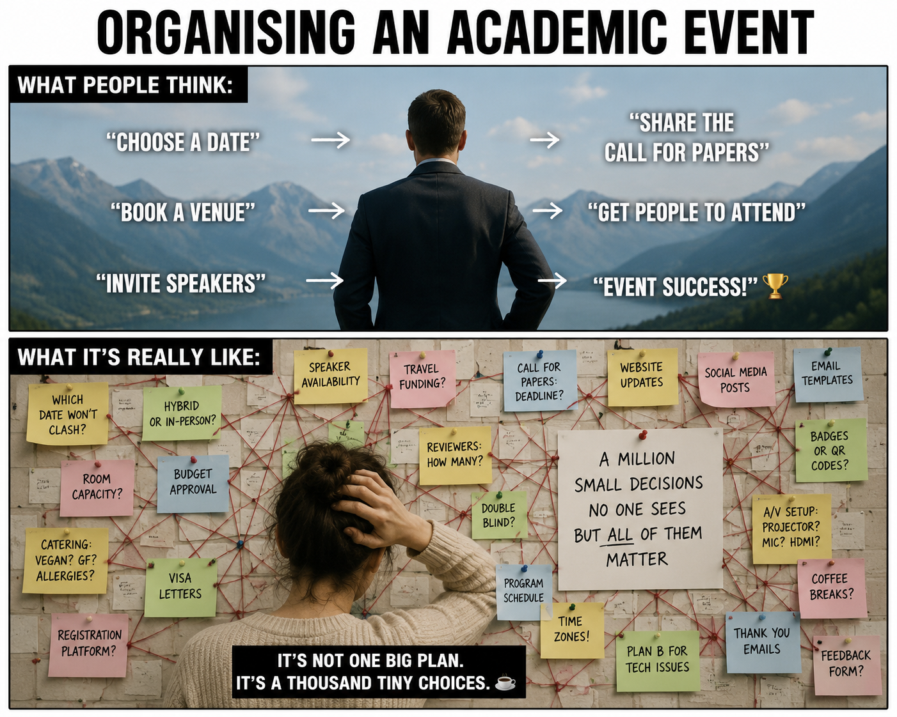
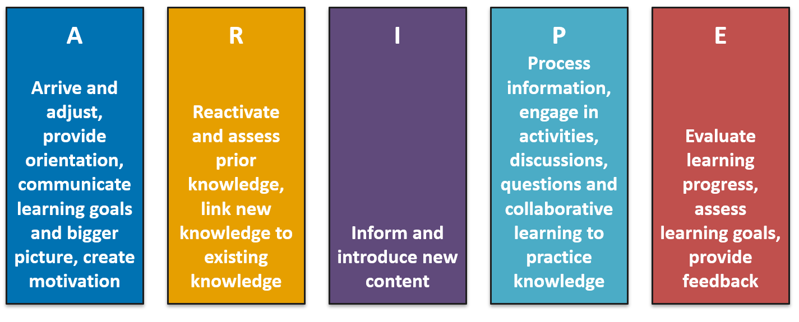
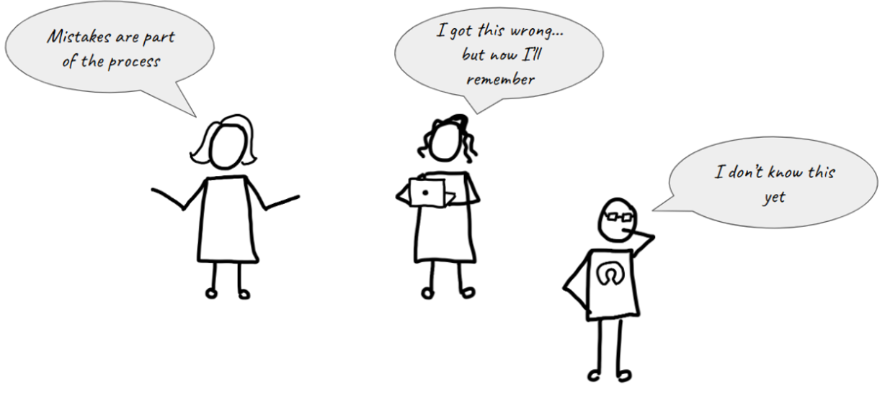
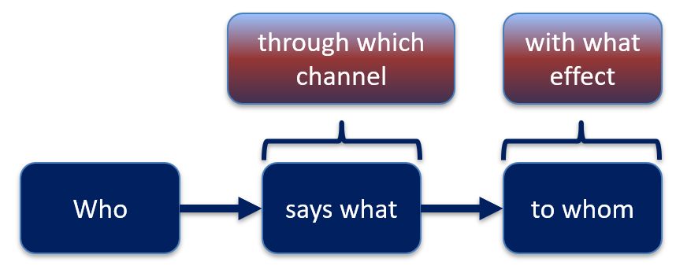
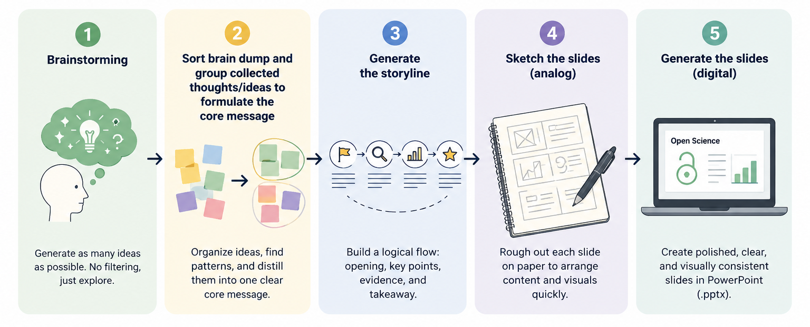
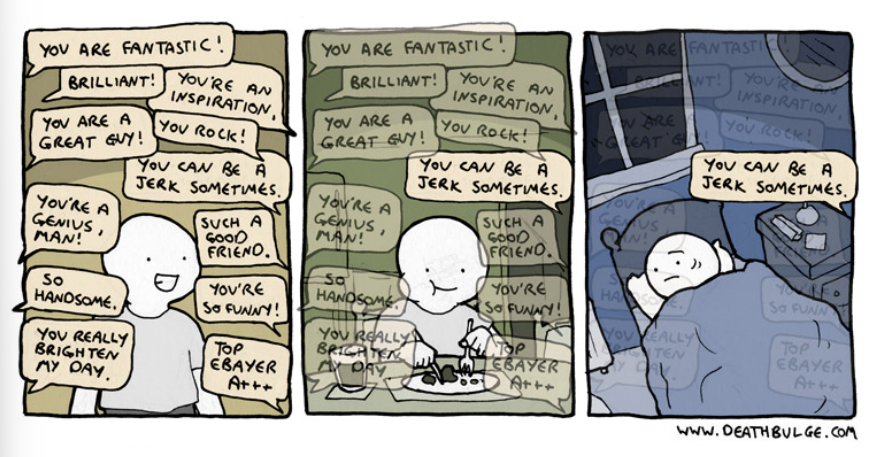
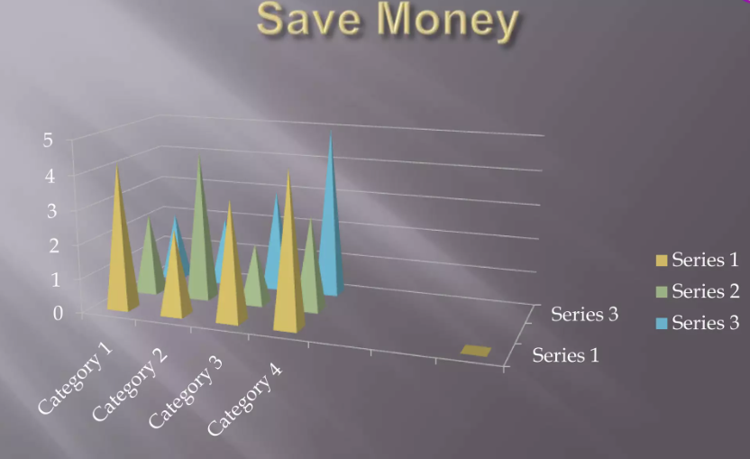

## Licence

 

  

This current work by Sarah von Grebmer zu Wolfsthurn, Sara Lil Middleton and Malika Ihle is licensed under a CC-BY-SA 4.0 [Creative Commons Attribution 4.0 International SA License](https://creativecommons.org/licenses/by-sa/4.0/deed.en). It permits unrestricted re-use, distribution, and reproduction in any medium, provided the original work is properly cited. If you remix, transform, or build upon the material, you must distribute your contributions under the same license as the original.

::: {.notes}
**Presenter Notes**: The Creative Commons Attribution–ShareAlike 4.0 license, or CC BY-SA 4.0, allows others to copy, share, and adapt a work in any medium, including for commercial purposes. These permissions are broad and cannot be withdrawn as long as the license terms are followed. The main requirement is attribution: users must give appropriate credit to the original creator, provide a link to the license, and clearly indicate whether any changes were made, without implying endorsement by the original author. In addition, the ShareAlike condition means that if someone modifies or builds upon the work, the resulting material must be distributed under the same CC BY-SA 4.0 license, or a compatible one. Finally, users are not allowed to apply legal or technical restrictions, such as DRM, that would prevent others from exercising these same rights.
:::

---

## Contribution statement

 

**Creator**: Von Grebmer zu Wolfsthurn, Sarah ({fig-alt="orcid logo"}
[0000-0002-6413-3895](https://orcid.org/0000-0002-6413-3895))

**Reviewer**: Middleton, Sara ({fig-alt="orcid logo"}[0000-0001-5307-8029](https://orcid.org/0000-0001-5307-8029))

**Consultant**: Ihle, Malika ({fig-alt="orcid logo"} [0000-0002-3242-5981](https://orcid.org/0000-0002-3242-5981))

::: {.notes}
**Presenter Notes**: These are the **presenter notes**. You will a script for the presenter for every slide. In presentation mode, your audience will not be able to see these presenter notes, they are only visible to the presenter. 

**Instructor Notes**: There are also **instructor notes**. For some slides, there will be pedagogical tips, suggestions for activites and troubleshooting tips for issues your audience might run into. You can find these notes underneath the presenter notes.

**Accessibility Tips**: Where applicable, this is a space to add any tips you may have to facilitate the accessibility of your slides and activities. 
:::

---

## Prerequisites - EDIT

::: {.callout-important}
Before completing this submodule, please carefully read about the prerequisites.
:::

| Prerequisite   |  Description  | Link/Where to find it   |
|------------|------------|------------|
| Core didactic principles | A firm grasp on important didactic tools and elements | [Download Link](https://quarto.org) |

::: {.notes}
**Presenter Notes**: For this session, it is important that you have previously thought about didactics and incorporating pedagogical elements in your teaching. You should be familiar with the basics of what learning means, the framework of constructivism, constructive alignment and how to set and formulate learning goals. If you are not yet familiar with these concepts, please see the previous session on "Core didactic principles" when teaching about Open Research. 

**Instructor Notes**: These are the prerequisites for this submodule. Before you get started on this submodule with your audience, you need to ensure that the audience fulfills these criteria.
:::

---

## Questions from previous submodule

 
 

What are your questions from the previous session?

::: {.notes}
**Presenter Notes**: What were your questions from the previous session? 
**Instructor Notes**: Instead of asking "Do you have any questions", work under the assumption that there are questions to show your learners that it is normal to ask questions and to still be unsure about specific elements of previous sessions. Instead, ask "What are your questions". 
:::

---

## Key terms and definitions

- **ARIPE+ scheme**: 
- **Positive error framing**: 
- **Error patterns** in the learning process:

::: {.notes}
**Presenter Notes**: Here are some  key concepts we will be discussing throughout the session. Thin for yourself what each one of these concepts means to you at this points, or have an educated guess based on your experience what the key term could mean. Then, discuss with your partner. We will then briefly discuss the terms in the plenum. At the end of the session, we will come back to these terms and you will have formed new concepts relared to each of these terms.

**Instructor Notes**: Identify prior knowledge of learners at this point and come back to possible misconceptions throughout the session. Use the think-pair-share method. Allow for about 5 minutes for this exercise.
:::

---

## Key terms and definitions

- **ARIPE+ scheme**: A didactic framework for planning competency-based instruction that structures learning in five phases.
- **Positive error framing**: A didactic approach that views mistakes as learning opportunities and encourages learners to analzye their errors to boost understanding, skills and confidence.
- **Error patterns** in the learning process: Systematic mistakes rather than random failure, critical indicators for how learners think and where the misconceptions lie

::: {.notes}
**Presenter Notes**: 

First, the ARIPE+ scheme by Städeli (2013) is a didactic framework that helps educators systematically plan learning experiences. It structures instruction into five phases, guiding learners from initial engagement and exploration through to application, feedback processes and reflection. 

Second, positive error framing refers to an educational mindset that treats mistakes as valuable learning opportunities. Instead of viewing errors as signs of failure, learners are encouraged to examine and understand them. This process helps deepen conceptual understanding, develop skills, and build confidence by creating a learning environment where experimentation and reflection are welcomed.

Finally, error patterns are recurring and systematic mistakes that occur during learning. Unlike random errors, these patterns provide important insights into learners’ thinking processes. By identifying and analyzing error patterns, educators can uncover underlying misconceptions and adapt instruction to address specific learning needs more effectively.

**Instructor Notes**: If you do the think-pair-share exercice the slide before, skip this slide, this is for learners to come back to these concepts in their own time.
:::

---

## Covered in this session

- **Practical** and **logistical** considerations when organizing an Open Research event
- **ARIPE+ scheme** to structure an OR event
- Assessing **prior/existing knowledge** in your learners
- Fostering **motivation**
- Providing useful **feedback**

::: {.notes}
**Presenter Notes**: This session focuses on both the practical and pedagogical aspects of organizing and delivering an Open Research event.

We will begin by looking at the practical and logistical considerations involved in planning and running an event.

Next, we will explore how the ARIPE+ scheme can be used to structure an individual lesson or event. This framework provides a clear sequence for designing learning activities and provides structure for your learners. 

A key element of successful instruction is understanding your audience. Therefore, we will discuss strategies for assessing learners’ prior knowledge and existing competencies, enabling you to tailor activities and support to their needs.

We will also examine ways of boosting motivation, considering how to create an engaging learning environment that encourages active participation, curiosity, and sustained involvement throughout the event.

Finally, we will address the role of feedback in the learning process. We will focus on how to provide feedback that is timely, constructive, and actionable, helping learners reflect on their progress and continue developing their skills.
:::

---

## Learning goals - EDIT

At the end of this session, you will be able to:

- Learning goal 1
- Learning goal 2
- Learning goal 3

::: {.notes}
**Presenter Notes**: Script for the slide here.

**Instructor Notes**:  

- **Aim**: Formulate specific, action-oriented goals learning goals which are measurable and observable in line with Bloom's taxonomy (Anderson et al., 2001; Bloom et al., 1956)

- Place an emphasis on the **verbs** of the learning goals and choose verbs that align with the skills you want to develop or assess.

- Examples: 
  - Learners will **describe** the process of photosynthesis or
  - Learners will **construct** a diagram illustrating the process of photosynthesis
  
:::

---

## Before we start: Survey time!

::: {.notes}
**Presenter Notes**: Script for the slide here. 
**Instructor Notes**:  
- **Aim**: The pre-submodule survey serves to examine learners' prior knowledge about the submodule's topic.
- Use free survey software such as particify or formR to establish the following questions (shown on separate slides).
:::

---

**What is your level of experience with organsing Open Research events (e.g., a workshop, a seminar, lecture, lecture series..)?**

a. I have never organized an Open Research event

b. I have organised 1-2 Open Research events

c. I have organized 3-10 Open Research events

d. I regularly organize Open Research events

e. Organizing Open Research events is all I do because it is my (literal) job. 

---

**What is your level of familiarity with the ARIPE+ scheme?**

a. I have never heard of it before.

b. I have heard of it but have never worked with it.

c. I have basic understanding and experience with it.

d. I am very familiar and have worked with it extensively.

---

**Which of the following pedagogical elements do you feel most confident about in your teaching?**

a. Probing and boosting motivation

b. Formulate and communicate learning goals for your event

c. Conceptualize and communicate the bigger vision of the event

d. Reactivate prior knowledge

e. Incorporate interactive activities and elements of collaborative learing into your teaching

f. Providing constructive feedback

---

## Discussion of survey results

 

What do we see in the results?

::: {.notes}
**Presenter Notes**: Let us have a look at these results. 

**Instructor Notes**:

- **Aim**: Briefly examine the answers given to each question interactively with the group. Use visuals from the survey to highlight specific answers.

**Accessibility Tip**: Have people work in pairs if someone did not bring their phone/does not have a phone. This survey also cannot be completed in an asynchronous setting. 
:::

---

## Your turn! 5 minutes

 
 

**Activity**:
 
**Why do you teach? What motivates you to teach?**
 
 
*Write a few bulletpoints on what motivates you to teach. Save this as part of your developing teaching philosophy for future reference.*

::: {.notes}
**Presenter Notes**: Time for an activity! Why do you teach? What motivates you to teach? Write a few bulletpoints on what motivates you to teach. Save this as part of your developing teaching philosophy for future reference. Keep this in mind as we go along.

**Instructor Notes**: Plan about 2 minutes for this activity.
:::

---

## General framework of an Open Research event

 

What do you think are some initial **points to consider** when you **plan** an **Open Research event**?
 
*(event = workshop, course, lecture, seminar, talk etc.)*

::: {.notes}
**Presenter Notes**: Next question when planniung an event on Open Research: what do you think are some initial **points to consider** when you **plan** an **event on Open Research**? An event could be a workshop, course, lecture, seminar, talk etc.

**Instructor Notes**: Answers that instructor might be looking for are: 
- What is a suitable topic?
- Who is my audience? How much experience do they have with Open Research topic X?
- What is the event format? 
- How long is the event/course?
- Prior learning goals or learning materials?
- What do my learners connect with Open Science?
:::

---

## Logistics: Practical considerations

{fig-align="center"}

 

Made with generative AI.

::: {.notes}
**Presenter Notes**: This is an illustration of what organising an academic event more generally can feel like: at first, it all seems very straightforward and the organization follows a more or less logical sequential flow. In reality though it can also feel a little more like in the image at the bottom, where you are constantly facing micro decisions, sometimes with little time to think about them and running about ten operations in parallel. 
:::

---

## Logistics: Practical considerations

Things to consider **when organizing an event**:

:::incremental
- **Who** could the target audience be?
- What are suitable **dates and times**?
- What does my **audience need**? (accessibility)
- What **modality** is suitable? (in-person, online, hybrid)
- What **equipment/materials/software** do I need?
- How can I **book rooms/equipment**?
- What are the **administrative procedures** (catering, room booking..)?
- How can I **advertise** my event?
:::

<!-- https://docs.google.com/document/d/1vh34ziAVGYErtco_8tNhfyOJo29x_BBk7g9UH08kzZU/edit?tab=t.0#heading=h.lw4i2wvq5ump -->

::: {.notes}
**Presenter Notes**: Before focusing on the learning design itself, it is important to consider the practical aspects of organizing an Open Research event. Good planning helps create an environment in which learners can fully engage with the learning activities.

The first question is who the target audience is. Are you designing the event for undergraduate students, doctoral researchers, professional staff, or a mixed audience? 

You should also think carefully about dates and times. Consider learners’ schedules, competing commitments, and time zones if the event includes online attendees. Choosing an appropriate time can have a significant impact on attendance and engagement. For example, if learners have to travel for your course, you might consider avoiding periods where there are large festivities in town happening at the same time.

Another important consideration is accessibility and learners needs. Think about whether learners may require accessible rooms, captioning, alternative formats for materials, or flexible participation options. This ties in with creating an inclusive learning environment.

Next, consider the most suitable modality. Depending on the goals and audience, an event may work best in person, online, or in a hybrid format. Each option offers different opportunities and challenges in terms of interaction, logistics, and resource requirements.

You will also need to identify any equipment, materials, or software required. This could include presentation equipment, laptops, workshop materials, collaboration tools, or specialized research software.

Related to this is understanding how to book rooms and equipment. Institutional procedures often require advance planning, and popular spaces or resources may need to be reserved well ahead of time.

In addition, familiarize yourself with any administrative procedures that may apply, such as room bookings, catering requests, registration systems, or approval processes. These practical details can have a significant impact on the smooth running of the event.

Finally, consider how you will advertise the event. Effective communication helps ensure that the intended audience is aware of the opportunity and understands its value. This might include email lists, institutional websites, newsletters, social media channels, or personal networks.

:::

---

## Structuring your event

:::incremental
- **Check your working conditions**:
  - How much **time** do I have? 
  - What **milestones** do we need to achieve? What is expected?
- **Formulate** a broader **vision** and **learning goals**:
  - What is the **journey** you are taking your learners on?
  - What are **broader goals** for the event?
  - What are the **specific goals** for individual sections/workshops?
  - How does it all **fit within** the existing context (program, syllabus..)?
  
:::

::: {.notes}
**Presenter Notes**: Once the logistical aspects are in place, the next step is to think about how to structure the event.

Start by considering your working conditions. How much time is available, and what milestones or outcomes are expected? Being clear about these constraints helps ensure that your plans are realistic and focused.

Next, develop a broader vision for the event. Think about the learning journey you want participants to experience and the overall goals you hope to achieve.

From there, define specific learning goals for individual sessions, workshops, or activities. These should contribute to the broader objectives of the event and provide a clear sense of purpose for both facilitators and learners.

Finally, consider how the event fits within the wider context, such as an existing program, curriculum, or institutional strategy. Alignment with the broader learning environment helps create a more coherent and meaningful experience for participants.

:::

---

## Structuring your lesson: The ARIPE+ scheme (Städeli et al., 2013)

{fig-align="center"}

 

*The "+" generally stands for elements connected to the **learning environment**, e.g., creating a supportive, accessible and safe environment, inclusivity, (body) language ... 

::: {.notes}
**Presenter Notes**: One useful framework for structuring an event or individual lesson on Open Research is the ARIPE+ scheme, developed by Städeli and colleagues (2013). The model organizes learning into a sequence of phases that guide learners from initial engagement with a topic through exploration, practice, application, and reflection. ARIPE+ helps educators design learning experiences that are active and learner-centered. Rather than focusing only on content delivery, the framework emphasizes what learners do, experience, and demonstrate throughout the learning process. The "+" generally stands for elements connected to the learning environment, e.g., creating a supportive, accessible and safe environment, inclusivity, (body) language ... 

In the following slides, we will explore each phase of the ARIPE+ scheme and consider how it can be applied when designing an Open Research event.

:::

---

## The ARIPE+ scheme

:::incremental
- **A** - *Arrive and adjust*: Provide orientation, outline journey and bigger picture, communicate learning goals, create and foster motivation
- **R** - *Reactivate*: Reactivate and assess prior knowledge, link new content to existing content (constructivism)
- **I** - *Inform*: Introduce new content
- **P** - *Process*: Activities, tasks, discussions, questions, collaborative learning
- **E** - *Evaluate*: Check progress on learning goals, feedback and assessment
:::

::: {.notes}
**Presenter Notes**: Talking about *how* to structure the learning process and the learning environment for your learners, the ARIPE model is highly relevant. There are different phases, which have been backed up by empirical evidence. 

- **A: Arrive and adjust**. This is where learners get oriented. Explain why the session matters, what they'll learn, how the workshop is structured,  how it connects to the bigger picture and what the intended learning goals are. This phase also helps establish motivation and creates a positive learning environment.

- **R: Reactivate**. Before introducing new ideas, help learners connect with what they already know. This could involve asking questions, discussing previous experiences, or using a quick activity to surface prior knowledge. Within the framework of constructivism, learning is much more effective when new information can be linked to existing mental models.

- **I: Inform**. This is the instructional phase where you introduce new concepts, methods, or skills. Rather than trying to cover everything, focus on the key ideas that learners need in order to achieve the learning goals that you introduced in the first phase.

- **P: Process**. Learning happens through active engagement. Give participants opportunities to apply what they've learned in the previous phase through exercises, discussions, problem-solving, or collaborative activities. This is often the longest phase of a workshop because practice is essential for learning.

- **E: Evaluate**. Finally, check whether learners have achieved the intended outcomes. Evaluation doesn't have to mean a formal test or exam, it can be reflection, instructor or peer feedback, a short quiz, or a practical task. It also gives you valuable information about what learners have understood and what may need further clarification. The modality and practicalities around this should also already be clearly explained during the first phase to manage expections of your learners.

**Instructor Notes**: While the model is presented as a linear framework, in practice you may move back and forth between phases depending on your learners and context.
:::

---

## **A** - *Arrive and adjust*: Orientation

Provide **orientation** at the start and the end:

:::incremental
- Accessibility and **equipment** needed (*laptop, software installed, internet access ...*)
- Explain what **materials** will be needed (*slides, cheatsheets, Moodle, GitHub*) and where to find them)
- Highlight the **modality** (*hybrid/in-person/online*)
- Let your learners find **common goals** and shared interests
- Communicate **milestones** and important dates (*deadlines, homework assignments, intermediate and final assessments*)
- Clarify your **expectations** to the learners (*attendance, homework, criteria for obtaining a certificate, assessments, general conduct...*)
:::

::: {.notes}
**Presenter Notes**: The *Arrive and Adjust* phase starts before you teach any content. Your goal is to help learners feel prepared and know what to expect.

Begin by checking that everyone has what they need. For example, do they have a laptop, the required software installed, a stable internet connection, or access to the online platform? Solving technical issues early saves time later.

Next, explain what materials you'll be using and where learners can find them. This might include the slides, cheat sheets, Moodle, GitHub, or any other resources. Make it easy for learners to know where to look during and after the session.

Be clear about how the course will run. Is it in person, online, or hybrid? If some learners are joining remotely, explain how they can ask questions, join discussions, or take part in activities.

If possible, help learners get to know each other. A short introduction or discussion can help participants discover shared interests or common goals of why they are together in this session. This creates a more welcoming learning environment and makes collaboration easier.

Clearly communicate the learning goals. Explain what learners should be able to do by the end of the session or course. Knowing the destination helps learners understand why each activity is included.

Point out important milestones such as homework, deadlines, assessments, or major activities. This helps learners plan their time and reduces uncertainty.

Finally, be clear about your expectations. Explain practical matters such as attendance, participation, homework, assessment methods, requirements for a certificate, and expectations for respectful behavior. Setting these expectations from the beginning helps create a positive and productive learning environment.
:::

---

## **A** - *Arrive and adjust*: Journey and bigger picture

- Clearly communicate where learners are headed and the **vision** or **bigger picture**
  - e.g., "*Today's workshop helps you move from using open research practices yourself to learning how to teach these practices to the next generation of researchers using evidence-based methods.*"

{fig-align="center"}

::: {.notes}
**Presenter Notes**: People are more motivated when they understand not just what they are learning, but why it matters.

At the beginning of a session, explain the bigger picture. Help learners see how today's topic fits into the overall course, their professional development, or the wider impact of their work.

For example, instead of simply saying, "Today we'll learn about teaching methods," you could say:

"Today's workshop helps you move from using open research practices yourself to learning how to teach these practices to the next generation of researchers using evidence-based methods."

This gives learners a sense of purpose. It shows that the workshop is not just about learning a new skill, but about increasing their impact by helping others adopt good research practices.

**Instructor Notes**: You can return to this vision at the end of the session. Briefly remind learners what they have achieved today and how it moves them one step closer to that larger goal. This helps connect individual activities to the overall learning journey and reinforces motivation.
:::

---

## **A** - *Arrive and adjust*: Learning goals

- Clearly communicate the **learning goals**
  - State the **learning goals** for the course/event series and provide an outlook on how you are planning to achieve them with your audience

{fig-align="center"}

- **Examples**:
  - "*Learners will **compare** traditional publishing models with open-access publishing models*
  - "*Learners will **create** a reproducible research document using Quarto and **publish** it on GitHub*"

::: {.notes}
**Presenter Notes**: Clearly communicate the learning goals. Explain what learners should be able to do by the end of the session or course. Knowing the destination helps learners understand why each activity is included.

In the first example, "Learners will compare traditional publishing models with open-access publishing models." The key action is compare. This tells us that learners are expected to analyse similarities and differences, not just remember definitions.

In the second example, "Learners will create a reproducible research document using Quarto and publish it on GitHub." Here, the actions are create and publish. These are practical skills that learners can demonstrate by producing a real output.

**Instructor Notes**: Remember: A useful question to ask when writing a learning goal is: "How will I know that learners have achieved this?" If you can clearly observe or assess the action, your learning goal is probably well written.
:::

---

## Your turn! 10 minutes

**Thought experiment**: Imagine that you give a half-day workshop on *Git* to a group of ten learners. In groups, write down concrete examples on how you could provide orientation at the start of the Git workshop.

- **Equipment and materials**: 
- **Modality**: 
- **Activity on finding common goals**:
- **Milestones to achieve during the workshop**:
- **Learning goals**: 
- **Expectations**: 

::: {.notes}
**Presenter Notes**: Now it's your turn to put all of this into practice. Imagine that you are teaching a half-day workshop on Git to a group of ten learners. Your task isn't to plan the technical content yet. Instead, focus only on the Arrive and Adjust phase.

Working in small groups, think about how you would help learners feel prepared, motivated, and ready to learn before introducing Git itself.

For each of the prompts on the slide, write down one or two concrete examples. For example, what equipment or materials would participants need? How would you explain the workshop format? What activity could help learners discover shared interests or goals? What milestones would you communicate? What learning goals would you share? And what expectations would you set from the beginning?

You have 10 minutes to discuss and write down your ideas. Afterwards, we'll come back together and compare approaches to see the range of possibilities.
:::

---

## **A** - *Arrive and adjust*: Motivation

**Why does motivation (and demotivation!) matter when teaching and learning?**

:::incremental
- Applying didactic tools can be unsuccessful if learners are **demotivated**
- Motivation (and demotivation) are **contagious**
- Motivation can be **positively influenced** by the instructor
:::

::: {.notes}
**Presenter Notes**: Motivation is a critical element in the learning process. It matters because even the best-designed learning activities are less effective if learners do not see the value in participating or do not feel engaged. You can have excellent content and well-planned exercises on open research topics, but if learners are disengaged, learning becomes much harder. Motivation is especially important in the context of open research, because some of its practices are difficult to implement in different contexts, learners may face obstacles or challenges within their research groups etc. 

When learners are curious, engaged, and willing to participate, that positive energy often encourages others to join in. The opposite is also true, if frustration or disengagement spreads, it can affect the whole learning environment. This can come from both the other learners, or the instructor.

The good news is that instructors can influence motivation. You can't control every learner's level of interest, but you can create conditions that support motivation and make it a key element of the design process. Explaining why the topic matters, connecting it to learners' goals, providing achievable challenges, creating opportunities for success, and fostering a respectful and inclusive atmosphere can all make a real difference.
:::

---

## Probing and enhancing motivation in your learners

 

**Activity**: Think back to open research courses, workshops or seminars you attended in the past. Consider things that a **teacher or trainer** has **said or done** that you found either **motivating** or **demotivating**. 
 
 
*Try to think of at least two examples for each, and then share them with your  neighbor. You have 5 minutes.*

[https://zenodo.org/records/18905547](https://zenodo.org/records/18905547)
 
[https://carpentries.github.io/instructor-training/08-motivation.html#brainstorming-motivational-impacts](https://carpentries.github.io/instructor-training/08-motivation.html#brainstorming-motivational-impacts)

::: {.notes}
**Presenter Notes**: How would you know if your learners are motivated? And what could you do to motivate them in the first place?

Think back to an open research course, workshop, or seminar that you've attended. Focus on the instructor rather than the content. What did the teacher or trainer say or do that made you feel more motivated to learn more about this open research topic? And what did they say or do that had the opposite effect and reduced your motivation?

Try to come up with at least two examples of motivating behaviors and two examples of demotivating behaviors. 

Once you've had a minute or two to think individually, turn to the person next to you and share your examples. As you listen to each other, see if you notice any common themes.

We'll then bring some of these ideas back to the whole group and discuss what they tell us about creating a motivating learning environment.

Take 5 minutes for this activity.

**Instructor Notes**: Some examples: how the instructor responded to questions, how they introduced the topic, how they gave feedback, or how they interacted with the group.
:::

---

## Motivation: Lessons

 
 

**What can *you* do to enhance motivation in your learners?**

::: {.notes}
**Presenter Notes**: Bringing it all together, let us now discuss concrete strategies how you can actively increase motivation in your learners.
:::

---

## Lesson 1: Explore why the topic matters

Learning is most successful when we **care about the topic** and when learners believe they can acquire a skills with **reasonable time and effort**.

 

::: {.callout-tip}
## What you can do: 
Start by exploring **what brought learners to this lesson** and **what motivates and interests them** about the topic, e.g., through short questions or an interactive poll.
:::

[https://zenodo.org/records/18905547](https://zenodo.org/records/18905547)

::: {.notes}
**Presenter Notes**: Learning works best when two things come together: first, when learners actually care about the topic, and second, when they feel that they can realistically learn it with the time and effort available. If either of these is missing, engagement drops quickly.

As instructors, we often start with content. But here, the focus is on starting with the learners instead.

At the beginning of a lesson, take time to understand what brought learners here. Ask yourself: Why did they join this session? What are they hoping to get out of it? What problems are they trying to solve, or what interests do they already have in the topic? When learners see that the topic relates to their goals or challenges, they are more likely to stay engaged and persist when things become difficult.

A simple way to do this is to ask short questions, run a quick poll, or have a short pair discussion at the start of the session.
:::

---

## Lesson 2: Establish an early feeling of success

Kick-start the learning process by focusing on something **useful** and **relevant** that requires comparatively **low effort** and connects the materials to their **own interests/goals**.

 

::: {.callout-tip}
## What you can do: 
Beginn the lesson with something that is **quick to learn** and **useful to your learners**. Use examples and task from real-life scenarios, e.g., things you encountered before.
:::

[https://carpentries.github.io/instructor-training/08-motivation.html#invite-participation](https://carpentries.github.io/instructor-training/08-motivation.html#invite-participation)

::: {.notes}
**Presenter Notes**: When people start learning something new, confidence matters a lot. If the first task feels too difficult or too abstract, learners can quickly feel overwhelmed. But if they achieve something useful early on, it builds confidence and momentum. The idea here is to begin with something that is simple to understand, quick to complete, and clearly relevant to the learners’ own goals or work.

This does not mean simplifying the whole topic. It means choosing a first step that gives learners a positive experience and shows them that progress is possible.

One effective approach is to use real-life examples or scenarios that learners can relate to. For instance, you might use a small task based on a situation you have encountered in your own work, or something that learners are likely to face in their context and that they can immediately succeed at.

The key is that learners should quickly see: “I can do this,” or “this is useful for me.”
:::

---

## Lesson 3: Invite participation from learners

- Encourage and foster an **interactive environment **for learners to ask questions, discuss difficulties and demonstrate prior knowledge
- Actively engage learners **early on** in the lesson

 

::: {.callout-tip}
## What you can do: 
Introduce an **interactive activity** early on in the lesson, e.g., "*What brings you here today?*" and then discuss in the plenum.
:::

[https://carpentries.github.io/instructor-training/08-motivation.html#invite-participation](https://carpentries.github.io/instructor-training/08-motivation.html#invite-participation)

::: {.notes}
**Presenter Notes**: Learning is not something that happens by just listening. People learn more effectively when they are actively engaged—when they ask questions, share ideas, and connect the content to what they already know.

As instructors, we can support this by creating an interactive environment early in the lesson. This means making it clear from the start that questions are welcome, discussion is encouraged, and learners’ own experiences are valuable.

It is especially important to involve learners early on. If a session starts with a long period of passive listening, it can be harder to get participation later. But if learners are engaged from the beginning, they are more likely to stay active throughout.

A simple way to do this is to start with a short interactive activity. For example, you might ask: “What brings you here today?” Then give learners a moment to think, discuss with a neighbour, or share in the group.

**Instructor Notes**: Get learners to think back about their own experiences when starting this session. 
:::

---

## Lesson 4: Encourage learners to learn from each other

- Encourage learners to **talk through** the learning process **with peers** to maximize learning
- Helps to (partially) **level out** potential differences in prior knowledge or experience

 

::: {.callout-tip}
## What you can do: 
Integrate activities **in pairs** to foster the exchange. 
:::

[https://carpentries.github.io/instructor-training/08-motivation.html#invite-participation](https://carpentries.github.io/instructor-training/08-motivation.html#invite-participation)

::: {.notes}
**Presenter Notes**: Learning is often more effective when learners talk to each other, not just to the instructor. When they explain ideas in their own words, ask questions, or compare approaches, they deepen their understanding.

Peer learning also helps manage differences in prior knowledge. In any group, some learners will already have experience with the topic, while others are completely new. When learners work together, they can support each other and help close these gaps in understanding.

As instructors, we can support this by deliberately building in opportunities for interaction between learners.

A simple and effective approach is to use pair activities. Instead of only addressing the whole group, ask learners to discuss a question with a partner, explain a concept to each other, or compare their solutions to a task.

**Instructor Notes**:
:::

---

## Lesson 5: Acknowledge and integrate confusion

- Make confusion an integral **part of your teaching**
- **Explore** confusion with **kindness**
- **Reward learners** for sharing vulnerable information

 

::: {.callout-tip}
## What to do: 
Integrate **formative assessments** or quizzes to pinpoint misunderstandings. **Validate** the thinking process and ask for **collaboration** from other learners on resolving any confusion.
:::

[https://carpentries.github.io/instructor-training/08-motivation.html#invite-participation](https://carpentries.github.io/instructor-training/08-motivation.html#invite-participation)

::: {.notes}
**Presenter Notes**: A key aspect of boosting motivation is confusion, which at first maybe feels counterintuitive. Confusion is not something to eliminate as quickly as possible. In fact, a certain amount of confusion is often a sign that learning is taking place. When learners encounter information that challenges their existing understanding, they have an opportunity to build stronger mental models, provided they feel safe enough to explore that uncertainty.

The first point is to make confusion an integral part of your teaching. Rather than presenting a workshop as a smooth transfer of knowledge, normalize that moments of uncertainty are expected. You might even tell participants at the beginning that feeling confused is a natural part of learning something new, especially when discussing topics like open science, where practices and terminology may be unfamiliar or evolving.

When someone expresses uncertainty or gives an incomplete answer, avoid immediately correcting them or moving on. Instead, become curious about their thinking. Ask questions like, "Can you tell us what led you to that conclusion?" or "What part feels unclear?" This helps uncover misconceptions while demonstrating that the learning process is valued just as much as the correct answer.

It is equally important to reward learners for sharing vulnerable information. Admitting "I don't understand" or "I thought it worked differently" requires some form safe space. Thank learners for raising these questions, because chances are others are wondering the same thing. A simple response such as, "Good that you asked, that's an important question," reinforces that speaking up contributes to everyone's learning.
One practical strategy is to integrate formative assessments throughout the workshop. These can be quick polls, multiple-choice questions, short reflective prompts, or think–pair–share activities. Their purpose is not to evaluate learners but to give both you and the learners insight into current understanding and identify misconceptions before they become entrenched.
:::

---

## Lesson 6: Praise effort and improvement

- Evidence suggests that learner perseverance is best supported in the long term by **praising effort or improvement** rather than ability or performance
- Leverage the power of "*yet*"

 

::: {.callout-tip}
## What you can do: 
Transform quests for help or support by learners by **adding the word *yet* **: "I cannot do this *yet*", "I do not understand *yet*". 
:::

::: {.notes}
**Presenter Notes**: Another lesson is about how the way we give feedback can influence motivation and learning. Evidence suggests that learners are more likely to persevere when we praise their effort and improvement rather than their ability or performance. This reinforces that learning happens through practice and persistence.

A simple but powerful way to support this mindset is to use the word yet. Encourage learners to reframe statements such as "I can't do this" or "I don't understand" as "I can't do this yet" or "I don't understand yet." This emphasizes that learning is an ongoing process and that understanding can develop over time.

When learners ask for help or support, model this language yourself and encourage them to adopt it. This small change can help learners approach challenges with greater confidence and persistence.
:::

---

## Your turn! 5 minutes

**Which of the following praise statements are effort-based, improvement-based, or performance based?**

1. That’s exactly how you do it, you haven’t gotten it right yet, but you have tried two different strategies to solve that problem. Keep it up!
2. You are getting to be really good at that. See how it pays to keep at it?
3. Wow, you did that perfectly without any help. Have you thought about taking more computing classes?
4. That was a hard problem. You did not get the right answer, but look at what you learned trying to solve it!
5. Look at that, you are just a natural!

::: {.notes}
**Presenter Notes**: Let's have a look at your conceptualization for effort-based, improvement-based and performance-based phrasing. Remember that we want to encourage and validate the effort, and the improvement as opposed to the performance per se. Which of the following praise statements are effort-based, improvement-based, or performance based?

**Instructor Notes**: Answers:
1. Effort-based.
2. Improvement-based.
3. Performance-based.
4. Improvement-based.
5. Performance-based.
:::

---

## Lesson 7: You can be learning too!

- Present yourself (the instructor) as a learner
- Let your learners **relate** to you
- **Make useful mistakes**!
- Leverage your own mistakes or knowledge gaps for **positive error framing**

::: {.callout-tip}
## What you can do:
When discussing an activity involving coding, use the opportunity when you make mistakes to embrace them with enthusiasm and present them as a learning opportunity rather than an index for failure or incompetence. 
:::

[https://carpentries.github.io/instructor-training/08-motivation.html#brainstorming-motivational-impacts](https://carpentries.github.io/instructor-training/08-motivation.html#brainstorming-motivational-impacts)

::: {.notes}
**Presenter Notes**:  Remember that instructors are learners too. By presenting yourself as someone who is still learning, you help create a more open and supportive learning environment. Let learners relate to you by being honest about your own learning experiences, challenges, or knowledge gaps. This shows that learning is a continuous process, even for experienced instructors.

Don't be afraid to make useful mistakes. For example, when live coding, a mistake can become a valuable teaching moment. Instead of apologizing or hiding it, show learners how you identify the problem, think through possible solutions, and correct it.

This is an example of positive error framing. By responding to mistakes with curiosity rather than frustration, you model that errors are a normal and useful part of learning. This can help learners feel more confident to experiment, ask questions, and learn from their own mistakes.
:::

---

## Embrace errors as part of the learning process

  
  
<em>Errors as part of the learning process.</em>

::: {.notes}
**Presenter Notes**:

**Instructor Notes**:
:::

---

## Lesson 7: Your motivation matters too!

:::incrememental
- Learners **mirror the instructor's motivation** and enthusiasm
- Teaching inherently demands (self-)motivation
  - Mantaining it in light of challenges during teaching boosts your own teaching skills
:::

[https://carpentries.github.io/instructor-training/08-motivation.html#not-just-learners](https://carpentries.github.io/instructor-training/08-motivation.html#not-just-learners)

::: {.notes}
**Presenter Notes**: Motivation is not just important for learners, but also for us as instructors. Learners often mirror the instructor's motivation and enthusiasm. When we show genuine interest in the topic and create a positive learning environment, learners are more likely to stay engaged and motivated themselves.

At the same time, teaching takes effort. Not every session will go as planned, and challenges are a normal part of teaching. Maintaining your own motivation during these moments can help you respond constructively and continue developing your teaching skills. Remember that you do not have to be a perfect instructor. Approaching teaching with curiosity, enthusiasm, and a willingness to keep learning benefits both you and your learners.
:::

---

## Your turn! 10 mins

**Activity**: Let us get back to our planned **Git workshop** for a group of learners. 

1. What are **concrete activities** where you could **actively boost motivation** in your learners? 

2. What could some Git-specific **factors** be that could **demotivate** your learners at the workshop? 

::: {.notes}
**Presenter Notes**: Thinking about the Git workshop that we started planning earlier: What are **concrete activities** where you could **actively boost motivation** in your learners?  What could some Git-specific **factors** be that could **demotivate** your learners at the workshop? 

Take 10 minutes for this exercise. 
:::

---

## ARIPE+ scheme

{fig-align="center"}

::: {.notes}
**Presenter Notes**: For a quick orientation, we have just been discussing the A - arrive and adjust phase of the ARIPE scheme. Lots went in there. Let us now move onto the next phase. 

:::

---

## **R** - *Reactivate*

**Remember**: Learners *bring* prior knowledge into the learning environment, can *help* or *hinder* learning.

 

**Activity**: How could you **explore** and **activate** prior knowledge on *Open Science* in your learners?

[https://zenodo.org/records/18905547](https://zenodo.org/records/18905547)

::: {.notes}
**Presenter Notes**: Moving onto the second phase of the ARIPE scheme, we are now in the reactivate phase. Before introducing new concepts, it is important to remember that learners already bring knowledge, experiences, and ideas into the learning environment.

This prior knowledge can support learning if it is accurate, but it can also make learning more difficult if learners have misconceptions or different understandings of key concepts. Taking time to explore what learners already know helps you build on their existing knowledge and identify areas that may need clarification.

For this activity, think about how you as the instructor could explore and activate prior knowledge in an Open Science workshop. 

**Instructor Notes**: Encourage using examples from this session, or examples such as asking learners what Open Science means to them, using a short poll or quiz, or having learners discuss their previous experiences in pairs before introducing new content, see also the next slide for an overview.
:::

---

## **R** - *Reactivate*

Methods to **explore and activate** prior knowledge:

:::incremental
- **Exchange** with other teaching colleagues about the content of preceding workshops
- **Pre-session surveys** and quizzes to identify existing knowledge
- **Brainstorm** with learners 
- Check for **error patterns** in the homework assignment
- Explicitly **link new materials** to elements from previous sessions
- Use **analogies** and examples that connect to existing knowledge
- ...
:::

::: {.notes}
**Presenter Notes**: Some ideas and concrete strategies to explore and reactivate prior knowledge:

- **Exchange** with other teaching colleagues about the content of preceding workshops
- **Pre-session surveys** and quizzes to identify existing knowledge
- **Brainstorm** with learners 
- Check for **error patterns** in the homework assignment
- Explicitly **link new materials** to elements from previous sessions
- Use **analogies** and examples that connect to existing knowledge
- ...

**Instructor Notes**: Visualize these ideas on a whiteboard or an online visualization tool for everyone to see. 
:::

---

## Reactivating prior knowledge: analogies

{fig-align="center"}

 Image generated with AI and adapted from
[https://nicebread.github.io/Empra1_2026/slides/Replicability_Crisis/OS-M1-S1-Replicability-slides.html#b58fc729-690b-4000-b19f-365a4093b2ff7b7b3c2066612070656f706c652d67726f75702073697a653d3178203e7d7d-the-used-car-dealer-10-min](https://nicebread.github.io/Empra1_2026/slides/Replicability_Crisis/OS-M1-S1-Replicability-slides.html#b58fc729-690b-4000-b19f-365a4093b2ff7b7b3c2066612070656f706c652d67726f75702073697a653d3178203e7d7d-the-used-car-dealer-10-min)

::: {.notes}
**Presenter Notes**: One possible analogy:

*Imagine that being a researcher can go two different ways: you can be the **used car dealer** (= researcher), who hides the main parts of the used car (= scientific work) under the hood (= non-transparency), so that from the outside it all looks nice and shiny.  Or you can be the **skeptical buyer** (= researcher supporting open research) who would want to look under the hood and also opens the hood for everyone to see (= transparency. **Which researcher do you want to be?***"

**Instructor Notes**:
:::

---

## Your turn! 5 minutes

 

**Think of a different analogy connected to open research or an open research tool you are familiar with**.  
*Explain your analogy to your group members.* 

<!-- *e.g., "Open Science is like moving from your home kitchen to a shared global cookbook"* -->

::: {.notes}
**Presenter Notes**: Your turn for analogies! Think of a different analogy connected to open research or an open research tool you are familiar with Explain your analogy to your group members. You have 5 minutes. 

:::

---

## ARIPE+ scheme

{fig-align="center"}

::: {.notes}
**Presenter Notes**: Moving onto the third phase of the ARIPE scheme: Inform. 
:::

---

## **I** - *Inform* 

Communication model by *Lasswell (1948)*:

 

{fig-align="center"}

::: {.notes}
**Presenter Notes**: The next phase is all about informing or conveying content. At this stage, the instructor provides core concepts, explanations, and models that learners need to understand the topic. The goal is to give learners a shared foundation of accurate information.
Lasswell’s communication model is a simple way to describe communication using five questions: **Who says what, in which channel, to whom, and with what effect?**

- Who: the instructor or facilitator
- Says what: the key concepts or content being taught
- Channel: the teaching method (lecture, slides, demo, discussion)
- To whom: the learners
- Effect: learners understand and build a shared knowledge base

**Instructor Notes**:
Who: the instructor or facilitator
Says what: the key concepts or content being taught
Channel: the teaching method (lecture, slides, demo, discussion)
To whom: the learners
Effect: learners understand and build a shared knowledge base
:::

---

## **I** - *Inform*: Designing slides

...is a **process**: 

{fig-align="center"}

Made with generative AI.

::: {.notes}
**Presenter Notes**: The Lasswell model is particularly important when using slides to inform your learners about content, concepts, models, explanations, skills etc. It is a useful framework to think about the purpose and message of your slides, not just the content and to design slides with intent. 

Designing slides is a process. While it is beyond the scope of this session to go into detail, keeping the Lasswell model in mind can help you move through the basic stages of designing slides. First, you braindump your ideas. Next, you sort your brain dump and formulate the core message. Next, you generate the flow of the story you are trying to tell. Next, you sketch out the slides in an analog format. Finally, you create them digitally. 

**Instructor Notes**: Emphasize that this could be a session in itself and is merely intended as a brief overview. Welcome questions about this at the end. 
:::

---

<!-- ## **I** - *Inform*: Designing slides -->

<!-- ...is a **process**:  -->

<!-- :::incremental -->
<!-- 1. Brainstorming -->
<!-- 2. Sort brain dump and group collected thoughts/ideas to formulate the core message -->
<!-- 3. Generate the storyline -->
<!-- 4. Sketch the slides (analog) -->
<!-- 5. Generate the slides (digital) -->
<!-- ::: -->

<!-- ::: {.notes} -->
<!-- **Presenter Notes**: -->

<!-- **Instructor Notes**: -->
<!-- ::: -->

---

## Useful principles for designing slides

:::incremental
- Learning effect largest when **visual and auditory channels** are activated

- **Arrangement of elements matters**: place the most important elements in the top left, arrange the rest according to importance

- **Play with contrast**: Contrast two elements by changing the size, the shape, color, proximity or direction

- **Less is sometimes more**: Consciously incorporate empty spaces into your slides to direct attention to the important elements
:::

Bühler, P., Schlaich, P. & Sinner, D. (2017). Visuelle Kommunikation: Wahrnehmung - Perspektive - Gestaltung (1. Aufl.). Vieweg.

::: {.notes}
**Presenter Notes**: When designing slides, here are some useful guiding principles. 

Learning is often more effective when information is presented through both visual and auditory channels, so combining spoken explanation with clear visuals can support understanding.

The arrangement of elements on a slide matters. Viewers tend to focus first on the top left, so placing the most important information there and organizing other elements by importance can help guide attention.

Contrast can be used to highlight differences or key points. This can be done through changes in size, shape, color, proximity, or direction to make important elements stand out.

Finally, less content can improve clarity. Leaving empty space on a slide helps reduce visual overload and directs attention to what matters most.

**Instructor Notes**: Have examples ready to show if your learners ask for them. 
:::

---

### Tangent: Want to know more about designing slides?

 
 

Check out [PROFiL](https://www.lmu.de/profil/de/) and their courses on slide design!

::: {.notes}
**Presenter Notes**: If you want to know more, please visit the website of Profil if you are an LMU member or contact your local didactics expert!
:::

---

## ARIPE+ scheme

{fig-align="center"}

::: {.notes}
**Presenter Notes**: We have reached the fourth stage of successful learning, the processing stage. 
:::

---

## **P** - *Process*

- Incorporate **activities**, **discussions** and **collaborative learning** to practice and consolidate learning

- Make use of activation methods for maximizing learning outcomes, see next session!

::: {.notes}
**Presenter Notes**: The Process stage of ARIPE focuses on what learners do with new information. Instead of only receiving input, learners actively work with the content to deepen and consolidate their understanding.

This is where activities, discussions, and collaborative learning become central. For example, learners might solve a problem together, discuss a concept in pairs, or apply new knowledge to a short task. These interactions help learners test and refine their understanding.

Activation methods are especially useful in this stage. They support learners in engaging with the material in different ways and help strengthen learning outcomes. We will explore specific activation methods in the next session.
:::

---

## ARIPE+ scheme

{fig-align="center"}

::: {.notes}
**Presenter Notes**: Reaching the evaluation stage! This is where learners and instructors assess understanding and learning outcomes to determine what has been achieved and what may need further development.
:::

---

## **E** - *Evaluate*: Feedback

{fig-align="center"}

[https://carpentries.github.io/instructor-training/11-practice-teaching.html#feedback-is-hard](https://carpentries.github.io/instructor-training/11-practice-teaching.html#feedback-is-hard)

::: {.notes}
**Presenter Notes**: Depending on the types of people and learners we are, you may encounter learners who are biased towards weighing the negative feedback more than the positive, because our brain seeks survival and not happiness, so it tries to extract information necessary for survival from negative feedback whenever possible. This makes feedback an extremely important tool in your teaching, particularly when you are teaching about Open Research practices where confidence with the topic might be low to begin with. 
:::

---

## Providing feedback to learners to enhance learning

:::incremental
- Actively **initiate** feedback exchanges
- Provide **targeted** feedback **early on** in the process so that learners can adapt
- Be **constructive** in your feedback: What is a next step from here?
- **Connect** it to the learning goals
- **Balance** positive and negative feedback
- Integrate **peer feedback** elements
:::

[https://www.cultureamp.com/blog/how-to-give-feedback-to-peers](https://www.cultureamp.com/blog/how-to-give-feedback-to-peers)

[https://www.youtube.com/watch?v=KE9NleGZqPk](https://www.youtube.com/watch?v=KE9NleGZqPk)

[https://zenodo.org/records/18905547](https://zenodo.org/records/18905547)

::: {.notes}
**Presenter Notes**: Some strageties where you can use feedback to enhance the learning process:

- Actively **initiate** feedback exchanges rather than waiting for learners to request them
- Provide **targeted feedback early** so learners can adjust during the learning process
- Make feedback **constructive** by focusing on **clear next steps**
- **Link** feedback explicitly to the learning goals
- **Balance** positive and corrective feedback to support learning and motivation
- Include **peer feedback** to increase engagement and shared learning

:::

---

## Feedback considerations

:::incremental
- Giving and receiving feedback can be **hard**
- Lead the feedback conversation with **empathy**
- Your **words matter**
:::

[https://zenodo.org/records/18905547](https://zenodo.org/records/18905547)

::: {.notes}
**Presenter Notes**: Giving and receiving feedback can be challenging, especially when it involves uncertainty or differing perspectives.

It can help to lead feedback conversations with empathy, by paying attention to how messages may be received and creating space for dialogue.

The choice of words matters, as feedback can influence how learners understand their progress and how they approach future learning.
:::

---

## Your turn: Giving feedback - 10 mins

**Roleplay "feedback giver" - observer: Practice giving feedback on the following slide**.  
*The observer provides feedback on the feedback in relation to whether feedback was targeted, constructive and balanced.*

{fig-align="center"}

[https://www.slideshare.net/slideshow/bad-powerpoint-example/2260367](https://www.slideshare.net/slideshow/bad-powerpoint-example/2260367)

::: {.notes}
**Presenter Notes**: In this activity, you will work in pairs or small groups and take on different roles.

One person acts as the feedback giver and practices giving feedback based on the example on the slide. Focus on making your feedback targeted, constructive, and balanced.

Another person acts as the observer. The observer’s role is to watch the interaction and then give feedback on the feedback given. Pay attention to whether the feedback was specific, focused on next steps, and included both positive and developmental points.

After the roleplay, briefly discuss what worked well and what could be improved in the feedback approach.

You have 10 minutes.

:::

---

## E - Evaluate: Wrapping up

:::incremental
- **Summarize and recap** covered content
- Reiterate the **learning goals**
- Highlight important **take-home** messages
- Small **check-in assessment** to see where your learners are at
- Clearly communicate **expectations** and timeframe for **homework**
- Provide an **outlook** on the following sessions
- Open the floor for questions
  - "**What are your questions?**" instead of "*Do you have any questions?*"
:::

::: {.notes}
**Presenter Notes**: Wrapping up is equally part of the evaluation process. Some important elements of concluding a lesson and the learning process: 

- **Summarize and recap** covered content
- Reiterate the **learning goals**
- Highlight important **take-home** messages
- Small **check-in assessment** to see where your learners are at
- Clearly communicate **expectations** and timeframe for **homework**
- Provide an **outlook** on the following sessions
- Open the floor for questions
  - "**What are your questions?**" instead of "*Do you have any questions?*"
  
:::

---

## Don'ts during a workshop/event

**Do not**:

:::incremental
- Overwhelm learners with facts early on
  - Dive into complex or detailed technical discussions
- Talk with scorn about a tool or practice
- Pretend to know more than you do
- Do not use the word "*just*" or other demotivating words/phrases
  - Express surprise at unawareness ("*Funny, you have never heard about Git!?*")
- Take over the learner's keyboard to complete the task yourself

:::

[https://carpentries.github.io/instructor-training/08-motivation.html#first-do-no-harm](https://carpentries.github.io/instructor-training/08-motivation.html#first-do-no-harm)

::: {.notes}
**Presenter Notes**: When learning a skill, we develop more than expert awareness gaps – we also develop opinions about tools and methods, and sometimes base a professional identity around displaying technical expertise. Technical boasts, insults, and other showy moves can score points in conversation with fellow experts, but these present serious hazards in the classroom! Here are a few things you should not do in your workshop:

- Talk contemptuously or with scorn about any tool or practice, or the people who use them. Regardless of its shortcomings, many of your learners may be using that tool, and may have invested many years in learning to do so. Convincing someone to change their practices is much harder when they think you disdain them.
- Dive into complex or detailed technical discussion with the one or two people in the audience who clearly don’t actually need to be there. Reserve those conversations for breaks or follow-up emails.
- Pretend to know more than you do. People will actually trust you more if you are frank about the limitations of your knowledge, and will be more likely to ask questions and seek help. (Also see “Presenting the instructor as a learner,” above)
- Use the word “just” or other demotivating words we talked about in a previous episode. These signal to the learner that the instructor thinks their problem is trivial and by extension that they therefore must be deficient if they are not able to figure it out.
- Take over the learner’s keyboard. It is rarely a good idea to type anything for your learners. Doing so can be demotivating for the learner (as it implies you don’t think they can do it themselves or that you don’t want to wait for them). It also wastes a valuable opportunity for your learner to develop muscle memory and other skills that are essential for independent work.
- Express surprise at unawareness. Saying things like “I can’t believe you don’t know X” or “You’ve never heard of Y?” signals to the learner that they do not have some required pre-knowledge of the material you are teaching, that they don’t belong at the workshop, and it may prevent them from asking questions in the future.

It can be difficult to avoid these demotivators entirely. Some people are so used to complaining about certain tools that they initially fail to realise they’re doing it while teaching. If you catch yourself doing this, you might find a way to walk it back, or consider how you might repair or improve your motivational efforts on your next interaction. Teaching yourself (and your helpers!) to avoid these types of comments takes practice, but is well worth the effort.
:::

---

## Tangent: Stereotypes about learners

::: {.callout-tip}
**Want to know more about your own [stereotypes and biases](https://carpentries.github.io/instructor-training/09-eia.html#what-are-stereotypes) about learners?** [https://carpentries.github.io/instructor-training/09-eia.html#what-are-stereotypes](https://carpentries.github.io/instructor-training/09-eia.html#what-are-stereotypes).
:::

::: {.notes}
**Presenter Notes**: Want to know more about your own stereotypes and biases about your learners? Then see the link for more information.
:::

---

## Recap

:::incremental
- **Start from the beginning**: logistics and practical considerations
- Structure your open research lesson so that it includes **orientation**, **reactivation of prior knowledge**, **transfe** and **processing** of content and **wrapping up elements**
- Actively foster **motivation** early on and throughout
- **Assess** and **activate** **prior/existing knowledge** about open research to boost the learning process
- Use **feedback procedures** as a foundational element of the learning process
:::

::: {.notes}
**Presenter Notes**: Implementing immediately what we have just heard, here is a quick recap of what is important when planning for an open science event. 

- **Start from the beginning**: logistics and practical considerations
- Structure your lesson so that it includes **orientation**, **reactivation of prior knowledge**, **transfe** and **processing** of content and **wrapping up elements**
- Actively foster **motivation** early on and throughout
- **Assess** and **activate** **prior/existing knowledge** to boost the learning process
- Use **feedback procedures** as a foundational element of the learning process

:::

---

# Break!

---

## Additional considerations when teaching Open Research

:::incremental
- Some learners may **prioritize immediate task-related knowledge** over fundamental concepts, e.g., they have to submit a paper and want to learn about licencing
- Recognize **diverse motivations**: not all novices share the same starting interests or passion for open research practices, e.g., some are frustrated about code not being available, some have to "do open research" because the funders want it
:::

[https://carpentries.github.io/instructor-training/04-expertise.html#you-are-not-your-learners](https://carpentries.github.io/instructor-training/04-expertise.html#you-are-not-your-learners)

---

## Attitude towards your audience

What can you do to create a positive learning environment?

::: notes
What do you think are key aspects of a positive attitude towards your audience? Collect on papers and then try to sort into  verbally, body language and methods.
:::

---

## Attitudes towards your audience: Verbal

- Small-talk (yes, it is important)
- Call by name
- Validate and show appreciation
- Paraphrase what audience members express
- Give tangible examples
- Ask open questions
- Accept silences

---

## Attitudes towards your audience: body language

- Maintain eye contact with students
- Use non-verbal communication (shake head, use hands)

---

## Attitudes towards your audience: methods

- Have introductory round
- Motivate audience to get involved as early as possible
- Observe the room
- Use different visualisation methods/tools

::: notes
Collect examples for each one of the bullet points and what they could mean - add to the existing papers. 
:::

---

## Interactive teaching methods

transition to activation method

---

## Your turn!

Take 20 minutes in pairs to practise an activation method of your choice in the context of a topic of your choice. Each pair demonstrates the activity in "class", with the rest acting as audience. 

::: notes
Interactively ask participants to provide feedback on the selected method, delivery and improvement points.
:::

---

- Establish **norms for interaction**

---

## Literature

- Antosch-Bardohn, J. (2018): Nicht-intentionale
Lernprozesse im Alltag von Studierenden. Logos Verlag.

- Antosch-Bardohn, J., Beege, B., & Primus, N. (2019). In die
Lehre starten. UTB GmbH.

- Antosch-Bardohn, J. (2019): "Für mein Thema brennen die
Studis" - Lernmotivation in der Hochschullehre. In: Neues
Handbuch Hochschullehre. Nummer 89, S. 1-18.

- Hofmann, E. & Löhle, M. (2004). Erfolgreich lernen.
Hogrefe Verlag.

- Kergel, D. & Heidkamp-Kergel, B. (2020). E-Learning, EDidaktik
und digitales Lernen. Springer VS.

---

# Thank you!

---

## Introduction of submodule topic

- **Aim**: Core theoretical introduction of submodule topic.
- Pair theoretical aspects with practical exercises and group discussions according to the Think-Pair-Share style and according to Cognitive Load Theory (Sweller, 1980).
- Use multiple slides for this part.

::: {.notes}
For a 90-minute lesson, the instructor should try to "lecture" for only 20 minutes, students should work in groups/pairs/on their own for at least 55 minutes of the lesson (+ a 15 minute break).
:::
---

## Submodule content slide

- **Aim**: Present relevant content
- Highlight particularly important aspects with Quarto call-out boxes, for example: 

::: {.callout-important}
## Important with Title

This is an example of a callout box to highlight particularly important information.
:::

::: {.callout-tip}
## Tip with Title

This is an example of a callout box to give important tips. 
:::

---

## Practical exercise 1

- **Aim**: Design more practical exercises for students to apply the new skills in practise.
- Depending on the topic, the exercises should be in accordance with the learning objective(s).
- Add a description of the task, as well as a checklist as an overview of that your students need to be doing. 

- [x] Step 1
- [ ] Step 2
- [ ] Step 3

---

## Pre-break survey

- **Aim**: This pre-break survey serves to examine students' current understanding of key concepts of the submodule
- Use free survey software such as  or other survey software (particify, formR) to establish the following questions (shown on separate slides):
---

**Which species is the largest type of penguin**?

a. Chinstrap Penguin

b. Emperor Penguin ✅

c. Adélie Penguin

d. King Penguin

---

**What is the key biological feature that helps penguins swim efficiently?**

a. Hollow bones for buoyancy

b. Webbed feet for paddling

c. Waterproof feathers and flipper-like wings ✅

d. Gills to breathe underwater

---

# Break! 15 minutes

---

## Post-break survey discussion

- **Aim**: To clarify concepts and aspects that are not yet understood
- Highlight specific answers given during the survey

---

## Practical Exercise 2

- **Aim**: Design more practical exercises for students to apply the new skills in practise.
- Depending on the topic, the exercises should be in accordance with the learning objective(s).
- Add a description of the task, as well as a checklist as an overview of that your students need to be doing. 

- [x] Step 1
- [ ] Step 2
- [ ] Step 3

::: {.notes}
For students who advance faster: Prepare extra exercises. 
:::

---

## Relevance and implications

- **Aim**: To work out the relevance of the topic to your students.
- In an interactive setting, discuss how the new skills could be applied in practise with specific examples.
- Examine downfalls and practical obstacles.

---

## Take-home message

**Aim**: End lesson on clear take-home message that are interactively compiled by students.

::: {.callout-tip}
## Tip with Title

Add one practical tips or take-home message.
:::

---

## Assignment

- **Aim**: Explain the homework assignment and the rationale behind the homework.
- Examine whether/how it will be assessed
- Mention scoring rubrics, if applicable
- Design a peer-review system for assignments to place students in role of reviewer and author

---

## To conclude: Survey time!

- **Aim**: This post-submodule survey serves to examine students' current knowledge about the sumodule's topic.
- Use free survey software such as  or other survey software (particify, formR) to establish the following questions (shown on separate slides):

---

**What is your level of familiarity with [Topic] (e.g., basic concepts, terminology, or tools)?**

a. I have never heard of it before.

b. I have heard of it but have never worked with it.

c. I have basic understanding and experience with it.

d. I am very familiar and have worked with it extensively.

---

**Which of the following concepts or skills do you feel most confident about in relation to [Topic]? (Select all that apply)**

a. Concept 1

b. Concept 2

c. Concept 3

d. Concept 4

e. I am not sure about any of these concepts.

---

**On a scale of 1 to 5, how comfortable are you with using [specific tool/technology] related to [Topic]?
(1 = Not comfortable at all, 5 = Very comfortable)**

a. 1

b. 2

c. 3

d. 4

e. 5

---

## Discussion of survey results

- **Aim**: Briefly examine the answers given to each question interactively with the group.
- Compare and highlight specific differences in answers between pre- and post-survey answers

---

## References

- Provide literature you refer to throughout this lesson.

---

# Thanks!  
See you next class :)

---

## Pedagogical add-on tools for instructors

- This section is dedicated to ideas on how to incorporate pedagogical tools into teaching for this specific submodule topic. This could mean:
  - Information about the scientific evidence on the theory of the pedagogical add-on tool and the evidence for its efficacy.
  - Discussion/reflection on how tools can be incorporated into the teaching for this particular content.
  - Extra exercises for faster students.	

---

## Additional literature for instructors

- References for content
- References for pedagogical add-on tools	
- Other resources (videos etc.)	

---

# Formatting elements for instructors

- **Aim**: This section contains templates for different formatting elements, which can be modified and adapted for the instructor's individual purposes. 

---

## Pre-break survey

- **Aim**: This pre-break survey serves to examine learners' current understanding of key concepts of the submodule
- Use free survey software such as  or other survey software (particify, formR) to establish the following questions (shown on separate slides)

::: {.notes}
**Presenter Notes**: Script for the slide here.

**Instructor Notes**: This pre-break survey serves to examine learners' current understanding of key concepts of the submodule. Guidance on interpreting the results:

- If more than 80% of the learners select the correct response option, show which one it is and move on.

- If less than 80% of answers are correct, let them discuss with each other for 1-2 minutes which one they selected, and why, and afterwards let them re-take the question. If they`re above 80% correct the second time, move on, else show the correct response and explain why it is correct (plus maybe why the others are not).

- If more than 30% select a specific distractor answer, discuss it in class.
:::

---

**Which species is the largest type of penguin**?

a. Chinstrap Penguin

b. Emperor Penguin ✅

c. Adélie Penguin

d. King Penguin

---

**What is the key biological feature that helps penguins swim efficiently?**

a. Hollow bones for buoyancy

b. Webbed feet for paddling

c. Waterproof feathers and flipper-like wings ✅

d. Gills to breathe underwater

---

# Break! 15 minutes

---

## Post-break survey discussion

- **Aim**: To clarify concepts and aspects that are not yet understood
- Highlight specific answers given during the survey

::: {.notes}
**Presenter Notes**: Script for the slide here.

**Instructor Notes**:

- **Aim**: To clarify concepts and aspects that are not yet understood

- Highlight specific answers given during the survey
:::

---

## Practical exercise 2

- **Aim**: Design more practical exercises for learners to apply the new skills in practice.
- Depending on the topic, the exercises should be in accordance with the learning objective(s).
- Add a description of the task, as well as a checklist as an overview of that your learners need to be doing. 

- [x] Step 1
- [ ] Step 2
- [ ] Step 3

::: {.notes}
**Presenter Notes**: Script for the slide here.

**Instructor Notes**:

- **Aim**: Design more practical exercises for learners to apply the new skills in practice.

- Depending on the topic, the exercises should be in accordance with the learning objective(s).

- Add a description of the task, as well as a checklist as an overview of that your learners need to be doing. 
:::

---

## Relevance and implications

- **Aim**: To work out the relevance of the topic to your learners.
- In an interactive setting, discuss how the new skills could be applied in practise with specific examples.
- Examine downfalls and practical obstacles.

::: {.notes}
**Presenter Notes**: Script for the slide here. 

**Instructor Notes**:

- **Aim**: To work out the relevance of the topic to your learners.

- In an interactive setting, discuss how the new skills could be applied in practise with specific examples.

- Examine downfalls and practical obstacles.
:::

---

## Assignment

- **Aim**: Explain the homework assignment and the rationale behind the homework.
- Examine whether/how it will be assessed
- Mention scoring rubrics, if applicable
- Design a peer-review system for assignments to place learners in role of reviewer and author

::: {.notes}
**Presenter Notes**: Script for the presentation here. 

**Instructor Notes**:

- **Aim**: Explain the homework assignment and the rationale behind the homework.

- Examine whether/how it will be assessed

- Mention scoring rubrics, if applicable

- Design a peer-review system for assignments to place learners in role of reviewer and author
:::

---

## Take-home message

- **Aim**: End lesson on clear take-home message that are interactively compiled by learners.

::: {.callout-tip}
## Tip with Title
Add one practical tips or take-home message.
:::

::: {.notes}
**Presenter Notes**: Script for the slide here. 

**Instructor Notes**:

- **Aim**: End lesson on clear take-home message that are interactively compiled by learners.
:::

---

## To conclude: Survey time!

- **Aim**: This post-submodule survey serves to examine learners' current knowledge about the sumodule's topic.
- Use free survey software such as  particify or formR to establish the following questions (shown on separate slides)
- Use identical questions as in the pre-submodule survey to be able to directly compare

::: {.notes}
**Presenter Notes**: Script for the slide here. 

**Instructor Notes**:

- **Aim**: This post-submodule survey serves to examine learners' current knowledge about the sumodule's topic.

- Use free survey software such as  particify or formR to establish the following questions (shown on separate slides)

- Use identical questions as in the pre-submodule survey to be able to directly compare
:::

---

**What is your level of familiarity with [Topic] (e.g., basic concepts, terminology, or tools)?**

a. I have never heard of it before.

b. I have heard of it but have never worked with it.

c. I have basic understanding and experience with it.

d. I am very familiar and have worked with it extensively.

---

**Which of the following concepts or skills do you feel most confident about in relation to [Topic]? (Select all that apply)**

a. Concept 1

b. Concept 2

c. Concept 3

d. Concept 4

e. I am not sure about any of these concepts.

---

**On a scale of 1 to 5, how comfortable are you with using [specific tool/technology] related to [Topic]? (1 = Not comfortable at all, 5 = Very comfortable)**

a. 1

b. 2

c. 3

d. 4

e. 5

---

## Discussion of survey results

- **Aim**: Briefly examine the answers given to each question interactively with the group.
- Compare and highlight specific differences in answers between pre- and post-survey answers

::: {.notes}
**Presenter Notes**: Script for the slide here.

**Instructer Notes**:
- **Aim**: Briefly examine the answers given to each question interactively with the group.

- Compare and highlight specific differences in answers between pre- and post-survey answers
:::

---

## References {.smaller}

::: {#refs}
:::

::: {.notes}
**Presenter Notes**: Script for the slide here. 

**Instructor Notes**: Highlight particularly relevant reading for your learners in bold. 
:::

---

## CREDiT Contribution Statement

**Name main content creator**: Conceptualization, Software, Writing - Original Draft, Visualization. **Co-contributor**: Writing - Review & Editing, Supervision. **Sarah Von Grebmer Zu Wolfsthurn**: Conceptualization, Writing - Review & Editing, Supervision, Project Administration, Validation.

---

# Thanks!

---

## For reviewers: Giving feedback on slides

  Your feedback in small red text here.

---

## References

::: {#refs}
:::

---
