## License

 

  

This current work by Sarah von Grebmer zu Wolfsthurn, Sara Lil Middleton and Malika Ihle is licensed under a CC-BY-SA 4.0 [Creative Commons Attribution 4.0 International SA License](https://creativecommons.org/licenses/by-sa/4.0/deed.en). It permits unrestricted re-use, distribution, and reproduction in any medium, provided the original work is properly cited. If you remix, transform, or build upon the material, you must distribute your contributions under the same license as the original.

Code snippets are dedicated to the public domain and licensed under a CC0 1.0 [Creative Commons Universal License](https://creativecommons.org/publicdomain/zero/1.0/). You may use, modify, distribute, and sell the code snippets for any purpose, without permission or attribution. The code snippets are provided “as is”, without warranty of any kind.

::: {.notes}
**Presenter Notes**: The Creative Commons Attribution–ShareAlike 4.0 license, or CC BY-SA 4.0, allows others to copy, share, and adapt a work in any medium, including for commercial purposes. These permissions are broad and cannot be withdrawn as long as the license terms are followed. The main requirement is attribution: users must give appropriate credit to the original creator, provide a link to the license, and clearly indicate whether any changes were made, without implying endorsement by the original author. In addition, the ShareAlike condition means that if someone modifies or builds upon the work, the resulting material must be distributed under the same CC BY-SA 4.0 license, or a compatible one. Finally, users are not allowed to apply legal or technical restrictions, such as DRM, that would prevent others from exercising these same rights.
:::

---

## Contribution statement

 

**Creator**: Von Grebmer zu Wolfsthurn, Sarah ({fig-alt="orcid logo"}
[0000-0002-6413-3895](https://orcid.org/0000-0002-6413-3895))

**Reviewer**: Middleton, Sara ({fig-alt="orcid logo"}[0000-0001-5307-8029](https://orcid.org/0000-0001-5307-8029))

**Consultant**: Ihle, Malika ({fig-alt="orcid logo"} [0000-0002-3242-5981](https://orcid.org/0000-0002-3242-5981))

::: {.notes}
**Presenter Notes**: These are the **presenter notes**. You will find a script for the presenter for every slide. In presentation mode, your audience will not be able to see these presenter notes, they are only visible to the presenter. 

**Instructor Notes**: There are also **instructor notes**. For some slides, there will be pedagogical tips, suggestions for activities and troubleshooting tips for issues your audience might run into. You can find these notes underneath the presenter notes.

**Accessibility Tips**: Where applicable, this is a space to add any tips you may have to facilitate the accessibility of your slides and activities. 
:::

---

## Prerequisites

::: {.callout-important}
Before completing this submodule, please carefully read about the prerequisites.
:::

| Prerequisite   |  Description  | Where to find this  |
|------------|------------|------------|
| Basic familiarity with Open Science practices | Examples: R, Quarto, Git, GitHub, preregistration, Open Access etc.| [Click here to get familiar with Open Science first](https://lmu-osc.github.io/train-the-trainer-student-track-OS/) |

::: {.notes}
**Presenter Notes**: This session assumes a basic familiarity with common Open Science practices and tools. You do not need to be experts, but they should have at least seen or used some of these concepts before. Examples include: R for data analysis and reproducible workflows;  Quarto for reproducible documents; Git and GitHub for version control and collaboration, preregistration to document hypotheses and analysis plans in advance, Open Access publishing and broader transparency practices. If some of these terms are new, you are encouraged to review the introductory Open Science materials linked on the slide before continuing. The goal is simply to ensure everyone shares a common baseline vocabulary so the workshop can focus on learning how to teach about Open Science rather than Open Science itself.

**Instructor Notes**: These are the prerequisites for this submodule. Before you get started on this submodule with your audience, you need to ensure that the audience fulfills these criteria. Outline any essential prerequisites (software, tools, other submodules etc.) here in table format. If you prefer bullet points to list the prerequisites, delete the table and use bullet points instead. 
:::

---

## Before we start: Survey time!

ADD QR code

---

## Before we start: Survey time!

::: {.panel-tabset}

### Question 1

**Which of the following concepts or skills do you now feel most confident about in relation to didactics and teaching? (Select all that apply)**

a. Considering the learner's prior knowledge in the learning process

b. Constructivism

c. Constructive alignment

d. Formulating clear learning objectives

### Question 2

**What is your level of familiarity with the three learning domains (cogntive, affective and psychomotor)?**

a. I have never heard of them before.

b. I have heard of them but have never considered them in my teaching.

c. I have a basic understanding and sometimes implement them in my teaching.

d. I am very familiar and have routinely applied them in my teaching.

### Question 3

**What is your level of familiarity with Bloom's taxonomy?**

a. I have never heard of it before.

b. I have heard of it but have never implemented it in my teaching.

c. I have a basic working definition in mind and sometimes implement it in my teaching.

d. I am very familiar and have routinely applied this in my teaching.

:::

---

## Discussion of survey results

 

What do we see in the results?

::: {.notes}
**Presenter Notes**: Let us have a look at these results. 

**Instructor Notes**: Briefly examine the answers given to each question interactively with the group. Use visuals from the survey to highlight specific answers.

**Accessibility Tip**: Have people work in pairs if someone did not bring their phone/does not have a phone. This survey also cannot be completed in an asynchronous setting. 
:::

---

## Today's session journey

  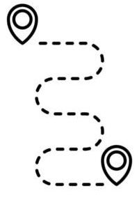

From

**I am not sure what good teaching in open research involves**

to

**I feel more confident that I can pass on my knowledge of open research to my learners using evidence-based didactic methods.**

::: {.notes}
**Presenter Notes**: Before we start, I would like to give you an overview of where we are going today. We will discuss this a little more later, but maybe some of you are here thinking, hm, I am unsure what it really means to do "good" teaching of open research topics. By the end of today, the plan is to boost your confidence in terms of your teaching skills and guide you step-by-step towards a great level of confidence, that you can pass your knowledge of open research on to novice learners through evidence-based practice. 

**Instructor Notes**: It is important to provide the overall vision of this session so that learners understand where they are headed in relation to where they are at in terms of how they feel about this topic.
:::

---

## Where are we at?

**Previously**:

- Getting to know the group

**Up next**:

- What is learning?
- Constructivism
- Constructive alignment
- Learning domains
- Levels of knowledge: Bloom's taxonomy
- Formulating learning objectives

::: {.notes}
**Presenter Notes**: Script for the slide here.

**Instructor Notes**:
- **Aim**: Place the topic of the current submodule within a broader context.
- Remind learners what you are working towards and what the bigger picture is.
:::

---

## Key terms and definitions

Some terms we will come across today...

:::incremental

- **Constructivism**: 
- **Constructive alignment**: 
- **Learning objectives**:
- **Bloom's taxonomy**: 
:::

::: {.notes}
**Presenter Notes**: Before we go further, I want to briefly show you the three key concepts that will underpin today’s session. These concepts may not make sense to you at this point. Broadly speaking, these concepts are closely related and together provide a useful foundation for thinking about effective teaching and learning design. What do you connect to these concepts? What comes to mind?

**Instructor  Notes**: Base yourself on conceptual change theory and examine existing concepts in relation to some key terms. Re-examine the formation of new concepts at the end of the lesson. Give your learners enough time to think about this. 
:::

---

## Key terms and definitions

Some terms we will come across today...

- **Constructivism**: The notion that learners actively build their own understanding of the world rather than absorbing information passively [@sjobergConstructivismLearning2010].
- **Constructive alignment**: A teaching approach in which learning objectives, teaching activities, and assessment tasks are aligned so that learners actively construct knowledge and skills [@biggsEnhancingTeachingConstructive1996].
- **Learning objectives**: Describe what learners should be able to do after instruction and should specify the intended performance, conditions, and criteria for success.
- **Bloom's taxonomy**: A framework for classifying levels of learning and cognitive skills [@bloom1964taxonomy], organized from lower-order thinking skills (e.g., remembering and understanding to higher-order skills (analyzing, evaluating).

::: {.notes}
**Presenter Notes**: Today's goal is to get to know these concepts in depth, so that at the end of the session you will have come to learn what each one of them entails in more detail. 

**Instructor  Notes**: Emphasize that knowledge of these concepts is not required at this point, and that you will get back to these definitions towards the end of the class.  
:::

---

## Learning objectives

At the end of this session, you will...

:::incremental
- **Remember** basic didactic concepts as the foundation for learning success
- **Explain** and **compare** how knowledge can be organized depending on the level of expertise
- **Evaluate** the alignment between learning objectives, assessment types and teaching activities
- **Formulate** concrete learning objectives according to specific learning domains for real-world content
:::

::: {.notes}
**Presenter Notes**: These are the main learning objectives for today’s session.  First, you should be able to understand some basic didactic concepts that support effective learning and teaching. This gives us the theoretical foundation for the rest of the session.

Second, you will analyze how knowledge can be structured differently depending on the learner’s level of expertise, for example, how novices and experts organize information in different ways.

Third, you will evaluate whether learning objectives and assessment methods are actually aligned and why this is important. In other words, does the assessment really measure the kind of learning we want students to achieve? Finally, you will formulate your own learning objectives using authentic examples and applying the principle of constructive alignment.

Notice that I have highlighted the verbs in bold, we will come back to this later in this session.
:::

---

## Getting started!

---

### How much teaching experience do you have?

- Workshops, peer training, (guest) lectures, seminars, lab presentations etc. on **open research** topics

 
 

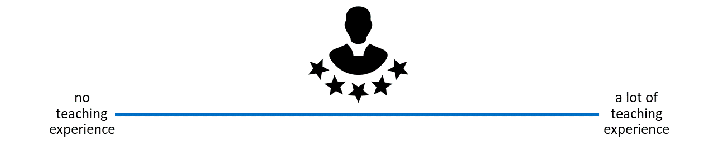{width=100%, fig-align="center"}

::: {.notes}
**Instructor Notes**: *For in-person learners*: Get people to stand along imaginary line across the room in terms of how much teaching experience they have. *For online learners*: Ask them to indicate experience on the screen. Pick out two people on either end of the spectrum (one from the in-person audience, one from online audience) and have them explain their teaching experience. Next, pick two people around the middle (one from the in-person audience, one from online audience) and have them explain and compare their experiences. Involve your audience as early as possible, so that they pay attention in case they unexpectedly get called upon. 
:::

---

### How much have you already thought about didactics?

- If and when you teach about open research, do you or would you consider **didactic elements** in you design and/or teaching style..?

 
 

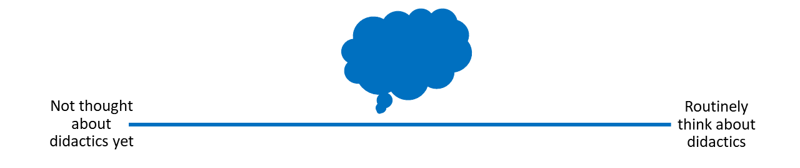{width=100%, fig-align="center"}

::: {.notes}
**Presenter Notes**: Next, let us think a little more about "didactics" or "pedagogy". If and when you teach, how often do you think about didactics? What do you connect with that term?

**Instructor Notes**: For *in-person learners*: Get people to stand along imaginary line across the room in terms of how much they think about didactics. For *online learners*: Ask them to indicate experience on the screen. Pick out two people on either end of the spectrum (one from the in-person audience, one from online audience) and have them explain their teaching experience. Next, pick two people around the middle (one from the in-person audience, one from online audience) and have them explain and compare their didactic thinking processes.
:::

---

### How big are your teaching/training audiences?

- i.e., what is the average group size you teach in open research? (< 5 people = very small, > 100 people = very large)

 
 

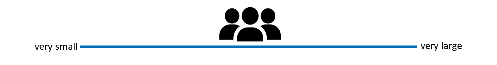{width=100%, fig-align="center"}

::: {.notes}
**Presenter Notes**: Finally, how big are your training audiences? How many people are in the room with you, virtually or in person? What kind of group would this be?

**Instructor Notes**:  For *in-person learners*: Get people to stand along imaginary line across the room in terms of how large their teaching audiences are. For *online learners*: Ask them to indicate group size on the screen. Pick out two people on either end of the spectrum (one from the in-person audience, one from online audience) and have them explain their teaching experience. Next, pick two people around the middle (one from the in-person audience, one from online audience) and have them explain and compare their respective teaching audiences.
:::

---

## What *is* didactics?

> The Greek origins:

| Greek | Transliteration | Meaning |
|:------|:----------------|:--------|
| **διδάσκω** | *didaskó* | to teach; to instruct; to show; to indicate |
| **διδακτός** | *didaktos* | taught |
| **διδακτικός** | *didaktikos* | apt to teach; able to teach |

:::footer
Liddell et al. (1996). *A Greek–English Lexicon*. Oxford University Press.
:::

::: {.notes}
**Presenter Notes**: Before we define didactics in an educational context, it's helpful to look at where the word comes from. It has its roots in Greek. The verb didaskó means to teach, to instruct, or to show. The adjective didaktos means taught, while didaktikos refers to someone who is able or apt to teach.

Today, this definition has expanded a little, as we will see next.
:::

---

## Didactics ...

 

“...is the **science of learning and teaching in general**”   (Dolch, 1967)  
"...includes **teaching and learning strategies** [...] referring to the **design**, programming, elaboration and **formulation** of **learning contents** in verbal or written form."   [@casasolariveraPapelDidacticaProcesos2020]

:::footer
@casasolariveraPapelDidacticaProcesos2020; @duitDidaktik2015; @riskulovaTheRoleofDidactics2020
:::

::: {.notes}
**Presenter Notes**: Within the realm of school pedagogics, didactics consists in planning and organizing successful processes of students’ learning. According to Dolch’s (1967) seminal definition, didactics is the science of learning and teaching in general. It deals with learning in all possible forms and with teaching of all kinds at all levels, initially without any reference to the possible content of teaching. Dolch’s definition corresponds largely to approaches that are based on theories of learning and focus on the analyzing and planning teacher, who may refer to information about the design of class instruction provided by didactics. 
:::

---

## Didactics ...

 

“... encompasses questions about the **selection of knowledge, teaching methods**, and how learning takes place in different **contexts**. It can be seen as the **planning, implementation, and analysis of teaching**, with a particular focus on **why certain objectives, content, and methods are chosen**."

:::footer
@ 2026 [Stockholm University](https://www.su.se/english/research/research-catalogue/research-subjects/d/didactics)
:::

::: {.notes}
**Presenter Notes**: I particularly like the definition of didactics by Stockholm University, who have a strong focus on didactics and conduct research around the topic, didactics is the art and science of teaching and learning. It is a field within education that seeks to answer three central questions: What should be taught, how should it be taught, and why should it be taught? Didactics encompasses questions about the selection of knowledge, teaching methods, and how learning takes place in different contexts. It can be seen as the planning, implementation, and analysis of teaching, with a particular focus on why certain goals, content, and methods are chosen. The well-known didactic triangle – what, how, why – is often used as a tool for analyzing and planning teaching and learning. Thus, didactics concerns the relationships between the teacher’s choice of content and methods, and what students actually learn. 

Here we have an important key point: the instructors choice of content and methods, and what learners learn. You can view didactics as a framework in which knowledge and skills are not passively presented, but understood, retained and applied across different contexts. 
:::

---

## Your turn: What *is* learning?

What do you **connect** with this concept? First thoughts? Assumptions? Expectations?

ADD WORDCLOUD

::: {.notes}
**Presenter Notes**: A natural follow-up question from didactics: What is learning to you? How would you define it? What expectations or assumptions come with it?

**Instructor Notes**: Use an interactive tool such as wordcloud for this to engage your learners. 

Keep in mind that your learners may have very different educational, cultural, or professional backgrounds, which will shape how they define learning. Moreover, because the question is personal and open-ended, learners need to feel comfortable sharing ideas without fear of being judged or “wrong.” Emphasize that there is no right or wrong and they could take a guess if they felt comfortable. Importantly, use this as an opportunity to understand what learners prior conceptualization of this process is. 
:::

---

## What *is* learning?

 
 

“...a **process** that leads to **change**, which occurs as a result of **experience** and increases the potential for improved performance and **future learning**”

:::footer
See @lovettHowLearningWorks2023. Slide adapted from Laura Carter: "Evidence-based Training" [https://zenodo.org/records/18905547](https://zenodo.org/records/18905547). Slide originally licensed under CC BY 4.0: [https://creativecommons.org/licenses/by/4.0/](https://creativecommons.org/licenses/by/4.0/)  
:::

::: {.notes}
**Presenter Notes**: Pulling together our discussion from before, this definition from @lovettHowLearningWorks2023 and Ambrose et al. shifts the focus from learning as information being presented to learning as a process that leads to change.

That change results from experience and may involve knowledge, skills, attitudes, or approaches to problems. Simply being exposed to information is not enough; learners need to actively engage with it.

Importantly, learning also increases the potential for improved performance and future learning, building capacity for continued growth.

Overall, this aligns with what in educational sciences is known as constructivism, which emphasizes active engagement, experience, and developing understanding over time rather than passively receiving information.

**Instructor Notes**: This slide is a good moment to go back to the previous activity whereby learners were thinking about their existing concepts of "learning" and compare and integrate some of the ideas that were put forward by learners with this definition.
:::

---

## What *is* learning?

:::incremental
> As a *process* (not a product), learning ...

- is **learner-centered** and something that learners themselves **"do"**
- is **active** and **self-controlled**
- is **integrated** in a broader context and a positive learning environment
- is **shaped** by prior knowledge
- is **inferred** from learners' products or performance

:::

:::footer
@efgiviaAnalysisConstructivismLearning2021, @lovettHowLearningWorks2023. Slide adapted from Laura Carter: "Evidence-based Training" [https://zenodo.org/records/18905547](https://zenodo.org/records/18905547). Slide originally licensed under CC BY 4.0: [https://creativecommons.org/licenses/by/4.0/](https://creativecommons.org/licenses/by/4.0/)  
:::

::: {.notes}
**Presenter Notes**: Let us look at "learning" even more in detail.
As described in Efgivia et al,  learning is an active, learner-centered process, where learners build knowledge internally rather than just simply receiving it from their teachers or instructors. It emphasizes learning as an active building of knowledge in the mean, with teachers being the facilitators who create a positive learning environment much more than being just the providers of information. In learning, it is not just about the individual. Instead, social interactions and collaborations with instructors and fellow learners are important drivers of the learning process. 
:::

---

## What *is* learning?

 

**Constructivism**: Learning is not passively received, but **actively built and shaped** by prior knowledge and the learning context.

 

:::incremental
- Learners are **not empty "vessels"** to be filled
  - They **interpret new ideas** through the lens of **what they already know**
- The **learning context matters**!
  - Learning does **not happen in isolation**, but is **shaped by the environment**

:::

:::footer
[@fosnotConstructivismTheoryPerspectives2013]
:::

::: {.notes}
**Presenter Notes**: The idea that learning is not simply "being transmitted" from an instructor to learners, but more something that learners actively achieve is captured by constructivism. 

What this means in practice is that learners are not “empty vessels” waiting to be filled with information. Instead, they interpret new ideas through the lens of what they already know. Prior knowledge therefore plays a central role in how new information is understood, and sometimes it can even support learning, or get in the way if existing ideas conflict with new ones.

The second important element here is the role of context. Learning does not happen in isolation, it is shaped by the environment, the tasks learners engage with, and the social interactions they experience. The same content can therefore be understood differently depending on how and where it is learned.

**Instructor Notes**: Check for understanding here, this is a key point of today's session. 
:::

---

## The importance of prior knowledge

- Knowledge = **facts, concepts, beliefs, values, models, perceptions, attitudes ...**

 

> **Prior knowledge** ... can **help** or **hinder** learning!

::: columns

::: {.column width="50%"}

- Can be **accurate**, complete and appropriate for context

{width=100%, fig-align="center"}

:::

::: {.column width="50%"}

- Can be **inaccurate**, incomplete or inappropriate for context
  
{width=100%, fig-align="center"}

:::

::::

::: {.notes}
**Presenter Notes**: As we just heard, prior knowledge plays an important role in constructivism. But also we know that not everything we know is true or complete. Knowledge, here defined as facts, concepts, beliefs, values, models, perceptions and attitudes, may be complete or appropriate or a context, or may be incomplete or inappropriate.

For example, I could have the "belief" that research published in open access journal means that it is lower quality compared to research published in high-impact journals. When I now encounter Open Access publishing, say someone tells me that my paper would fit well in this open access journal, I may reject the idea, or distrust research published in that open access journal. The information I might be missing here is in essence that research quality depends on methodological rigor and peer review, not paywalls or access restrictions. Within a constructivist view, I would integrate this piece of information with my existing belief to form a more complete and accurate model and towards becoming more of an expert in a given topic. 

We will also talk more about assessing prior knowledge in the following submodules.

**Instructor Notes**: Ask if someone in the audience can think of another example where prior knowledge might be interfering with the learning process in the context of Open Science. 
:::

---

## Your turn! 5 minutes

 

**What does *being an expert* mean?**

What is something that **you are an expert in**?

How does your **experience** when you are acting as an expert **differ** from when you are **not an expert**?

::: {.notes}
**Presenter Notes:** An important question to ask at this point is what "being an expert" actually means. Please take a few moments to think about these three questions for yourselves, then discuss with a partner. We will then share your thoughts in the larger group. Take 5 minutes for this exercise.

**Instructor Notes**: Use the think-pair-share method. *For the discussion round*: In reviewing the answers to the third question above, you will find that the expert experience amounts to much more than just knowing more facts in your learners. What makes an expert? The answer is that experts have more connections among pieces of knowledge that help them think and problem-solve quickly; more “short-cuts”, if you will.
:::

---

## A model of skills acquisition

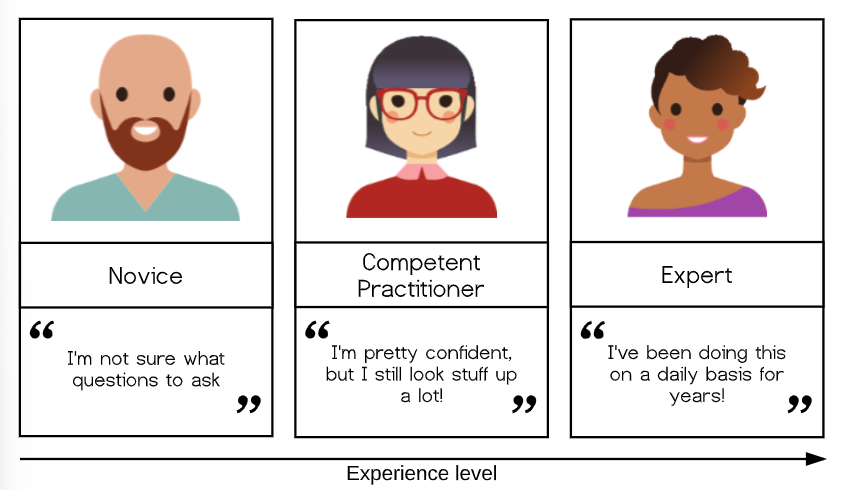{width=100%, fig-align="center"}

 
 

:::footer
[https://carpentries.github.io/instructor-training/02-practice-learning.html](https://carpentries.github.io/instructor-training/02-practice-learning.html)
:::

::: {.notes}
**Presenter Notes**: With increasing experience level, we move from one type of learner and mental model to another. Simplified, you could look at the types ot learners in terms of novice, competent practitioner, and expert. Here, the differences between these levels of learners can be summarized as starting from: unsure what questions to ask to I know something, but have to look up things to I am super experienced at this stage and basically do not have to think anymore. Let me give you examples for each type of learner: 

- **Novice**: Someone who does not know what they do not know, i.e., they do not yet know what the key ideas in the domain are or how they relate. Novices may have difficulty formulating questions, or may ask questions that seem irrelevant or off-topic as they rely on prior knowledge, without knowing what is or is not related yet. 

- **Competent practitioner**: someone who has enough understanding for everyday purposes. They will not know all the details of how something works and their understanding may not be entirely accurate, but it is sufficient for completing normal tasks with normal effort under normal circumstances. 

- **Expert**: someone who can easily handle typical situations and those that are out of the ordinary. 

Note that how a person feels about their skill level is not included in these definitions! You may or may not consider yourself an expert in a particular subject, but may nonetheless function at that level in certain contexts. 

**Example from daily life: Cooking a meal**

- Novice: A beginner follows a recipe step by step and may not know which questions to ask or how to adjust when something goes wrong.
- Competent practitioner: An experienced cook can prepare familiar meals independently and make small adjustments in terms of quantities, but may still need guidance for unfamiliar dishes.
- Expert: A skilled chef understands ingredients and techniques deeply, adapts recipes creatively, and can quickly solve unexpected problems while cooking.

It is common to think of a novice as a sort of an “empty vessel” into which knowledge can be “poured.” By now, we have learned that a more useful way to look at this would be through the lens of constructivism. Let us look at a concrete example next.
:::

---

### Example: A model of acquiring Open Access skills

<table style="font-size: 0.70em; width: 100%;">
<thead>
<tr>
<th style="width: 20%;">Level</th>
<th style="width: 40%;">Can do✅</th>
<th style="width: 40%;">Cannot (yet) do❌</th>
</tr>
</thead>
<tbody>
<tr>
<td><strong>Novice learner</strong></td>
<td>Recognize that Open Access and publishing licenses exist</td>
<td>Identify different publishing licenses or explain their effects on authors and readers</td>
</tr>
<tr>
<td><strong>Competent practitioner</strong></td>
<td>Publish papers Open Access and apply open licenses (e.g., Creative Commons)</td>
<td>Explain in-depth differences between Gold, Green, and Diamond OA or navigate complex copyright and licensing issues</td>
</tr>
<tr>
<td><strong>Expert</strong></td>
<td>Strategically select and apply Open Access routes (Gold, Green, Diamond); choose Creative Commons licenses based on reuse goals; support and train others</td>
<td>—</td>
</tr>
</tbody>
</table>

::: {.notes}
**Presenter Notes**: Taking Open Access as an example.

- A **novice** learner in a Open Access workshop might never have heard of the Green Open Access model, and therefore may have no understanding of how it affects both the authors of academic papers as well as the readers of papers. 

- A **competent practitioner** in the context of an Open Access workshop might be able to check funder's requirements, publish papers Open Access and uses open licenses like Creative Commons licenses. What they maybe do not know are the in-depth differences between Gold, Green and Diamond OA and the legal subtleties of copyright and all the different licenses. 

- An **expert** publishes perhaps strategically across gold, green and diamond open access routes. Selects and applies different Creative Commons licenses based on reuse goals. Trains others in Open Access practices and institutional policy. Consults on unusual situations, e.g., checks embargo policies and rights retention, recommends alternative journals, meaning that they adapt and apply the knowledge and skills flexibly depending on the situation. 

Next, we will briefly explore the nature of “knowledge” through a concept that helps us differentiate between novices and competent practitioners in a more useful and visual way. This, in turn, will have implications for how we teach.

:::

---

## The organization of prior knowledge

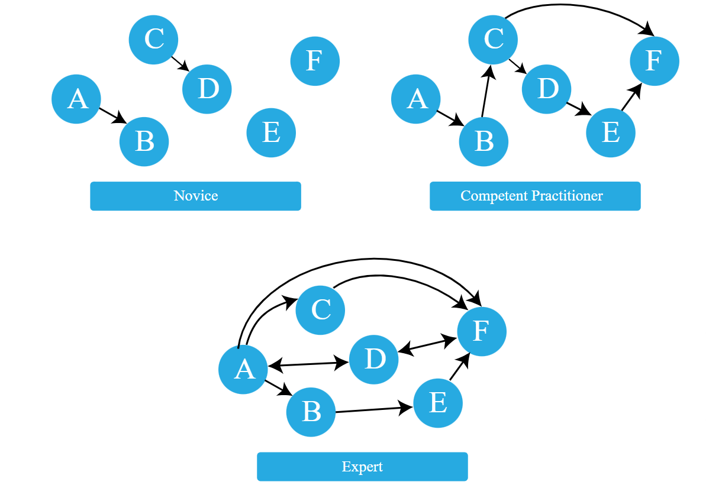{width=100%, fig-align="center"}

 
 

:::footer
[https://carpentries.github.io/instructor-training/04-expertise.html](https://carpentries.github.io/instructor-training/04-expertise.html)
:::

::: {.notes}
**Presenter Notes**: A novice has a minimal mental model of surface features of the domain. Inaccuracies based on limited or inaccurate prior knowledge may interfere with adding new information. Predictions are likely to borrow heavily from mental models of other domains which seem superficially similar.

A competent practitioner has a mental model that is useful for everyday purposes. Most new information they are likely to encounter will fit well with their existing model. Even though many potential elements of their mental model may still be missing or wrong, predictions about their area of work are usually accurate.

An expert has a densely populated and connected mental model that is especially good for problem solving. They quickly connect concepts that others may not see as being related. They may have difficulty explaining how they are thinking in ways that do not rely on other features unique to their own mental model.

A greater connectivity of a mental model allows expert to:

- see connections between two topics or ideas that no one else can see
- see a single problem in several different ways
- know how to solve a problem, or “what questions to ask”
- jump directly from a problem to its solution because there is a direct link between the two in their mind. Where a competent practitioner would have to reason “A therefore B therefore C therefore F”, the expert can go from A to F in a single step (“A therefore F”).
:::

---

## Your turn! 5 minutes

 

1. **Pick a topic** from open research (*different from open access*). 
2. **Sketch out** the mental model of a novice in comparison to a competent practitioner and an expert
3. **Provide concrete examples** of how the organization of knowledge differs among these three types of learners. 

::: {.notes}
**Presenter Notes**: Let us compare these mental models across the three types of learners with a concrete example. Think of an open science topic of your choice, not open access since we already had a few examples related to this. Sketch out the mental model of a novice in comparison to a competent practitioner and an expert and provide concrete examples of how the organization of knowledge differs among these three types of learners. Write down your thoughts over the next 5 minutes. 

**Instructor Notes**: Give people 5 minutes for this. Collect some ideas in the group and discuss. 
:::

---

## Recap

:::incremental
- **Didactics** = **planning and organizing** successful processes of learners’ learning
- **Learning** = learners actively **construct knowledge** through prior knowledge and context rather than passively receive information (**constructivism**)
- **Mental models of knowledge acquisition** develop with expertise
- Effective teaching **builds** on learners' existing knowledge and supports their **progression from novice to competent practitioner to expert**
:::

::: {.notes}
**Presenter Notes**: Let us briefly recap what we have learned so far:

- First, didactics is about the planning and organization of successful learning processes. The emphasis is on designing teaching in a way that helps learners achieve meaningful learning outcomes.

- Second, learning is an active process. According to the constructivist perspective, learners do not simply absorb information that we present to them. Instead, they actively construct understanding by making sense of new information in relation to what they already know. Importantly, prior knowledge and the learning context play a crucial role. Every learner brings existing experiences, beliefs, and mental models to the classroom, and these influence how new concepts are interpreted. The environment and learning activities also shape what and how learners learn.

- Third, in terms of different mental models, novices have limited and often fragmented mental models, making it harder to integrate new information, while competent practitioners have functional knowledge structures that support everyday problem solving. Experts have highly connected and sophisticated mental models that allow them to quickly identify relationships, solve complex problems, and apply knowledge flexibly.

- Finally, effective teaching starts from where learners are. Our role is to build on their existing knowledge and design learning experiences that help them progress, from being novices, to competent practitioners, and ultimately towards expertise.

:::

---

## What would help you organize your knowledge?

Is there something that you are **currently learning how to do**? 

Can you identify things that would help you with 
**organizing your mental model** in a course or workshop? 

::: {.columns}

::: {.column width="33%"}

### Think (2 min)
- For yourself: Collect some thoughts for yourself.

:::{.timer #think1 seconds=120 starton=interaction size=70% sound=true}
::: 

:::

::: {.column width="33%"}

### Pair (2 min)
- Discuss your   thoughts with your neighbor.

:::{.timer #pair1 seconds=120 starton=interaction size=70% sound=true}
:::

:::

::: {.column width="33%"}

### Share (2 min)
- Share your thoughts with the larger   group.

:::{.timer #share1 seconds=120 starton=interaction size=70% sound=true}
:::

:::

::::

::: {.notes}
**Presenter Notes**: Now that we have talked about mental models, next we want to talk about things that could help us move from novice learners to experts. Think about something that you are currently learning or learning how to do. What helps you with organizing your knowledge, beliefs, prior skills, etc. in your mental model, for example in the context of a workshop or course? Think back about things that you encountered in workshops or courses, or even things you have seen during this session. Write down thoughts for yourself (2 mins). Then discuss with your neighbor (2 mins). We will then discuss in the larger group.

**Instructor Notes**: Ask for interaction from the audience or make it an individual activity. Allow for approx. 6 minutes. 
:::

---

### Enhancing the organization of knowledge

Some strategies ...

:::incremental
- Provide learners with a **big picture** or outline of your workshop/course
- Clearly **lay out expectations or objectives** for a session
- Create **opportunities** to **discover** learners' prior knowledge
- **Make connections** between concepts **explicit**
  - Encourage learners to make these connections **themselves** (sorting tasks, concept maps)
- **Monitor** learners’ work **for problems** in their knowledge organization or mental model, e.g., add assessment tasks or progress trackers
- Provide direction through clear **learning objectives**

:::

{width=100%, fig-align="center"}

::: {.notes}
**Presenter Notes**: Some strategies could be: When designing a learning session, it is helpful to start by providing learners with a clear big picture or outline of the workshop or course so they understand how the content fits together. Alongside this, it is important to clearly lay out the expectations and objectives for the session, so learners know what they are working toward.

From there, the instructor should create opportunities to discover learners’ prior knowledge, for example through questions, short activities, or discussions. This helps surface existing mental models that may support or interfere with new learning.

Another key element is making connections between concepts explicit. While the instructor can help highlight these relationships, it is even more effective to encourage learners to construct these connections themselves, for instance through sorting tasks or concept mapping activities.

Finally, it is important to continuously monitor learners’ work for signs of misunderstanding or gaps in how knowledge is organized. This can be supported through formative assessment tasks, structured feedback, or progress trackers that make learners’ thinking visible over time.

**Instructor Notes**: Refer back to the answers from your learners from the previous task. 
:::

---

## Constructive alignment

> Focus on **learning objectives**: what do we want our learners to **achieve**?

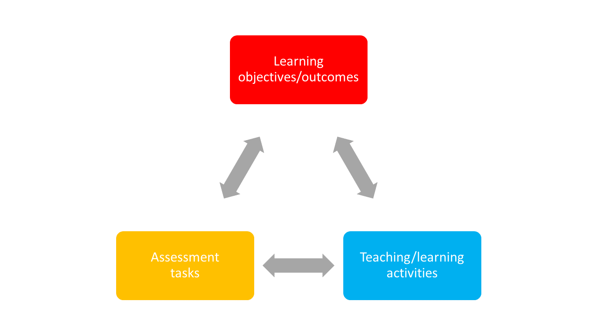{width=100%, fig-align="center"}

:::footer
@biggsEnhancingTeachingConstructive1996
:::

::: {.notes}
**Presenter Notes**: As mentioned before, clearly laying out expectations and what you want your learners to achieve for a given workshop is key to help with the organization of the mental model. Constructive alignment provides a clear framework and contributes to the optimal learning environment. It is about making sure that the structure of your course or your lesson supports the learning objectives you are aiming at. Constructive alignment means ensuring that three core elements, namely learning objectives/ outcomes, teaching/learning activities, and assessment tasks work together and are aligned with each other. If there is any misalignment, it can confuse students or make the learning process less effective. 

For example (social sciences/ humanities):
If you want students to critically analyze a text (learning outcome), you should teach them how to critically analyze texts (teaching activity) and then assess them on their ability to critically analyze texts (assessment task). But if your assessment is a multiple-choice test that does not require analysis, it creates a misalignment between your teaching methods and the way you are measuring student success. The outcome and assessment do not align, and students might not achieve the skills you intended.

For example (hard sciences):
In a physics class, the objective is for students to use Newton’s Second Law to solve real-world problems with friction and inclined planes. But lessons are mostly lectures and examples from the teacher, with no practice for students to solve problems themselves. Tests only ask definition questions instead of requiring calculations or problem-solving. Because of this, students can pass without learning the skills the objective describes.

Another example from the instructor: Learning objective = conducting an anamnestic interview with a patient. Teaching activites = role plays. Assessment task = Anamnestic interview with fake/real patient. 

**Instructor Notes**: Ask if someone in your audience has already heard about this concept. Ask to provide examples. In constructive alignment, we start with the outcomes we intend students to learn, and align teaching and assessment to those outcomes. The outcome statements contain a learning activity, a verb, that verb says what the relevant learning activities are that the students need to undertake in order to attain the intended learning outcome. Learning is constructed by what activities the students carry out; learning is about what they do, not about what we teachers do. Likewise, assessment is about how well they achieve the intended outcomes, not about how well they report back to us what we have told them or what they have read’ (Biggs n.d.).
:::

---

## Your turn! 5 minutes

 

Match each **learning objective** with an **assessment type** and reflect the following:

- Why does the assessment type fit the specific learning objective?
- What teaching activities can you think of that would align with the learning objective and the corresponding assessment type?

::: {.notes}
**Presenter Notes**: For this next exercise, I would like for you to match the assessment type with a given learning objective. We will learn more about learning objectives and how to formulate them later. For now, focus on the alignment aspect: does the learning objective match with the assessment type? Take five minutes for this task.
:::

---

## Practical activity

| Learning objective | Assessment type |
|---------------|--------------------|
| A: *Create* a reproducible research pipeline | 1: Hand in a brief  essay on Green open access along with two ethical benefits and two challenges  |
| B: *Apply* FAIR data principles to a dataset| 2: Generate a GitHub project and add project documentation (wiki) |
| C: *Analyze* reproducibility issues in published studies | 3: Hand in a data management plan (DMP) |
| D:  *Understand* ethical implications of open access | 4: Write a critical review of an open dataset/paper |

::: {.notes}
**Instructor Notes**: Discussion of solutions in the plenum and potential discussions. Solutions are:
- A2
- B3
- C4
- D1
:::

---

## Setting learning objectives

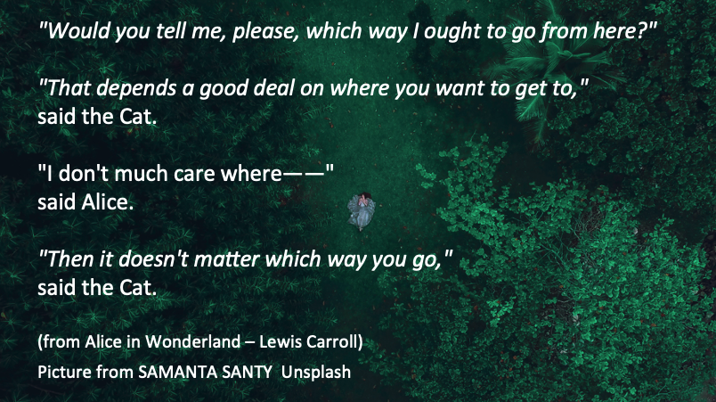{width=100%, fig-align="center"}

::: {.notes}
**Presenter Notes**: We are coming to another core didactic principle besides prior knowledge, constructivism, mental models and constructive alignment, namely setting learning objectives.
These quotes here represent the famous conversation between Alice and the Cheshire Cat in Alice in Wonderland. They highlight the importance of having a clear objective before choosing a direction. Just as Alice cannot choose the right path without knowing where she wants to go, instructors cannot teach effectively without clear learning objectives.

Clear objectives provide direction and intentionality, making them especially important in Open Science, a broad and interdisciplinary field that can sometimes seem abstract or ideological to learners.

**Instructor Notes**: Emphasize the importance of clear learning objectives in the context of Open Science. Clear learning objectives create the direction that allows open science education to move from awareness toward genuine cultural and practical change in research, which is what is currently needed.
:::

---

## Learning objectives: A definition

 

“... describes what **learners should be able to do** after instruction and should specify the **intended performance**, **conditions**, and **criteria for success**."

:::footer
@mager1962preparing
:::

::: {.notes}
**Presenter Notes**: When we talk about learning objectives, we are referring to more than simply describing what a teacher will cover or what content will be presented. A learning objective describes what learners should be able to do after an instructional activity. According to Mager, well-formulated objectives specify three important elements: the intended performance, what learners should demonstrate; the conditions under which this performance takes place; and the criteria for success, how we determine whether the learning goal has been achieved.
:::

---

## "Hierarchy" of learning objectives

::: columns

::: {.column width="40%"}

>  What is the **general objective** of this course?

> What are **specific individual learning objectives** within the course?

:::

::: {.column width="60%"}

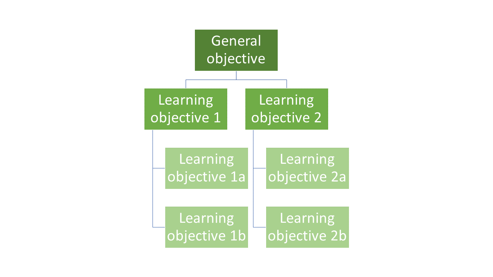{width=100%, fig-align="center"}
:::

:::

::: {.notes}
**Presenter Notes**: Generally speaking, the instructor needs to formulate designated and specific learning objectives.

When preparing a teaching unit, it is important to gain an overview of the location of the learning objectives within this hierarchy to be pursued. Each learning objective is embedded in preceding and subsequent learning objectives. Previous learning achievements are an essential foundation for the successful acquisition of new knowledge and skills. At the same time, this knowledge prepares learners for the learning steps that follow. The learning objectives are not always on the same logical level. In order to reach the next level, it is necessary for learning success that the foundation of the lower levels has been laid.

What are the three levels  of learning objectives?
- General objectives — Course as a whole (e.g. producing transparent and reproducible research)
- Designated objectives — Subject area (e.g. use FAIR data principles when organizing and publishing research data)
- Specific objectives — Learning unit (Upload a dataset to an open repository with appropriate metadata)
:::

---

## Formulating learning objectives

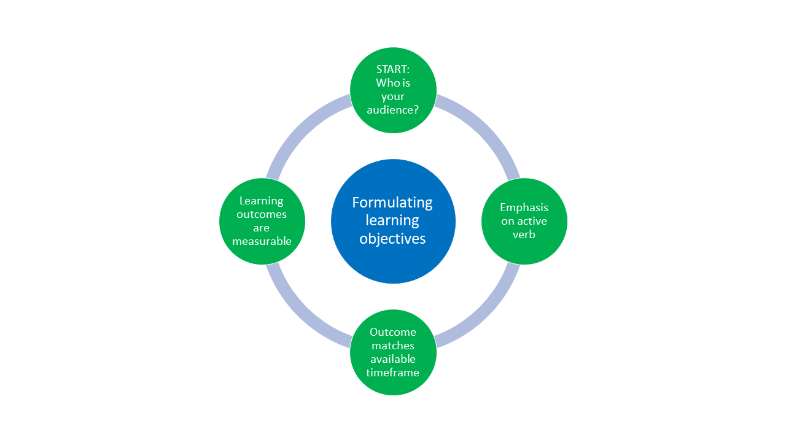{width=100%, fig-align="center"}

::: {.notes}
**Presenter Notes**: Let's talk about the formulation of learning objectives, which is visualized here. We need to first start with: who are we teaching? Next, the verbs matter! Pick them wisely in an active tense. Third, match the assessment task to your learning objective. Fourth, ensure the learning objective is measurable. 

It is best to practice this, so without any more explanations, let us practice!
:::

---

## Three domains of learning

| Domain | Focus |
|:-----|:-------------|
| **Cognitive** | Knowledge or thinking |
| **Affective** | Growth in feelings or emotional areas (attitude or self), values |
| **Psychomotor** | Manual or physical skills, change in behaviors |

:::footer
@stapleton2023bloom
:::

::: {.notes}
**Presenter Notes**: Now, let's say we want to define our learning objectives, and we know where in the hierarchy we want to begin. We still do not fully know *where* we are going because we have to better define what we want our learners to take out of the course, the subject or the individual lesson. In other words, we need to be more specific in *what* we want our learners to learn. A useful framework is to divide learning objectives into three domains. The first domain is the cognitive domain, which focuses on knowledge and thinking. The second domain is the affective domain, which focuses on feelings, attitudes, values, and personal growth. The third domain is the psychomotor domain, which focuses on physical or technical skills and behavioral change. Let us go through each one in more detail. 
:::

---

### Cognitive domain

:::incremental
- Learning focused on expanding or building up **knowledge and thinking skills** as a learning outcome

- Widely implemented in education and typically connected to *Bloom's taxonomy*

- *Example*: 
  - **Learning objective**: Learners will be able to analyze how open science practices improve research transparency and reproducibility
  - **Teaching activity**: Evaluation and comparisons of reproducible and non-reproducible research workflows or published studies in groups
  - **Assessment task**: Group presentation discussing strengths, limitations, and transparency of selected research practices or publications
  
:::

::: {.notes}
**Presenter Notes**: The cognitive domain went through numerous revisions before a finalized version was published (Bloom 1956). Bloom's taxonomy of learning objectives [@bloom1964taxonomy] is a proven model for describing and classifying the cognitive skills that students should have mastered at the end of a course or module. The six levels of cognitive complexity build on each other and can be described using specific verbs.

The cognitive domain has been the primary focus in education and has become shorthand for Bloom’s taxonomy as a result. The cognitive domain is made up of six levels of objectives. These levels are organized by hierarchy, moving from foundational skills to higher-order thinking skills.

In 2001, Anderson and Krathwohl revised Bloom’s levels from nouns to verbs, and this is the version of the taxonomy used today [@andersonTaxonomyLearningTeaching2001].

- Remember: retrieve relevant knowledge from memory.
- Understand: determine the meaning of instructional messages.
- Apply: use a procedure in a given situation.
- Analyze: break materials into components and determine how they work together.
- Evaluate: make judgments based on criteria and standards.
- Create: create a new or original work.

Example from Open Science: The learning objective focuses on analysis. Learners are expected to critically examine how open science practices contribute to transparency and reproducibility in research. This moves beyond memorization and requires higher-order thinking, such as comparing, evaluating, and interpreting research processes. The teaching activity supports this objective by engaging learners in the evaluation and comparison of real or simulated research workflows. For example, they might look at a traditional analysis pipeline versus one that uses version control, preregistration, or shared data. The emphasis here is on identifying differences in structure, transparency, and reproducibility. Finally, the assessment task asks learners to demonstrate their understanding through a group presentation. This allows them to articulate strengths and limitations of different research practices and justify their evaluation using evidence. It also encourages discussion and collaborative reasoning, which is important when dealing with complex methodological topics such as Open Science. 
:::

---

### Cognitive domain

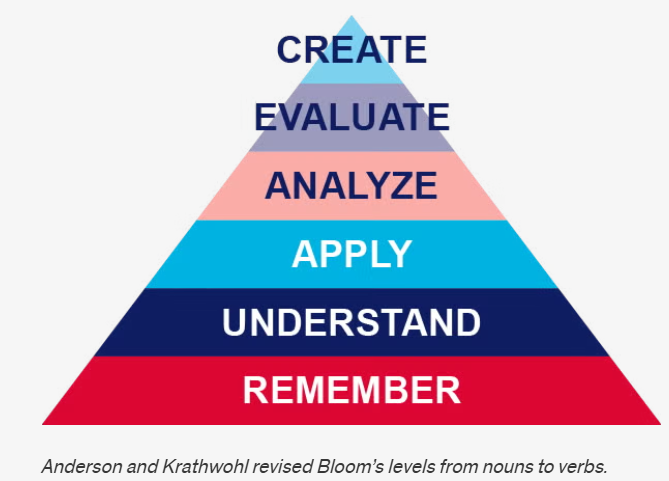{width=100%, fig-align="center"}

:::footer
@andersonTaxonomyLearningTeaching2001
:::

::: {.notes}
**Presenter Notes**: This figure visualizes the learning objectives associated with the cognitive learning domain. What you see is the pyramid of learning objective verbs by Anderson and Krathwohl. This is a revised version of Bloom’s taxonomy and organizes learning objectives into a hierarchy of cognitive processes. It is often shown as a pyramid because it moves from simpler thinking skills at the base to more complex, higher-order thinking at the top.

At the **Remember** level, learners recall basic facts and definitions. For example, they might remember what open science, preregistration, or FAIR data principles stand for without yet applying them.

At the **Understand** level, learners explain concepts in their own words. For instance, they might describe why open science improves transparency and reproducibility, or summarize what problems in research the reproducibility crisis highlights.

At the **Apply** level, learners use knowledge in a concrete situation. An example would be a student implementing open science practices in a small study, such as uploading data and code to an open repository or preregistering a simple experiment.

At the **Analyze** level, learners break information into parts and examine relationships. For example, they might compare an open dataset with a traditionally published study to identify potential sources of bias, missing information, or differences in reproducibility.

At the **Evaluate** level, learners make judgments based on criteria. In open science, this could involve critically assessing whether a published study’s open data and materials are sufficient for replication, or evaluating the quality and transparency of an open peer review process.

At the **Create** level, learners produce new work by combining knowledge in original ways. For example, they might design a fully open research project with preregistration, open materials, reproducible code, and a public dataset, or extend an existing open dataset to ask a new research question.

With respect to the example we just discussed, which level or levels do you think are we at when we think of the learning objective that was formulated?
:::

---

### Affective domain

:::incremental
- Learning focused on identifying and developing **attitudes and values** of learners as learning outcome
- Difficult to measure directly, but can be assessed through *observable behaviors* (e.g., appreciation, showing commitment, awareness of nuances)

- *Example*:
  - **Learning objective**: Learners will actively engage  with differing views on the pros and cons of preregistration by asking clarifying questions and incorporating at least one alternative viewpoint into their own arguments
  - **Teaching activity**: Learners participate in a panel discussion in which they argue either the benefits or the limitations of preregistration in scientific research.
  - **Assessment task**: Learners write a reflection essay in which they summarize the arguments presented during the discussion and reflect on how considering both the advantages and disadvantages of preregistration influenced their own perspective on open science practices.

:::

:::footer
@krathwohl1964taxonomy
:::

::: {.notes}
**Presenter Notes**: The affective domain was first published in 1964 by @krathwohl1964taxonomy. It focuses on attitudes and values, with learners becoming increasingly self-reliant and internally motivated as they progress through its levels. Affective objectives can be difficult to articulate and assess, but they can be observed through behaviors such as appreciating alternative perspectives, engaging thoughtfully in discussion, asking questions, and recognizing complexity. These outcomes are often closely linked to deeper thinking and lifelong learning.

In this example, the learning objective is not simply for learners to know what preregistration is, but for them to actively engage with differing viewpoints about its advantages and disadvantages. Learners are expected to ask clarifying questions and incorporate alternative perspectives into their own arguments, demonstrating openness and reflective thinking.

The teaching activity supports this objective through a panel discussion where learners argue either the benefits or the limitations of preregistration in scientific research. This encourages perspective-taking and respectful engagement with viewpoints they may or may not personally agree with.

Finally, the assessment task is a reflection essay. Here, learners summarize the different arguments discussed in class and reflect on how engaging with both sides of the debate influenced their own perspective on preregistration and open science practices. This reflective component is central to assessing affective learning because it reveals how learners process, evaluate, and potentially revise their own attitudes and values.
:::

---

### Affective domain

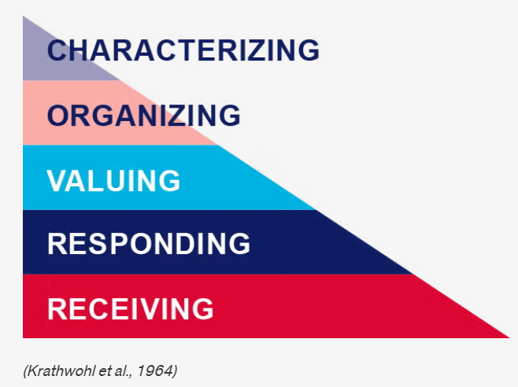{width=100%, fig-align="center"}

:::footer
@krathwohl1964taxonomy
:::

::: {.notes}
**Presenter Notes**: The affective domain contains five levels, from lowest to highest:

Receiving: Willing to listen and receive knowledge.
Responding: Actively participates and engages in knowledge transfer.

Valuing: Finds value and worth in one’s learning with motivation to continue.

Organizing: Integrates and compares values, resolves conflict between these values, and orders them according to priorities.

Characterizing: Creates a value system that controls behavior. The behavior is pervasive, consistent, predictable, and characteristic of the learner.

With respect to the example we just discussed, which level or levels do you think are we at when we think of the learning objective that was formulated?
:::

---

### Psychomotor domain

:::incremental
- Learning focused on implementing, expanding and building **physical skills and behaviors**, .e.g., through physical movement, coordination and motor skills as learning outcomes (e.g., measured in terms of speed, precision or technical execution)

- *Example*:
  - **Learning objective**: Learners will accurately upload, document, and share a research dataset in an open repository using appropriate metadata and licensing practices.
  - **Teaching activity**: Hands-on workshop where learners practice preparing metadata, selecting appropriate licenses and uploading to an open repository. 
  - **Assessment task**: Each learner independently uploads a dataset and accompanying documentation to a repository with a suitable license.

:::

:::footer
@harrow1972taxonomy
:::

::: {.notes}
**Presenter Notes**: Bloom and his colleagues did not create subcategories for skills in the psychomotor domain, but other educators did, see @dave1970developing,  @harrow1972taxonomy and @simpson1985educational and other (Simpson 1966, 1972). The psychomotor domain includes physical movement, coordination, and motor skills. Development of these skills requires practice and is measured in terms of speed, precision, distance, procedures, or technical execution. 

A straightforward example could be the following: *The learning objective is for learners to accurately perform CPR using correct hand placement and rhythm. This emphasizes not only knowing the steps of CPR cognitively, but being able to physically carry them out correctly in a practical situation.*

The teaching activity involves learners practicing CPR on mannequins while receiving immediate feedback. This hands-on practice is essential in the psychomotor domain because physical skills improve through repeated performance, correction, and refinement of technique.

The assessment task places learners in a simulated emergency scenario where they must independently perform CPR for one to two minutes. This allows instructors to evaluate whether learners can execute the skill accurately and consistently under realistic conditions. The focus of assessment is therefore on observable performance and technical competence rather than only theoretical knowledge.

For Open Science, it is a little harder to find a good example. Let's take correcly uploading and documenting a dataset using appropriate metadata and licensing. 

The teaching activity provides guided, practical experience with preparing datasets and using an open repository. The assessment then evaluates learners’ ability to independently carry out these technical tasks accurately and correctly.
:::

---

### Psychomotor domain

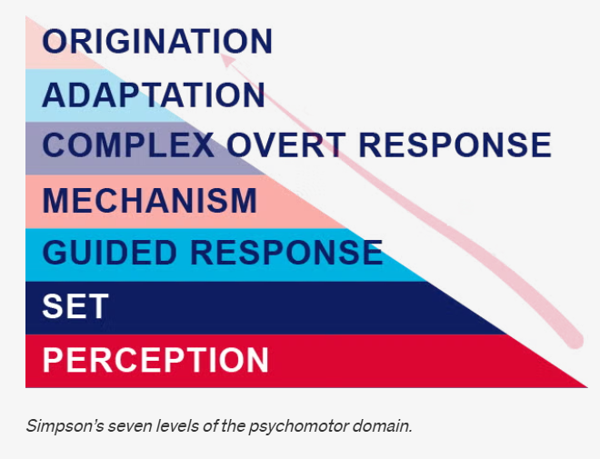{width=100%, fig-align="center"}

:::footer
@simpson1985educational
:::

::: {.notes}
**Presenter Notes**:  For the purpose of this teaching guide, we will explore Simpson’s version of the psychomotor domain, which has the following seven levels:

- Perception: Use sensory cues to guide actions or movements.
- Set: Demonstrates a readiness (physically, mentally, emotionally, and spiritually) to take action to perform the task or objective. (NOTE: This level of the Psychomotor domain is closely related to the “Responding to phenomena” level of the Affective domain).
- Guided response: Knows steps required to complete the task or objective and  learns through trial and error by practicing.
- Mechanism: Performs task or objective in a somewhat confident, proficient, and habitual manner.
- Complex overt response: Performs task or objective in a confident, proficient, and habitual manner. Expert level, high proficiency and performs with accuracy.
- Adaptation: Performs task or objective and can modify actions to account for new or problematic situations.
- Origination: Create new procedures and solutions to approach various situations.

With respect to the example we just discussed, which level or levels do you think are we at when we think of the learning objective that was formulated?
:::

---

## Recap: Learning objectives within learning domains

| cognitive  | affective      | psychomotor          |
|:-------:|:-------:|:-------:|
|            |                | origination            |
| create     |                | adaptation             |
| evaluate   | characterizing | complex overt response |
| analyze    | organizing     | mechanism              |
| apply      | valuing        | guided response        |
| understand | responding     | set                    |
| remember   | receiving      | perception             |

::: {.notes}
**Presenter Notes**: Let's recap: Bloom’s taxonomy is a hierarchical model used for classifying learning objectives by levels of complexity and specificity. Bloom’s taxonomy was created to outline and clarify how learners acquire new knowledge and skills. Though the original intention of the taxonomy was to serve as an assessment tool, Bloom’s taxonomy is effective in helping instructors identify clear learning objectives as well as create purposeful learning activities and instructional materials.

There are three learning domains:
- Cognitive: knowledge or thinking
- Affective: growth in feelings or emotional areas (attitude or self)
- Psychomotor: manual or physical skills

Learning objectives can be assigned to different taxonomy levels. Taxonomies serve to organize learning objectives. The most-used taxonomy is the one for the cognitive learning domain. 
:::

---

## Your turn! 10 minutes

*You are tasked to design a course module on Open Research practices and would like to include a lesson on open access publishing. In pairs, **design one assessment task** and **define one observable metric** of successfully achieving the learning objective for each **learning objective** below.* 

- **Cognitive domain**: Learners will be able to compare different open access publishing models, e.g., Gold, Green and Diamond Open Access and critically assess their advantages and limitations.

- **Affective domain**: Learners will critically reflect on the benefits and challenges of open access publishing and demonstrate openness toward differing perspectives on accessibility and publication costs.

- **Psychomotor domain**: Learners will accurately upload a manuscript to an open access repository and correctly apply metadata and an appropriate license. 

::: {.notes}
**Presenter Notes**: Time to practice! In pairs, design one assessment task for each learning objective (cognitive, affective, psychomotor). For each assessment, specify:

- an appropriate assessment method (e.g., checklist, rubric)

- at least one observable criterion that demonstrates successful achievement of the learning objective.

*Write your ideas into the workbook* to keep track of your thoughts. 

**Instructor Notes**:  Example answers:

- Cognitive: Students create a comparison brief analyzing at least two open access models (e.g., gold vs. green open access), including costs, accessibility, and author rights (assessment task). Use of examples and supporting arguments (metric). Scoring rubric with comparison depth, number or argument, quality (assessment tool)
- Affective:
- Psychomotor: 

:::

---

## Your turn! 10 minutes

 

1. **Navigate** to the following online tutorial: [https://lmu-osc.github.io/introduction-to-zotero/](https://lmu-osc.github.io/introduction-to-zotero/).

2. **Skim over** the different sections using the navigation menu or the arrows at the bottom of the page to get an idea of the content of the tutorial. 

3. Using Bloom's taxonomy, **formulate** three learning objectives and assessment methods that match the content and the teaching activities of the tutorial.  Consider the following: Which level of Bloom's taxonomy are you at and which domain are you targeting?

::: {.notes}
**Presenter Notes**: Your task is the following: **Navigate** to the following online tutorial: [https://lmu-osc.github.io/introduction-to-zotero/](https://lmu-osc.github.io/introduction-to-zotero/). Then, **skim over** the different sections using the navigation menu or the arrows at the bottom of the page to get an idea of the content of the tutorial. Finally, using Bloom's taxonomy, **formulate** three learning objectives and assessment methods that match the content and the teaching activities of the tutorial.  Consider the following: Which level of Bloom's taxonomy are you at and which domain are you targeting?

This is individual work, take 10 minutes.

**Instructor Notes**: Possible solutions:

- Learners can **describe** the purpose and key features of Zotero (e.g., organizing references, generating citations). Bloom’s level: Remember / Understand. Domain: Cognitive (knowledge & comprehension). Assessment method: survey or multiple choice quiz. 
- Learners can **apply** Zotero to **add and organize** references in a library using tools like the Zotero Connector or manual entry. Bloom’s level: Apply
Domain: Cognitive (procedural knowledge). Assessment method: Create a Zotero collection and add minimum three references via manual entry, submit screenshot. 

- Learners can **create and evaluate** a properly formatted bibliography using Zotero in a document. Bloom’s level: Analyze / Evaluate. Domain: Cognitive (higher-order thinking). Assessment method: Insert citations into a word document and create a bibliography. Hand in file. 
:::

---

## Take-home messages

:::incremental
- Learning in an **active process**, integrated in a larger **context** and strongly shaped by **prior knowledge and beliefs** (**= constructivism**)

- Different learners differ in their organization of prior knowledge: *experts* enjoy more connections and short-cuts among pieces of knowledge

- Ensuring that **learning objectives**, the **assessment tasks** and the **teaching activities** **align** is key for a successful learning process (**= constructive alignment**)

- Before teaching, we need to know where we are going, i.e., **formulate learning objectives** according to the fitting learning domain(s): **cognitive, affective, psychomotor**
:::

::: {.callout-tip}
## The formulation matters!
Place a particular emphasis on the **verbs** when formulating learning objectives!
:::

::: {.notes}
**Presenter Notes**: What are you main take-home messages from today?

- Learning is an active process shaped by context, prior knowledge, and beliefs—a core idea of constructivism.
- Learners differ in how they organize prior knowledge. Experts typically have more connections between concepts, allowing them to recognize patterns and make connections more efficiently.
- Effective learning depends on alignment between learning objectives, assessment, and teaching activities—known as constructive alignment.
- Before teaching, we need to know where we are going. This means defining appropriate learning objectives across the relevant domains: cognitive, affective, and psychomotor.

**Instructor Notes**: End lesson on clear take-home message that are interactively compiled by learners.
:::

---

## Survey time!

ADD QR code

---

## Survey time!

::: {.panel-tabset}

### Question 1

**Which of the following concepts or skills do you now feel most confident about in relation to didactics and teaching? (Select all that apply)**

a. Considering the learner's prior knowledge in the learning process

b. Constructivism

c. Constructive alignment

d. Formulating clear learning objectives

### Question 2

**What is your level of familiarity with the three learning domains (cognitive, affective and psychomotor)?**

a. I have never heard of them before.

b. I have heard of them but have never considered them in my teaching.

c. I have a basic understanding and sometimes implement them in my teaching.

d. I am very familiar with these concepts and routinely apply them in my teaching.

### Question 3

**What is your level of familiarity with Bloom's taxonomy?**

a. I have never heard of it before.

b. I have heard of it but have never implemented it in my teaching.

c. I have a basic understanding and sometimes implement it in my teaching.

d. I am very familiar and have routinely applied this in my teaching.

:::

---

## Discussion of survey results

 

What do we see in the results?

::: {.notes}
**Presenter Notes**: Let us have a look at these results. 

**Instructor Notes**: Briefly examine the answers given to each question interactively with the group. Use visuals from the survey to highlight specific answers.

**Accessibility Tip**: Have people work in pairs if someone did not bring their phone/does not have a phone. This survey also cannot be completed in an asynchronous setting. 
:::

---

## Learning objectives - recap

At the end of this session, you now...

- **Remember** basic didactic concepts as the foundation for learning success✅
- **Explain** and **compare** how knowledge can be organized depending on the level of expertise✅
- **Evaluate** the alignment between learning objectives, assessment types and teaching activities✅
- **Formulate** concrete learning objectives according to specific learning domains for real-world content✅

::: {.notes}
**Presenter Notes**: Looking back at the learning objectives, this is what we achieved today. Great work! What are your questions?
:::

---

## References

::: {#refs}
:::

---

# Thanks!

---

# Additional content slides

---

## Constructing knowledge

:::incremental
- Knowledge is **actively constructed** by the learner, *not imposed*
- Learners **bring existing concepts** to learning situations
  - Existing ideas need to be **incorporated** into teaching in order to challenge/change these
- Learners construct knowledge **through interaction** with physical world/ social settings and within specific cultural/linguistic environments
  - The **learning environment** is integrated into the learning process

:::

:::footer
@sjobergConstructivismLearning2010
:::

::: {.notes}
**Presenter Notes**: This is where constructivism provides us with a solid theoretical framework that frames learning as this active process whereby knowledge is constructed. Within this framework, learning occurs when existing ideas are at odds with new information that is being presented. Therefore, existing ideas and knowledge need to be incorporated into the teaching process in order for learning to take place. 

Following from this notion, it means that a core component of learning is the integration of new information with prior schemas. The question here is now: how exactly are old and new information integrated with each other? This is where the interaction with the physical world in a specific social setting, constraint by cultural and linguistic norms is crucial, therefore making the learning environment and the interaction with it another core component of the learning process in the constructivist framework. 
:::

---

## Your turn: Why use Bloom's taxonomy in your teaching?

:::incremental
- To **align** teaching with learning objectives by guiding lesson planning, activities, and instructional delivery

- To **support** the creation of matching, reliable assessments that **target *all* levels of understanding** (not just memorization)

- To **enhance higher-order thinking** (e.g., critical thinking) while **improving metacognition**, clarifying objectives, and revealing misconceptions
:::

::: {.notes}
**Presenter Notes**: Bloom’s taxonomy can help instructors appropriately align instruction to the learning objectives, including the planning of learning activities and the delivery of instructional materials (Raths 2002).

Bloom’s taxonomy helps instructors create valid and reliable assessments by aligning course learning objectives to any given level of student understanding or proficiency. @crooksImpactClassroomEvaluation1988 suggests that much of college assessment involves recalling memorized facts, which only addresses the first level of learning. However, Bloom’s taxonomy aids instructors in creating assessments that address all six levels of the cognitive domain.

Bloom’s taxonomy has been shown to enhance students’ higher-order thinking skills, such as critical thinking. @bissellNewMethodAssessing2006 used Bloom’s taxonomy to assess critical-thinking skills in an introductory biology course. They developed a process by which they prepared questions with both content and critical-thinking skills in mind, and prepared grading rubrics that specified how to evaluate both the content and critical-thinking aspects of an answer. Using this methodology helped Bissell and Lemons clarify the course objectives (for instructors and students), improve student metacognition, and expose student misconceptions about the course content.
:::

---

## TODO

- [ ] Add wordcloud and QR codes
- [ ] Add alt text to all figures
- [ ] Sort out all references

