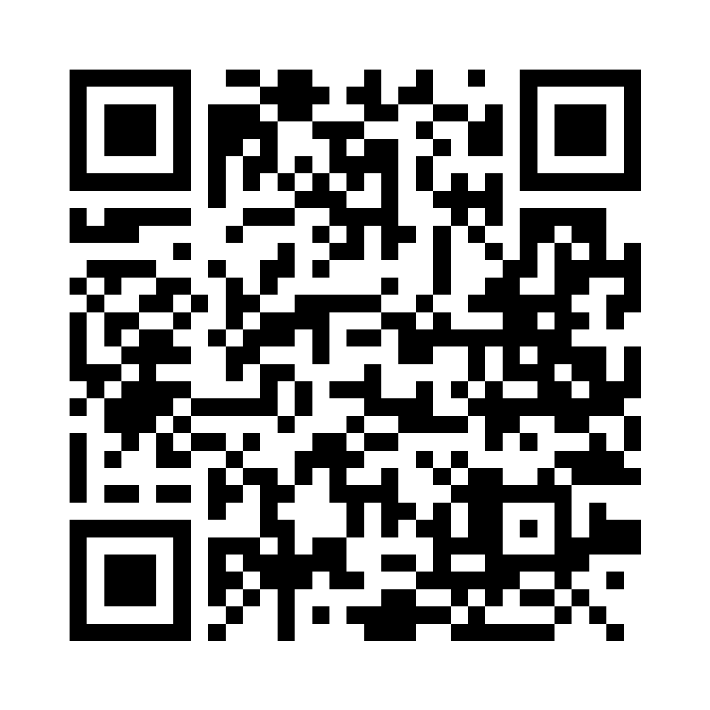
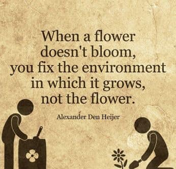
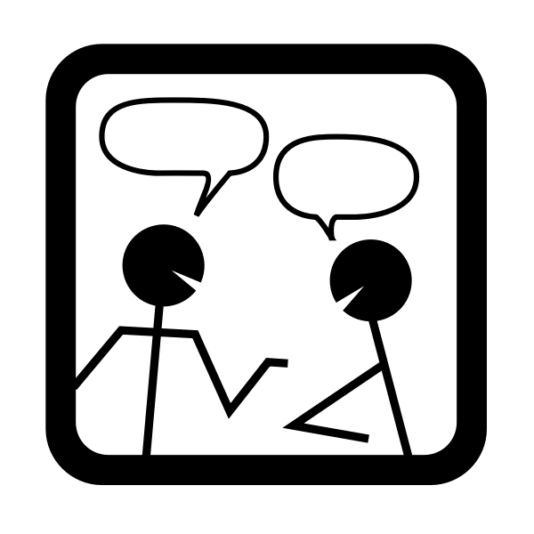
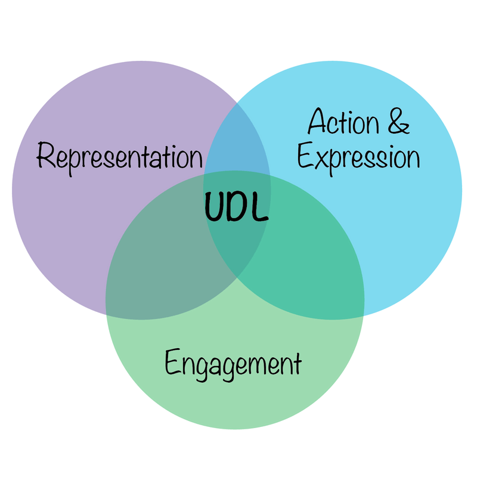

## Licence

 

  

This current work by Sarah von Grebmer zu Wolfsthurn, Sara Lil Middleton and Malika Ihle is licensed under a CC-BY-SA 4.0 [Creative Commons Attribution 4.0 International SA License](https://creativecommons.org/licenses/by-sa/4.0/deed.en). It permits unrestricted re-use, distribution, and reproduction in any medium, provided the original work is properly cited. If you remix, transform, or build upon the material, you must distribute your contributions under the same license as the original.

::: {.notes}
**Presenter Notes**: The Creative Commons Attribution–ShareAlike 4.0 license, or CC BY-SA 4.0, allows others to copy, share, and adapt a work in any medium, including for commercial purposes. These permissions are broad and cannot be withdrawn as long as the license terms are followed. The main requirement is attribution: users must give appropriate credit to the original creator, provide a link to the license, and clearly indicate whether any changes were made, without implying endorsement by the original author. In addition, the ShareAlike condition means that if someone modifies or builds upon the work, the resulting material must be distributed under the same CC BY-SA 4.0 license, or a compatible one. Finally, users are not allowed to apply legal or technical restrictions, such as DRM, that would prevent others from exercising these same rights.
:::

---

## Contribution statement

 

**Creator**: Von Grebmer zu Wolfsthurn, Sarah ({fig-alt="orcid logo"}
[0000-0002-6413-3895](https://orcid.org/0000-0002-6413-3895))

**Reviewer**: Middleton, Sara ({fig-alt="orcid logo"}[0000-0001-5307-8029](https://orcid.org/0000-0001-5307-8029))

**Consultant**: Ihle, Malika ({fig-alt="orcid logo"} [0000-0002-3242-5981](https://orcid.org/0000-0002-3242-5981))

::: {.notes}
**Presenter Notes**: These are the **presenter notes**. You will a script for the presenter for every slide. In presentation mode, your audience will not be able to see these presenter notes, they are only visible to the presenter. 

**Instructor Notes**: There are also **instructor notes**. For some slides, there will be pedagogical tips, suggestions for activites and troubleshooting tips for issues your audience might run into. You can find these notes underneath the presenter notes.

**Accessibility Tips**: Where applicable, this is a space to add any tips you may have to facilitate the accessibility of your slides and activities. 
:::

---

<!-- ## Prerequisites - EDIT -->

<!-- ::: {.callout-important} -->
<!-- Before completing this session, please carefully read about the prerequisites. -->
<!-- ::: -->

<!-- 
 -->
<!-- | Prerequisite   |  Description  | Link/Where to find it   | -->
<!-- |------------|------------|------------| -->
<!-- | Basic familiarity with Open Science concepts and practices | Examples: Replication crisis, open access, R, version control, preregistration, etc.| [Click here to get familiar with Open Science first](https://lmu-osc.github.io/train-the-trainer-student-track-OS/) | -->
<!-- | Core didactic principles | A firm grasp on important didactic tools and elements | [Download Link](https://quarto.org) | -->
<!-- | Knowledge about designing teaching events | Tools and strategies to create a learning experience to convey content and skills | [Download Link](https://quarto.org) | -->
<!-- 
 -->

<!-- ::: {.notes} -->
<!-- **Presenter Notes**: For this session, it is important that you have previously thought about didactics and incorporating pedagogical elements in your teaching. You should be familiar with the basics of what learning means, the framework of constructivism, constructive alignment and how to set and formulate learning objectives If you are not yet familiar with these concepts, please see the previous session on "Core didactic principles" when teaching about Open Research or Open Science.  -->

<!-- **Instructor Notes**: These are the prerequisites for this session. Before you get started on this session with your audience, you need to ensure that the audience fulfills these criteria. -->
<!-- ::: -->

<!-- --- -->

<!-- ## Questions from the previous session -->

<!--   -->
<!--   -->

<!-- 
 -->
<!-- What are your questions from the previous session? -->
<!-- 
 -->

<!-- ::: {.notes} -->
<!-- **Presenter Notes**: What were your questions from the previous session?  -->
<!-- **Instructor Notes**: Instead of asking "Do you have any questions", work under the assumption that there are questions to show your learners that it is normal to ask questions and to still be unsure about specific elements of previous sessions. Instead, ask "What are your questions".  -->
<!-- ::: -->

## Key terms and definitions

- **Learning environment**: 
- **Active listening**:
- **Growth mindset**: 
- **Inclusive language**: 

::: {.notes}
**Presenter Notes**: Here are some  key concepts we will be discussing throughout the session. Think for yourself what each one of these concepts means to you at this points, or have an educated guess based on your experience what the key term could mean. Then, discuss with your partner. We will then briefly discuss the terms in the plenum. At the end of the session, we will come back to these terms and you will have formed new concepts relared to each of these terms.

**Instructor Notes**: Identify prior knowledge of learners at this point and come back to possible misconceptions throughout the session. Use the think-pair-share method [@mundelseeThinkPairShare2021]. Allow for about 5 minutes for this exercise.
:::

---

## Key terms and definitions

- **Learning environment**: Comprises "the psychological, cultural, and physical setting in which learning occurs and in which experiences and expectations are co-created among its participants " [@rusticusWhatAreKey2023] 
- **Active listening**: "The deliberate process of listening with attention and intention to understand another person’s message, while showing that understanding through responses such as clarification, reflection, and feedback." ([Carnegie Mellon University](https://www.cmu.edu/student-affairs/civility/resources/active-listening.html))
- **Growth mindset**: "The ability to reframe perceived failures as opportunities to learn and grow" [@dweckMindsetNewPsychology2006]
- **Inclusive language**: Language that acknowledges the diversity of people, avoids stereotypes, discrimination and assumptions and supports equal opportunities ([United Nations](https://www.un.org/en/gender-inclusive-language/))

::: {.notes}
**Presenter Notes**: Some of the key terms we will come across today and what they mean:

A learning environment is more than just a physical classroom. It includes the psychological and cultural atmosphere, as well as the relationships and expectations that shape how people learn.

Active listening means making a conscious effort to understand others by paying attention, asking questions, and showing that we have understood their message. This helps create trust and respect.

A growth mindset means seeing challenges and failures as opportunities to learn and improve, rather than as signs of inability.

Finally, inclusive language means recognising and respecting diversity while avoiding stereotypes, assumptions, and discrimination. Together, these concepts help create a supportive and respectful learning environment.
:::

---

## Covered in this session

- What *is* a positive **learning environment**?
- **Behaviors** and **attitudes** towards your audience
- **Inclusive language** in your Open Research (OR) event
- **Taking perspective** and being a **role model** in your OR event

::: {.notes}
**Presenter Notes**: This is a little roadmap to what we will be discussing today. All of it falls under the framework of "What is a positive learning environment, what can I do to create one and what does it mean for my Open Research event?

- What *is* a positive learning environment?
- Behaviors and attitudes towards your audience
- Fostering a growth mindset
- Establishing norms for interactions
- Universal Design for Learning (UDL)
- Inclusive language
- Perspective-taking and being a role model

:::

---

## Learning objectives

At the end of this session, you will be able to:

- **Describe** the key elements of a positive learning environment
- **Characterize** strategies for creating a positive learning environment, including the roles of verbal strategies, body language, growth mindset, interaction norms, perspective-taking, role modelling and inclusive language
- **Describe** the impact of a growth mindset and interaction norms on the learning environment
- **Reflect** which strategies for creating a positive learning environment apply in the Open Research context

<!-- UNCOMMENT if exercises are included- **Apply** evidence-informed teaching strategies such as active listening and inclusive language to foster a positive learning environment in Open Research training -->

::: {.notes}
**Presenter Notes**: In this session, we will explore how to create and maintain a positive learning environment in Open Research training.

By the end of the session, you will be able to identify key elements that contribute to a supportive learning environment, reflect on how your own communication and behavior influence learners, and recognize challenges that may affect participation and engagement.

<!--You will also practice applying evidence-based strategies, such as active listening and inclusive language, to create more engaging, respectful, and inclusive learning experiences.-->
:::

---

## Before we start: Survey time!

{width="80%" fig-align="center" fig-alt="QR code"}

Scan the QR code and select the item **Intro-Survey** from the list.

::: {.notes}
**Presenter Notes**: Please scan this QR code. It will take you to a survey with a few questions intended to gauge your current familiarity with important concepts in this session.

Link to survey: [https://partici.fi/47416756](https://partici.fi/47416756)
:::

---

## Before we start: Survey time!

::: {.panel-tabset}

### Question 1

**What is your experience with actively creating a positive learning environment for your learners in Open Open Research events?**

a. I have never organized an Open Research event, so this does not apply

b. I am not familiar with the concept of a positive learning environment yet

c. I am familiar with the concept of a positive learning environment, but have not actively taken any steps towards it yet

d. I am familiar with the concept of a positive learning environment and have actively taken steps towards it

e. Creating a positive learning environment for your learners is all I think about for my Open Research events

### Question 2

**What is your level of familiarity with Universal Design for Learning (UDL)?**

a. I have not heard of it yet

b. I have heard of it but have never actively engaged with it.

c. I have a basic understanding and use it sometimes in my teaching and learner interactions.

d. I am very familiar and use it extensively in my teaching and learner interactions.

### Question 3

**Which of the following elements of creating a positive learning environment do you feel most confident about in your teaching?**

a. Using verbal strategies

b. Using non-verbal strategies

c. Fostering a growth mindset

d. Establishing norms for interaction

e. Using inclusive language

f. None of the above/does not apply

:::

---

## Discussion of survey results

 

What do we see in the results?

::: {.notes}
**Presenter Notes**: Let us have a look at these results. 

**Instructor Notes**: Briefly examine the answers given to each question interactively with the group. Use visuals from the survey to highlight specific answers.

**Accessibility Tip**: Have people work in pairs if someone did not bring their phone/does not have a phone. This survey also cannot be completed in an asynchronous setting. 
:::

---

<!-- ## The "learning environment" -->

<!-- {width="80%" fig-align="center" fig-alt="QR code"} -->

<!-- Scan the QR code and select the item **What does "learning environment" mean to you?** from the list. -->

<!-- ::: {.notes} -->
<!-- **Presenter Notes**: First question to you as the audience: What does the term learning environment mean to you? What thoughts or concepts come to mind? Take 5 minutes to collect some concepts and thoughts that come to mind with your neighbor. Use the QR code. -->

<!-- **Instructor Notes**: Collect thoughts with an interactive tool, such as a wordcloud or similar (e.g., with the software Particify). Highlight terms that were said more often by your learners, and also some that were mentioned only once. -->
<!-- ::: -->

<!-- --- -->

## The "learning environment"

 

"The **learning environment** comprises the **psychological, social, cultural, and physical setting** in which learning occurs and in which experiences and expectations are co-created among its participants." 

"[...] is the setting and conditions [...] which  **influences** learners **engagement** and **success**." 

:::footer
See @rusticusWhatAreKey2023. Adapted from [https://www.oecd.org/en/topics/policy-issues/learning-environment.html](https://www.oecd.org/en/topics/policy-issues/learning-environment.html).
:::

::: {.notes}
**Presenter Notes**: When we talk about the learning environment, we mean much more than the physical classroom or the online platform. It includes the psychological, social, cultural, and physical conditions in which learning takes place.

These different aspects shape how people experience learning. For example, whether learners feel respected, included, supported, and able to participate can influence their engagement with the course.

Research suggests that a positive learning environment can support learner engagement and success. This is why it is useful to think about not only what we teach, but also the conditions in which learning happens.

**Instructor Notes**: Connect these definitions with what learners had already mentioned during the brainstorming slide.
:::

---

## Why the learning environment matters

:::: {.columns}

::: {.column width="50%"}

{width="100%" fig-alt="Quote by Alexander den Heijer that says When a flower does not bloom, you fix the environment in which it grows, not the flower"}

:::

::: {.column width="50%"}

:::incremental
 

- Influences **motivation**
- Influences **performance**
- Influences **emotional well-being**

 

:::

:::

::::

::: footer
@rusticusWhatAreKey2023
:::

::: {.notes}
**Presenter Notes**: Research shows that the learning environment has a meaningful impact on learning outcomes. It can influence learners' motivation to engage with a topic, seminar or course and their overall performance.

The learning environment also affects emotional well-being. When learners feel supported, respected, and psychologically safe, they are generally better able to participate and learn.

Its impact can extend beyond the event or course itself. Positive learning environments are associated with better long-term knowledge retention and the development of competencies that learners can apply in their professional roles.

In brief: it matters where and how you teach your learners, perhaps more than you might think.
:::

---

## Why the learning environment matters

:::: {.columns}

::: {.column width="50%"}

{width=100% fig-alt="Quote by Alexander den Heijer that says When a flower does not bloom, you fix the environment in which it grows, not the flower"}

:::

::: {.column width="50%"}

 

- Influences **motivation**
- Influences **performance**
- Influences **emotional well-being**

 

All linked to long-term **knowledge retention** and increased **job competencies**.

:::

::::

::: footer
@rusticusWhatAreKey2023
:::

::: {.notes}
**Presenter Notes**: Research shows that the learning environment has a meaningful impact on learning outcomes. It can influence learners' motivation to engage with a topic, seminar or course and their overall performance.

The learning environment also affects emotional well-being. When learners feel supported, respected, and psychologically safe, they are generally better able to participate and learn.

Its impact can extend beyond the event or course itself. Positive learning environments are associated with better long-term knowledge retention and the development of competencies that learners can apply in their professional roles.

In brief: it matters where and how you teach your learners, perhaps more than you might think.
:::

---

## Your turn! Positive learning environment

 

Activity:
 
**What is a *positive* learning environment?**

*Go to Section 1 of the Open Science Workshop workbook and navigate to exercise C1. Take 5 minutes for this exercise.*

::: {.notes}
**Presenter Notes**: Time for an activity! What is a positive learning environment to you? What elements are in there? Write a few bullet points on your thoughts and what you connect with this concept. Save this as part of your developing teaching philosophy for future reference in the workbook. Keep this in mind as we go along.

**Instructor Notes**: Plan about 5 minutes for this activity. Some possible elements of a positive learning environment, see for example three dimensions of  Rusticus et al., 2023 from a learners perspective: personal development (active learning in class, practical applications of their learning, visuals, realistic expectations); relationships (faculty support, peer interaction, group work); and institutional setting (physical structure, expectations and culture of environment, community, smaller class sizes).
:::

---

# What *you* can do to create a positive learning environment

::: {.notes}
**Presenter Notes**: In this next section, we will discuss different methods and tools you can use to create a positive learning environment. Note that for now, we will stay a little more general, but throughout the following slides I want you to also think about how these methods and tools could be implemented in an Open Research training event where you are teaching about an Open Science topic.
:::

---

<!-- ## Practical activity: Exploring attitudes towards your audience -->

<!--   -->
<!--   -->

<!-- 
 -->
<!-- Activity: -->
<!--   -->
<!-- **What *can you do* to create a positive learning environment through your behavior and attitudes to your (Open Open Research) learners?** -->

<!--   -->

<!-- *Take 5 minutes to collect your thoughts and ideas in pairs*. -->
<!-- 
 -->

<!-- ::: {.notes} -->
<!-- **Presenter Notes**: Now that we have collected what is included in a positive learning environment, what do you think can *you* do to create a positive learning environment through your behavior and attitude to your learners? Collect your thoughts in pairs. -->

<!-- **Instructor Notes**: Allow for approx. 5 minutes for this task. -->
<!-- ::: -->

---

## Verbal strategies

:::: {.columns}

::: {.column width="40%"}

{width="70%" fig-alt="icon showing two people making small talk with each other" fig-align="center"}

:::

::: {.column width="60%"}

:::incremental
- **Small-talk** (yes, it is important)
- Call learners by their **name**
- **Validate** and show appreciation
- Accept **silences**
- Practice **active listening**
:::

:::

::::

::: {.callout-note}
Consider potential **language barriers** or **cultural differences** in verbal communication, e.g., technical terms, high vs. low context cultures, feedback styles.
:::

::: footer
Chat dialogue icon: OpenClipart / FreeSVG.org — CC0 Public Domain.
:::

::: {.notes}
**Presenter Notes**: Already small actions can help create a positive learning environment.

Starting with a little small talk before the event can help build a connection and make learners feel more comfortable participating.

Using learners' names acknowledges them as individuals and can help foster a sense of belonging.

Validating contributions and expressing appreciation encourages participation, even when responses are incomplete or lead to further discussion.

It is also helpful to be comfortable with silence. Giving learners time to think can lead to more thoughtful responses and allows different communication styles to be accommodated.

Finally, practicing active listening, a very valuable skill that is also quite effective outside the teaching context.

**Instructor Notes**: Highlight that it is important to consider cultural differences in verbal communication. For example, there are high and low context cultures.

High-context cultures: Much of the meaning is implied rather than directly stated. People rely on shared knowledge, relationships, non-verbal cues, and the situation to understand a message. Communication may be more indirect. Examples often include Japan, China, and many Arab cultures.

Low-context cultures: Most meaning is communicated explicitly through words. People tend to value clarity, directness, and saying exactly what they mean. Less shared background is assumed. Examples often include Germany, the United States, and the Netherlands.
:::

---

## The skill of active listening

"... **listening with attention and intention** to understand another person’s message, while **showing** that **understanding** through responses such as clarification, reflection, and feedback."

:::: {.columns}

::: {.column width="30%"}

{width="100%" fig-alt="illustration showing an hand close to a listening ear representing active listening"}

:::

::: {.column width="70%"}

:::incremental
- **Paraphrase** what audience members express (*"So you are saying that.."*)
- **Make** explicit **connections** between statements (*"This connects to what we discussed before.."*)
- **Refrain** from premature **judgment** (*"Ah the SAME happened to me!"*)
- Ask for **clarification** (*"Do I understand correctly.."*)
- **Listen fully** before responding
:::

:::

::::

:::footer
Source: [UC Berkely ExceEd Program](https://executive.berkeley.edu/thought-leadership/blog/art-active-listening)
:::

::: {.notes}
**Presenter Notes**: Active listening is a skill that helps learners feel really heard and understood.

Paraphrasing what someone has said helps confirm your understanding and shows that you are listening carefully. For example, so you are saying that..

Making connections between different contributions can help learners see relationships between concepts. For example, this connects to what you said before about X. 

Avoid rushing to evaluate or judge responses. Do not be too quick to say, Ah yes, I see.

When something is unclear, ask for clarification rather than making assumptions. Ask "Did I understand correctly that..".

Finally, listen fully before responding. Allowing learners to finish their thoughts demonstrates respect and leads to more thoughtful conversations.

**Instructor Notes**: Highlight active listening as a transferrable skill.
:::

---

## Body language

:::: {.columns}

::: {.column width="70%"}

:::incremental
- Maintain **eye contact** with learners
- Use your **body for communication**  
*(shake head, use hands)*
:::

:::

::: {.column width="30%"}

{width="100%" fig-alt="photo of Italian astronaut Samantha Cristoforetti at a press conference in Milan, using her hands to get across a point."}

:::

::::

::: footer
Astronaut Samantha Cristoforetti. Milan, Italy. Photo by Pier Marco Tacca/Getty Images.
:::

::: {.callout-note}
Consider **cultural differences in body language**, e.g., perception of eye contact and body gestures.
:::

::: {.notes}
**Presenter Notes**: Body language can reinforce verbal communication and help create a welcoming learning environment.

For example, use your hands to highlight a point.

Maintaining appropriate eye contact can show that you are attentive and engaged. 

Beware that the meaning and interpretation of eye contact, gestures, and personal space can vary, so being aware of these differences can help support respectful and inclusive communication. For example, in many Western cultures like Germany, Candada etc. direct eye contact is a sign of confidence and engagement, whereas in other cultures it could be considered confrontational in parts of Japan and South Korea.
:::

---

## Your turn: Practice your active listening

**Practice your active listening skills and observe your body language while your peer is answering one of the questions below.**
 
 

*Form groups of three. Go to Section 1 of the Open Science Workshop workbook and navigate to exercise C2. Follow the instructions. Take 6 minutes for this exercise.*

::: {.notes}
**Presenter Notes**: Form groups of three, one is the learner, one the instructor practicing the active listening, one the observer. The learner picks one of the questions, then tells the instructor about their thoughts on the question for approx. 2 minutes. The observer focuses on body language and verbal communication. At the end of the two minutes, discuss as the group. The learner goes first, and describes their experience with the body language and verbal strategies of the instructor. The observer shares their insights, and the instructor shares how the exercise was for them. 

**Instructor Notes**: Leave about 5 - 7 minutes for this exercise, plus about 2 minutes for discussion in the big group.
:::

---

## Attitudes towards your audience: methods

:::: {.columns}

::: {.column width="70%"}

:::incremental
- Motivate audience to get involved as **early as possible**
- Have **introductory activities**
- Use different **visualization methods** to encourage **different ways of participation** *(e.g., through speaking, chat, collaborative documents, whiteboards, anonymous questions...)*
- **Adapt** to your audience: pace, examples, level of difficulty ...
:::

:::

::: {.column width="30%"}

{width="70%" fig-alt="meme of a white dog with the title Well hello there"}

:::

::::

::: {.callout-note}
Consider **neurodiversity** when **designing engagement activities and visualizations**: color choices, sensory processing, mental imagery...
:::

::: footer
© 2018 Cristina Simmons
:::

::: {.notes}
**Presenter Notes**: Besides verbal strategies and using your body language, you can also create a positive learning environment through different teaching methods. For example, introductory activities can help learners get to know what is happening around them and who is who.

Encouraging participation early on at the start of a session can help establish an environment where learners feel comfortable contributing and sharing ideas.

Using different visualization methods and tools can support different ways of engaging with information and can make learning more accessible. Additionally, you invite more participation *(e.g., through speaking, chat, collaborative documents, whiteboards, anonymous questions...)*

Finally, adapting to your audience means being responsive to their needs, experiences, backgrounds, and level of understanding. This may involve adjusting examples, explanations, pacing, or activities to support effective learning.

*Note*: When designing activities and visual materials, consider that learners process information in different ways. Use clear visuals, thoughtful color choices, and varied ways of engaging with content to support different sensory and cognitive needs. For example, avoid relying only on color to communicate meaning, consider sensory load in activities, and provide enough structure for learners to process information in their own way.

**Instructor Notes**: Refer back to what was collected in previous exercises. 
:::

---

## Bonus exercise: Collect introductory activities

 

**Collect introductory activities that you use in your teaching on Open Research or saw in other Open Research training you attended and describe what effect you *think* they had on you or the learners**.

 
 

*Work in pairs. Go to Section 1 of the Open Science Workshop workbook and navigate to exercise C3. Follow the instructions. Take 6 minutes for this exercise.*

::: {.notes}
**Presenter Notes**: With these examples for methods in mind, collect some introductory activities that you use in your teaching on Open Research or have seen in other Open Research teaching events you attended

**Instructor Notes**: Allow approx. 6 minutes for this exercise, apply think-pair-share, two minutes each [@mundelseeThinkPairShare2021]. Discuss as a group in the "share" phase.
:::

---

## Fostering a growth mindset

**Growth mindset** = "the ability to reframe perceived failures as opportunities to learn and grow" [@dweckMindsetNewPsychology2006]

:::: {.columns}

::: {.column width="15%"}

{width="80%" fig-alt="icon with a purple lightbulb and roots to represent a growth mindset" fig-align="center"}

:::

::: {.column width="85%"}

:::incremental
- Positive **error framing**
- Praise **effort and improvement**, not performance or ability
- Provide opportunities for **self-assessment**
- Present **multiple** possible **approaches**
- Help your learners set **realistic expectations**
:::

:::

::::

::: footer
Adapted from Laura Carter: [https://zenodo.org/records/18905547](https://zenodo.org/records/18905547)  
[https://icons8.com/icons](https://icons8.com/icons)
:::

::: {.notes}
**Presenter Notes**: The idea of a growth mindset is that abilities are not simply fixed, but can develop through learning, effort, and effective strategies. The aim is therefore not to avoid errors or failure, but to treat them as useful information for learning and improvement.

In practice, this means framing errors constructively and giving feedback that focuses on the learning process. Rather than praising ability or intelligence, we can acknowledge effort and improvement. 

Self-assessment can help learners reflect on what they understand, where difficulties remain, and what they might try next. Providing several possible approaches also makes clear that there is often more than one way to solve a problem.

Finally, realistic expectations are important. A growth mindset does not mean assuming that everyone can achieve anything immediately. It means recognizing that progress is possible while being realistic about the time and resources available.
:::

---

## Establish norms for interaction

**Question: Which learning interactions will be common in your event/course?** (*e.g., large group discussions, work in pairs..*)

:::: {.columns}

::: {.column width="80%"}

:::incremental
- Based on this: **establish rules for interaction**   (or a *Code of *Conduct)
- **Examples**:
  - Take group work **seriously**
  - **Listen** respectfully, do not interrupt
  - **Respect** different perspectives and experiences with Open Research, critique ideas, not people
  - **Use inclusive language** and try to avoid assumptions about others
  - ...
  
:::

:::

::: {.column width="20%"}

{width="50%" fig-alt="icon of two shaking hands over an official document representing a code of conduct"}

:::

::::

::: footer
[https://crlt.umich.edu/examples-discussion-guidelines](https://crlt.umich.edu/examples-discussion-guidelines)  
[https://zenodo.org/records/18905547](https://zenodo.org/records/18905547)
:::

::: {.notes}
**Presenter Notes**: Next, we want to discuss norms for interacting. First, I need to think about what kind of interactions I am expecting in my class. More group work, more discussions, interactive things etc. Based on this, instructors could formulate a code of conduct. 

Examples:

- Take pair work or small group work seriously. Remember that your peers’ learning is partly dependent upon your engagement.
- Listen respectfully. Don’t interrupt, turn to technology, or engage in private conversations while others are speaking. Use attentive, courteous body language. Comments that you make (whether asking for clarification, sharing critiques, or expanding on a point) should reflect that you have paid attention to the previous speakers’ comments.
- Respect different perspectives and experiences. Open Research involves different disciplines, communities, and research traditions, as well as different views on "how research is done". 
- Using inclusive language means choosing words and behaviors that recognize and respect the diversity of learners and avoid assumptions about people’s identities, experiences, or abilities. Example non-inclusive language: "you guys", "everyone knows that"
:::

---

## Universal design for learning

:::: {.columns}

::: {.column width="60%"}

:::incremental
- Framework by [CAST](https://www.cast.org/) to **improve and optimize teaching and learning** for **all people** based on scientific insights in how humans learn
- Addresses **diversity in learning** in three categories:
  - *Engagement* (the **why** of learning)
  - *Representation* (the **what** of learning)
  - *Action & Expression* (the **how** of learning)

:::
  
:::

::: {.column width="40%"}

{width="100%" fig-alt="figure from the official website of universal design for learning showing the three key areas action and expression, representation and engagement"}

:::

::::

::: footer
[https://www.carleton.edu/its/blog/how-you-can-implement-universal-design-for-learning-udl-in-small-steps/](https://www.carleton.edu/its/blog/how-you-can-implement-universal-design-for-learning-udl-in-small-steps/)
:::

::: {.notes}
**Presenter Notes**: Universal Design for Learning, or UDL, is a framework developed by CAST that aims to improve and optimize teaching and learning by considering the diversity of learners from the beginning of the design process.

UDL encourages educators to provide flexible ways for learners to engage with content, access information, and demonstrate their learning.

The framework is based on research about how people learn and focuses on three key areas.

Engagement refers to the why of learning, how we motivate learners, support their interests, and encourage active participation.

Representation refers to the what of learning, how information is presented and whether learners have different ways to access and understand content.

Action and Expression refers to the how of learning, how learners can demonstrate their knowledge and skills through different methods.

We will not go into more detail here, but know that this is a framework that can help you design your events and the content for a wider range of learners. 

**Instructor Notes**: Make an explicit link between norms of interaction and UDL for a recognition effect, Provide a brief overview about UDL and then refer to the resources. 
:::

---

## Expression: Inclusive language

:::: {.columns}

::: {.column width="80%"}

 

**= language** that acknowledges the **diversity of people**, **avoids** stereotypes, **discrimination** and assumptions and supports **equal** opportunities (*United Nations*)

:::

::: {.column width="20%"}

 

{width="80%" fig-alt="icon with multiple speakers representing a multilingual audience"}

:::

::::

::: footer
[https://www.un.org/en/gender-inclusive-language/](https://www.un.org/en/gender-inclusive-language/)  
[https://icons8.com/icons](https://icons8.com/icons)
:::

::: {.notes}
**Presenter Notes**: Inclusive language is about choosing words and communication styles that recognize and respect the diversity of people.

It means avoiding stereotypes, discrimination, and assumptions about learners’ identities, backgrounds, abilities, experiences, or knowledge.

In a positive learning environment, inclusive language helps create a sense of belonging and supports equal opportunities for everyone to participate and contribute. As instructors, we can choose the language we use during our teaching. 
:::

---

# So.. what about creating a positive learning environment in your Open Research event?

::: {.notes}
**Presenter Notes**: So... what about creating a positive learning environment when teaching Open Research? What could a positive learning environment mean in that context? Where is the overlap?
:::

---

## Language in your Open Research event

:::incremental

- Use respectful and **person-centered language**
  - "**Everyone**", "**all**" etc. instead of "*You guys*"
  
- **Explain technical Open Research terms**, do not assume prior knowledge

- **Use examples** from **different** research fields, not just one domain

- Provide **multiple approaches** for a problem
  - "**One approach is..**" instead of "*Of course you would do it this way!*"

- **Avoid idioms, slang**, or culture-specific jokes
  - "**Share your research output across different trusted platforms.**" instead of "*Don't put all eggs into one basket!*"
  
:::

:::footer
@phanBridgingNeurodiversityOpen2025
:::

::: {.notes}
**Presenter Notes**: Language in your Open Research event is of highest importance. As we have seen, language is a massive part of the learning environment and therefore of the learning experience and process for your learners. It influences how learners feel, but also how learners engage and participate. Here are some ideas for language in your Open Research event:

- First, use respectful and person-centered language that recognizes participants as individuals and avoids reducing people to a single characteristic. Small changes, such as using “everyone” instead of “you guys,” can make communication more inclusive. At the same time, be mindful and respect people’s preferences, normalize asking how to correctly pronounce someones name and be open to updating your language, for example pronouns).

- Avoid assuming that participants share the same level of knowledge or experience. Explain technical Open Research concepts clearly and create opportunities for learners from different backgrounds to engage.

- When presenting examples, include perspectives from different research fields to show that Open Research practices can apply across disciplines.

- It is also important to acknowledge that there may be multiple valid ways to approach a challenge. Using language such as “one approach is…” encourages exploration rather than suggesting there is only one correct solution.

- Finally, avoid idioms, slang, or culture-specific references that may not be understood by everyone. Clear and accessible language helps ensure that all participants can fully engage with the content.

**Instructor Notes**: Concrete examples connected to Open Research: 

- *Less inclusive*: Everyone should already have Git installed. If not, you're behind.

- *More inclusive*: We will use Git during this session. If you have not installed it yet or run into issues, we will provide support to get everyone on the same page.
:::

---

## Taking perspectives in your Open Research event

**Do not assume.** Recognize that learners come to Open Research from different:

- perspectives
- disciplines
- institutions
- resources
- access to (research) infrastructure
- ...

::: {.notes}
**Presenter Notes**: It is very important to keep in mind that Learners come to Open Research with different backgrounds and experiences:

- *Perspectives*: People may have different views on Open Research For example, one researcher may see preprints as a way to share findings quickly, while another may have concerns about sharing work before peer review.
- *Disciplines*: Open practices vary across fields. For example, open data sharing may be common in astronomy, while researchers in neuroimaging studies may need to consider participant privacy and consent.
- *Institutions*: Researchers may have different levels of institutional support. For example, one university may offer Open Access funding and training, while another may not provide any funding.
- *Resources*: Time, funding, and support can influence participation. For example, a large research center may have dedicated data managers, while an independent researcher may have to these tasks alone.
- *Access to infrastructure*: Researchers may have different access to tools and platforms. For example, some may use institutional repositories, while others rely on public tools to share their work.
:::

<!-- --- -->

<!-- ## Your turn! 10 minutes -->

<!-- 
 -->
<!-- Activity:   -->

<!-- **Review the presenter notes from an imaginary workshop below. What message is being sent? Edit the notes so they use inclusive language while keeping the overall message the same.**  -->

<!-- *Hello guys, and welcome to today's Open Science workshop. I don't have a microphone but I am sure everyone can hear me well enough. We will be looking at how practices like FAIR data, preprints, and repositories can support more transparent research. You probably already know what those terms mean, so I'll only give a quick overview. If English is your first language, you'll likely find today's session easy to follow. We'll use examples from biomedical research because the same ideas apply everywhere. Of course, you'll want to share your research data in a repository, that's the right way to do it. Sharing your data is a piece of cake once you've done it a few times.* -->
<!-- 
 -->

<!-- ::: {.notes} -->
<!-- **Presenter Notes**: In this activity, we will look at how language choices in Open Research training materials affects the learning environment. The goal is to identify wording that may unintentionally exclude learners, make assumptions, or create barriers to participating. Your task is to review the example presenter notes and edit them using inclusive language. -->

<!-- After revising the notes, discuss: -->

<!-- - Which assumptions and wordings that excluded learners were present in the original version? -->
<!-- - What changes did you make? -->
<!-- - Why do these changes support a more inclusive learning environment? -->

<!-- **Instructor Notes**: Provide hints when you see your learners finding this challenging, for example: -->

<!-- - Does the language assume that participants have the same level of Open Research knowledge or experience? -->
<!-- - Are technical terms explained clearly rather than taken for granted? -->
<!-- - Does the wording consider different language backgrounds and levels of English proficiency? -->
<!-- - Are accessibility needs considered, for example in relation to hearing, vision, or access to learning materials? -->
<!-- - Are examples representative of different research fields rather than only one discipline? -->
<!-- - Are idioms or informal expressions replaced with clear, accessible language? -->
<!-- - Does the wording present Open Research practices as options where appropriate, rather than suggesting there is only one correct approach? -->

<!-- ::: -->

---

<!-- ## Interactions in your Open Research event -->

<!-- - Encourage **multiple ways of participating** (e.g., through speaking, chat, collaborative documents, whiteboards, anonymous questions...) -->

<!-- ::: {.notes} -->
<!-- **Presenter Notes**: Encourage **multiple ways of participating** (e.g., through speaking, chat, collaborative documents, whiteboards, anonymous questions...). This is an important element of the learning environment and boosts motivation as well. -->

<!-- **Instructor Notes**: Refer back to some strategies you have used today in your teaching. -->
<!-- ::: -->

## Be a role model in your Open Research event

:::incremental
- **Add anecdotes** about your own experiences with Open Research tools: "*To get this to work, I had to...*"
- **Show** your learners your **workflow**, e.g., your GitHub repository or folder structure
- **Share mistakes** or uncertainties you encountered in your own workflow: "*I got my R plot wrong at first because..*"
:::

::: {.notes}
**Presenter Notes**: One very powerful strategy to contribute to a positive learning environment in Open Research is to be a role model. For example:

- Add anecdotes: Briefly share examples from your own use of Open Science tools, including what worked well and what you learned along the way.
- Show your workflows: Demonstrating your own GitHub repository, file organization, or documentation practices can help learners see how Open Research is applied in practice.
- Share uncertainties and limitations: Being open about challenges in your workflow shows that Open Research is an ongoing process and encourages learners to reflect on their own practices.

**Instructor Notes**: Refer back to positive error framing when discussing uncertainties and challenges in your Open Science workflows. 
:::

---

## Your turn! Challenges to a positive learning environment

 

**What do you think are potential *challenges* to a positive learning environment during an Open Research training event? How would you solve them?** 
 (*e.g., format, modality, level of experience, audience group size, asynchronous work, technical set-up..*)

*Work in pairs. Go to Section 1 of the Open Science Workshop workbook and navigate to exercise C4. Follow the instructions. Take 10 minutes for this exercise.*

::: {.notes}
**Presenter Notes**: What do you think are potential *challenges* to a positive learning environment during an Open Research training event? How would you solve them?, e.g., format, modality, level of experience, audience group size, asynchronous work, technical set-up..). 

In pairs, write a few bullet points about this. Save this as part of your developing teaching philosophy for future reference.

**Instructor Notes**: Plan about 10 minutes for this activity.
:::

---

## Take-home messages

:::incremental
- **You can intentionally create a positive learning environment** through (body) language, active listening, teaching methods and many more strategies

- ***How* you teach** is as important as ***what you teach***: Your actions and attitudes as an instructor have a direct impact on the learning process and success

- **Model** the Open Science values you teach and
demonstrate openness, transparency in your own work

- **Make mistakes** and be open about them, too!

:::

::: {.notes}
**Presenter Notes**: To wrap up this session, here are some key take-home messages - if you do not remember anything else, this is what I would like for you to take away from today.

Very important:  a positive learning environment is something you can actively create as the instructor. You have power and control over this.

How you teach matters just as much as the content you deliver. Your behavior, attitudes, and choices as an instructor influence how learners engage and participate.

As Open Research trainers, model the values you promote by demonstrating openness, transparency, and a willingness to learn.

Finally, remember that making mistakes is part of the learning process. Make mistakes so that learners know that they are normal, and can observe you solving them.

These aspects will be discussed further in the sessions on leadership in Open Research.
:::

---

## Take-home messages

{width="40%" fig-align="center" fig-alt="Quote by Alexander den Heijer that says When a flower does not bloom, you fix the environment in which it grows, not the flower"}

---

## Learning objectives - Recap

At the end of this session, you are now able to:

- **Describe** the key elements of a positive learning environment✅ 
- **Characterize** strategies for creating a positive learning environment, including the roles of verbal strategies, body language, growth mindset, interaction norms, perspective-taking, role modelling and inclusive language✅ 
- **Describe** the impact of a growth mindset and interaction norms on the learning environment✅ 
- **Reflect** which strategies for creating a positive learning environment apply in the Open Research context✅ 
<!--- UNCOMMENT if exercises are included **Apply** evidence-based teaching strategies such as active listening and inclusive language to foster a positive learning environment in Open Research training ✅ -->

::: {.notes}
**Presenter Notes**: This where we are at now. To recap, you have now explored the key elements of a positive learning environment and how your communication, behavior, and attitude shape learner experiences.

You have analyzed potential challenges in Open Research and Open Science training contexts and practiced applying strategies such as active listening and inclusive language to support engagement and participation.

What are your questions?
:::

---

## To conclude: Survey time!

{width="80%"fig-align="center" fig-alt="QR code"}

Scan the QR code and select the item **End-Survey** from the list.

::: {.notes}
**Presenter Notes**: Please scan this QR code. It will take you to a survey with a few questions intended to gauge your current familiarity with important concepts in this session.

Link to survey: [https://partici.fi/47416756](https://partici.fi/47416756)
:::

---

## To conclude: Survey time!

::: {.panel-tabset}

### Question 1

**On a scale from 1 to 5, what is your level of confidence with actively creating a positive learning environment for your learners in Open Research events?** (*1 = not confident at all, 5 = extremely confident, let's go*)

a. 5

b. 4

c. 3

d. 2

e. 1

### Question 2

**Which of the following elements of creating a positive learning environment do you feel most confident about in your teaching at this point?**

a. Using verbal strategies

b. Using non-verbal strategies

c. Fostering a growth mindset

d. Establishing norms for interaction

e. Using inclusive language

f. None of the above

:::

---

## Discussion of survey results

 

What do we see in the results?

::: {.notes}
**Presenter Notes**: Let us have a look at these results. 

**Instructor Notes**: Briefly examine the answers given to each question interactively with the group. Use visuals from the survey to highlight specific answers.

**Accessibility Tip**: Have people work in pairs if someone did not bring their phone/does not have a phone. This survey also cannot be completed in an asynchronous setting. 
:::

---

## References

::: {#refs}
:::

---

## Additional references

- Antosch-Bardohn, J. (2018): Nicht-intentionale
Lernprozesse im Alltag von Studierenden. Logos Verlag.

- Antosch-Bardohn, J., Beege, B., & Primus, N. (2019). In die
Lehre starten. UTB GmbH.

- Antosch-Bardohn, J. (2019): "Für mein Thema brennen die
Studis" - Lernmotivation in der Hochschullehre. In: Neues
Handbuch Hochschullehre. Nummer 89, S. 1-18.

- Hofmann, E. & Löhle, M. (2004). Erfolgreich lernen.
Hogrefe Verlag.

- Kergel, D. & Heidkamp-Kergel, B. (2020). E-Learning, EDidaktik
und digitales Lernen. Springer VS.

---

## Additional resources

**Active listening**:

- [https://www.ncbi.nlm.nih.gov/books/NBK442015/](https://www.ncbi.nlm.nih.gov/books/NBK442015/)

- [https://executive.berkeley.edu/thought-leadership/blog/art-active-listening](https://executive.berkeley.edu/thought-leadership/blog/art-active-listening)

- [https://www.cmu.edu/student-affairs/civility/resources/active-listening.html](https://www.cmu.edu/student-affairs/civility/resources/active-listening.html)

---

# Thanks!

---

<!-- ## TO DO POST SUMMER SCHOOL -->

<!-- - [ ] Uncomment all exercises -->
<!-- - [ ] Uncomment prerequisites and previous questions -->